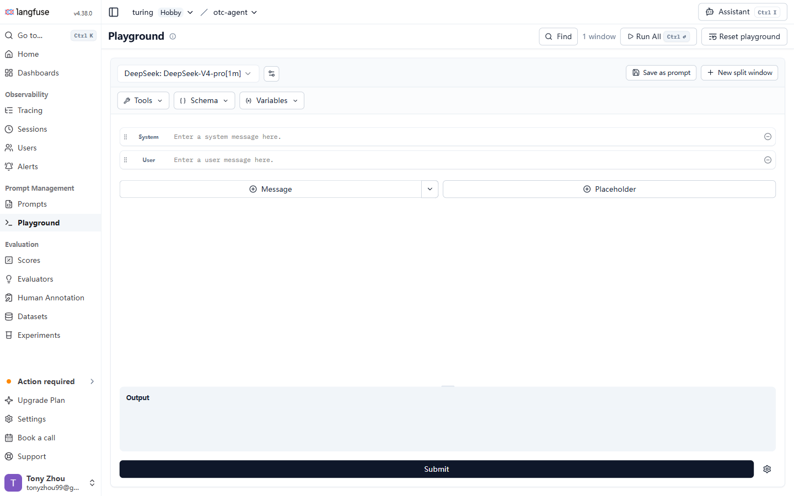
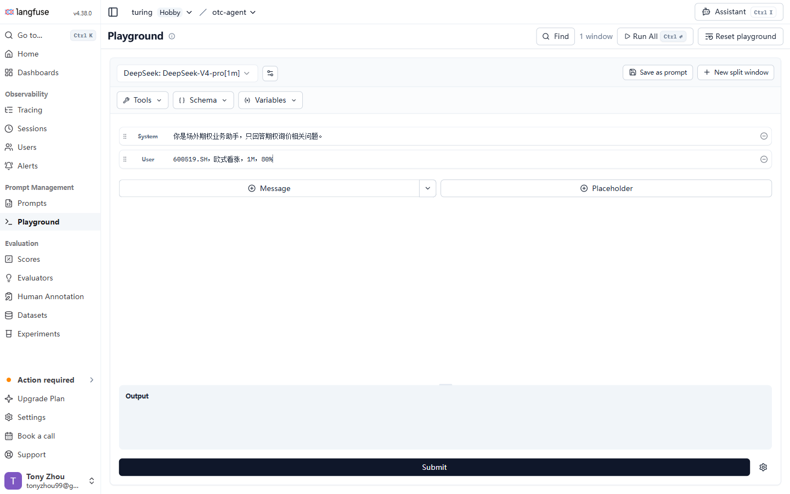
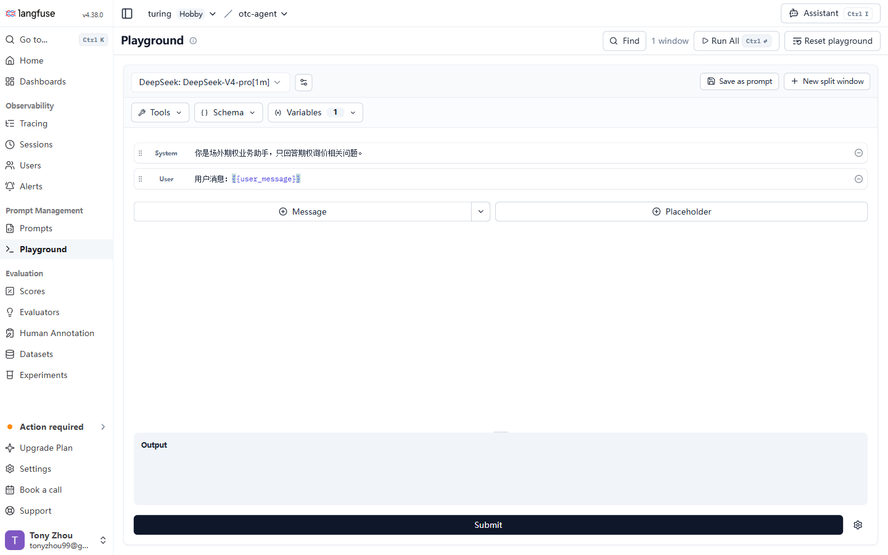
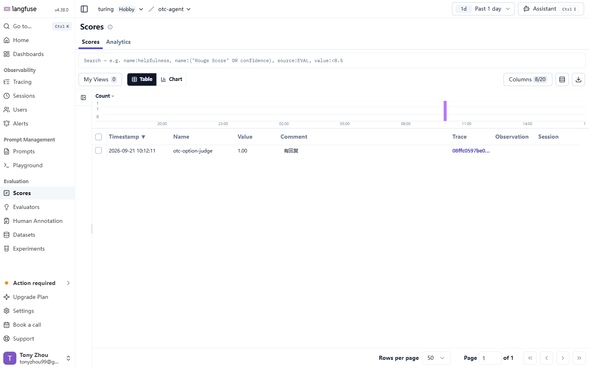
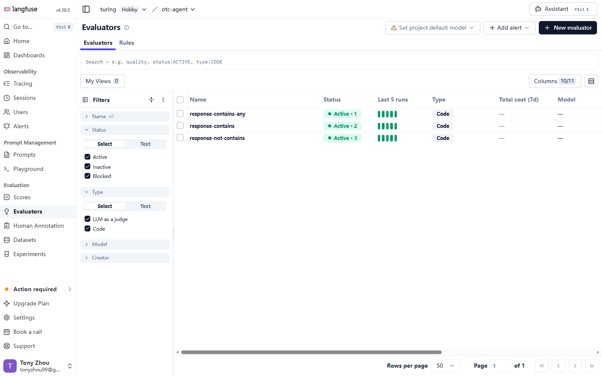
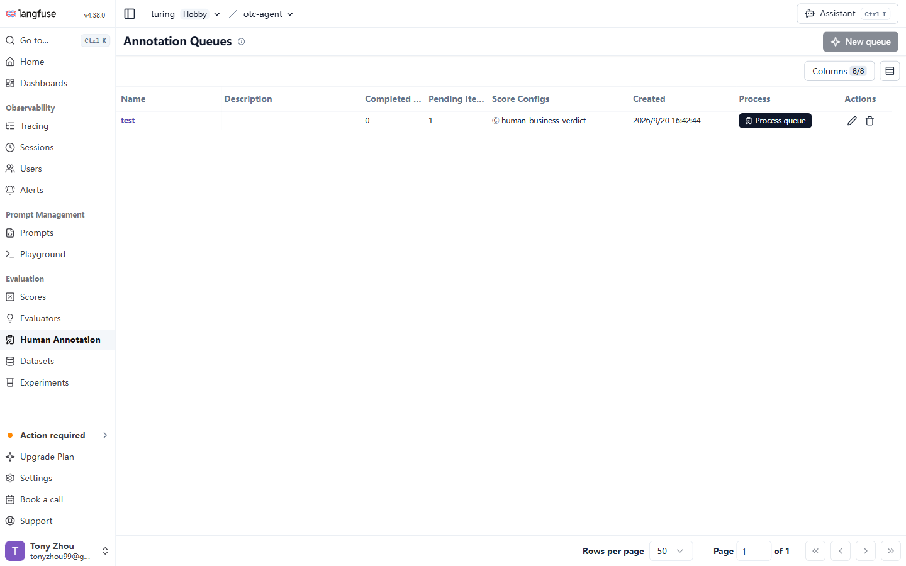
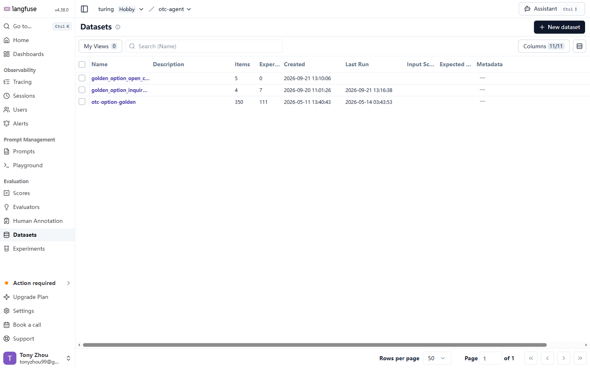
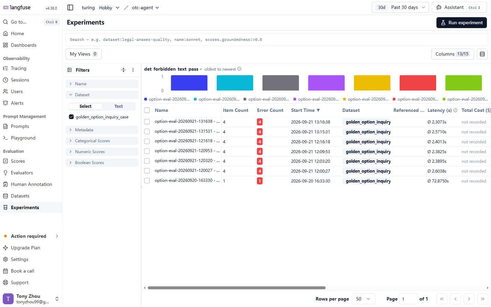

# Langfuse v4 WebUI 操作手册（面向非开发人员）

> 章节顺序：**可观测性 → 提示词管理 → 评测**。  
> 适用范围：Langfuse v4；以英文菜单名为准，中文用于解释。不同小版本、权限和自托管配置可能导致入口名称或位置略有差异。

## 手册结构

1. 可观测性：查找调用、查看会话、定位异常步骤
2. 提示词管理：编辑、测试、发布与回滚
3. 评测：维护测试用例、配置评分、执行测试、人工复核和失败链路追踪

---

# 1. 可观测性

可观测性模块用于查看系统实际发生了什么。遇到回答错误、响应慢、成本异常或多轮会话上下文混乱时，先从这里查，不要先修改 Prompt 或评分规则。


左侧栏 `Observability` 分组下只有四个页面，本章按此顺序逐一说明。登录后先确认左上角的 Organization 和 Project 是自己的项目，再进入具体页面。

| 页面 | 主要用途 |
|---|---|
| `Tracing` | 查看每次请求和内部步骤，定位错误、慢调用和异常输出 |
| `Sessions` | 把同一多轮会话的多次请求放在一起复盘 |
| `Users` | 按业务系统中的终端用户汇总调用和使用情况 |
| `Alerts` | 监控成本、延迟和质量指标，越过阈值时发送通知 |

## 1.1 Tracing：查看一次调用的完整链路

`Tracing` 是日常排查最常使用的页面。Langfuse v4 的列表主体是 Observations：模型调用、工具调用、检索和业务步骤各占一行；共享同一个 Trace ID 的 Observations 共同组成一次完整 Trace。


### 1.1.1 列表区域怎么看

- 顶部时间范围：限定查询时间，例如过去 1 天或过去 7 天。
- Search：用一行条件搜索，例如错误级别、环境、耗时、名称或 Score。
- `Quality`、`Slow`、`Cost`：快速切换到质量、慢调用或成本视角。
- `Table` / `Chart`：在明细表和趋势图之间切换。
- `Filters`：按 Name、Type、Environment、Model、Trace ID、User ID、Session ID 等精确筛选。
- `Columns`：选择列表中显示的字段。
- `My Views`：保存常用筛选组合，后续一键复用。

v4 默认可能启用 `Is Root Observation = true`，只显示每条应用链路的入口步骤。需要查看所有内部步骤时，取消该条件；如果只是寻找“一次请求”，保留它能减少重复行。

### 1.1.2 常用查询

| 目标 | 推荐条件 |
|---|---|
| 查一次指定请求 | Trace ID = 已知 ID |
| 查模型调用 | Type = `GENERATION` |
| 查工具调用 | Type = `TOOL` |
| 查错误 | Level = `ERROR` |
| 查某个会话 | Session ID = 指定值 |
| 查某个终端用户 | User ID = 指定值 |
| 查慢调用 | 按 Latency 降序，或使用 `Slow` 视图 |
| 查高成本调用 | Type = `GENERATION`，按 Total Cost 降序 |
| 查某个环境 | Environment = `production`、`staging` 或 `development` |

### 1.1.3 打开详情后检查什么

1. 点击目标 Observation。
2. 在 Trace tree 中确认整条链路及父子关系。
3. 从上到下检查每个步骤的 Input 和 Output。
4. 检查 Error、Level、Latency、模型、Token 和 Cost。
5. 查看 Metadata、Tags、Session ID、User ID 和 Scores。
6. 找到“输出第一次从正确变成错误”的 Observation，而不是只看最后一步。

判断方法：

- 上一步 Output 正确，下一步 Input 已错误：通常是步骤之间的数据传递问题。
- 模型 Input 正确而 Output 错误：检查 Prompt、模型和参数。
- Tool Input 错误：检查参数生成或路由步骤。
- Tool Input 正确但 Output 报错：检查后端服务或网络。
- 所有业务步骤都正确但最终文字错误：检查汇总或渲染步骤。

### 1.1.4 对记录进行后续处理

打开 Trace 或 Observation 后，可按权限执行：

- `Annotate`：人工打分和填写评论。
- `Add to queue`：加入人工标注队列。
- `Add to dataset`：把真实案例沉淀为回归测试用例。
- `Open in Playground`：把模型调用带入 Playground 复现和调整。
- 复制或分享当前筛选链接：交给其他人员复核同一视图。

## 1.2 Sessions：复盘多轮会话

Session 用于聚合同一用户交互过程中的多条 Traces，适合排查“前一轮信息在后一轮丢失”“多轮确认后执行错误”等问题。


### 1.2.1 查找并打开会话

1. 左侧进入 `Sessions`。
2. 选择时间范围和 Environment。
3. 使用 Search 或 Filters 按 Session ID、User ID、Tags、时长、Trace 数量、Token、Cost 或 Score 筛选。
4. 点击 Session ID 打开详情。
5. 按时间顺序阅读各轮 Trace 的 Input、Output 和 Scores。

### 1.2.2 多轮问题的检查顺序

1. 第一轮是否正确识别用户意图和关键参数。
2. 后续轮次是否沿用同一个 Session ID。
3. 每一轮输入中是否包含应保留的上下文。
4. 用户补充或纠正后，旧值是否被正确覆盖。
5. 最终执行轮是否使用了最新确认值。

如果一个真实多轮对话被拆成多个 Sessions，通常是应用没有稳定上报 Session ID；这不是在 WebUI 中手工合并能解决的问题，应把相关 Trace ID 和时间范围交给技术人员。

## 1.3 Users：按终端用户查看使用情况

这里的 Users 是业务应用传入的终端 User ID，不是能够登录 Langfuse 的团队成员。团队成员和权限应在 Organization / Project Settings 中管理。


### 1.3.1 常用操作

1. 左侧进入 `Users`。
2. 选择时间范围和 Environment。
3. 按 User ID 搜索，或按 Name、Trace Name、Tags 和 Metadata 筛选。
4. 在列表查看事件数、Token、Cost、首次和最后一次活动时间。
5. 点击 User ID，查看该用户关联的 Traces、Sessions、反馈和聚合指标。

### 1.3.2 适用场景

- 某位用户持续反馈结果错误：打开该用户近期记录，寻找共同错误模式。
- 某位用户调用量或成本异常：检查是否存在重复请求、超长输入或循环调用。
- 只影响少数用户：比较受影响与正常用户的 Environment、Tags、Metadata 和调用链。

如果 User ID 为空或无法对应业务用户，说明应用未上报或未稳定上报该字段，需要技术人员检查埋点。

## 1.4 Alerts：创建成本、延迟和质量告警

Alerts 会定期检查指标。当指标越过 Warning 或 Alert 阈值时，通过已连接的 Slack、Webhook 或 GitHub Actions 通知相关人员。


### 1.4.1 创建告警

1. 左侧进入 `Alerts`。
2. 如果尚未配置通知渠道，先连接允许使用的 Slack、Webhook 或 GitHub Actions。
3. 点击 `Create Alert` 或 `New Alert`。
4. 选择 Data source：Observations 或某种 Scores。
5. 选择 Metric，例如 Count、平均延迟、P95 成本或某个 Score 的比例。
6. 添加 Filters，将范围限制到正确的 Environment、模型、业务标签或 Score 名称。
7. 设置 Warning threshold 和 Alert threshold。
8. 设置时间窗口，例如 1 小时或 1 天。
9. 按需设置 No-data handling 和重复通知间隔。
10. 选择通知 Automation，保存并启用。

### 1.4.2 设置阈值时注意

- 先观察一段稳定期数据，再设置阈值；不要凭感觉填写。
- Production 和 Development 应分开监控。
- Boolean Score 的平均值代表 `true` 的比例，先确认 `true` 表示通过还是表示风险。
- “没有数据”与“指标为 0”含义不同，应明确 No-data handling。
- 告警建立后要做一次受控验证，确认通知确实到达负责人。

### 1.4.3 日常维护

从 Alert 列表或详情页可暂停、恢复、编辑或删除告警。业务调整、模型切换或 Score 定义改变后，应重新检查阈值是否仍合理。

## 1.5 可观测性标准排查流程

```text
用户反馈或告警
→ 确定时间、环境、用户或 Trace ID
→ Tracing 找到入口 Observation
→ 打开 Trace tree 定位第一处异常
→ 多轮问题转 Sessions 复盘上下文
→ 个体问题转 Users 比较历史记录
→ 人工评分并留下结论
→ 有复现价值的案例加入 Dataset
```

排查记录至少包含：时间、Environment、Trace ID、Session ID（如有）、异常 Observation 名称、预期结果、实际结果和负责人。

---

# 2. 提示词管理

提示词管理模块用于创建、版本化和试跑 Prompt。`Prompts` 保存正式的版本记录，`Playground` 用于快速试验；批量回归验证仍应使用 Evaluation 中的 Dataset 和 Experiment。


左侧栏 `Prompt Management` 分组下只有两个页面：`Prompts` 管版本，`Playground` 管试跑，两者分工不重叠。

> **本项目特别约束**：生产提示词以 Git 中的 `app/prompts/**/*.md` 为准。Langfuse Prompts 只作为开发和 staging 演练区；在 Langfuse 中移动 `production` label 不代表本项目生产环境已经发布。演练通过后仍需按项目流程晋升到 Git、评审和部署。

## 2.1 Prompts：创建、编辑、版本和标签


### 2.1.1 页面功能

- 搜索和打开已有 Prompt。
- 创建 Text Prompt 或 Chat Prompt。
- 查看同一 Prompt 的历史版本。
- 比较不同版本的内容差异。
- 维护 Config 和 Labels。
- 从 Prompt 打开 Playground 或发起 Experiment。
- 导入、导出和配置 Automation（按权限和套餐显示）。

### 2.1.2 新建 Prompt

1. 左侧进入 `Prompts`。
2. 点击 `New prompt` 或 `Create Prompt`。
3. 填写稳定、能表达业务用途的名称。
4. 选择类型：

   - Text：单段文本模板。
   - Chat：按 System、User、Assistant 等角色组织多条消息。

5. 编写内容；动态字段使用 `{{变量名}}`。
6. 按需填写 Config、Labels 和版本说明。
7. 保存，生成第一个不可变版本。


Prompt 类型创建后不应随意改变。需要从 Text 改成 Chat 时，通常应新建 Prompt，并由技术人员确认应用调用方式。

### 2.1.3 编辑 Prompt

Langfuse 不直接覆盖旧版本。编辑并保存会生成新的版本：

1. 打开目标 Prompt。
2. 确认当前查看的 Version 和 Labels。
3. 点击 `New`、`Edit` 或相应版本操作。
4. 修改 Prompt、Config 或说明。
5. 写清楚变更原因。
6. 保存为新版本。
7. 进入 Playground 做小范围试跑。
8. 使用 Dataset Experiment 与已通过版本做批量比较。

不要在未测试时把新版本直接用于生产。新版本自动成为 `latest`，但 `latest` 不等于已审核或已发布。

### 2.1.4 Labels 与回滚

Labels 是指向某个版本的可移动标记：

| Label | 常见含义 |
|---|---|
| `latest` | 系统自动指向最新保存版本 |
| `staging` | 已进入预发布验证的版本 |
| `production` | 被应用作为生产版本读取的版本 |
| 自定义 Label | A/B 测试、租户或特定实验版本 |

通用 Langfuse 项目发布时，把 `production` label 移到已验证版本；需要回滚时，把它移回旧版本。若 Label 受保护，只有 Admin 或 Owner 能修改。


再次提醒：本项目生产环境不从 Langfuse 拉取 Prompt，Label 操作只用于演练和记录，不能替代 Git 发布流程。

## 2.2 Playground：无代码试跑 Prompt



### 2.2.1 进入方式

- 左侧直接进入 `Playground`，从空白开始。
- 从 Prompt 版本详情选择在 Playground 打开。
- 从 Generation / Observation 详情点击 `Open in Playground`，复现某次真实调用。

### 2.2.2 执行一次试跑

1. 选择 LLM Connection 和模型。
2. 填写 System、User 等消息。
3. 在 `Variables` 中填写 Prompt 使用的变量值。
4. 按需设置 Temperature、Max Tokens 等模型参数。
5. 涉及工具调用时，在 `Tools` 中选择或定义工具。
6. 需要固定 JSON 输出时，在 `Schema` 中选择或定义结构。
7. 点击运行按钮。
8. 检查 Output、Tool call、Token、Cost、Latency 和错误信息。





### 2.2.3 并排比较

Playground 支持多个窗口并排比较：

1. 保留一个窗口作为当前基线。
2. 新增窗口并复制基线配置。
3. 每次只改变一个变量，例如 Prompt 内容、模型或 Temperature。
4. 使用同一组输入执行所有窗口。
5. 比较输出质量、结构、成本和延迟。

如果同时改变 Prompt、模型和参数，即使结果变好，也无法判断是哪项变化起作用。

### 2.2.4 保存结果

试跑满意后，可把当前内容保存到 Prompt Management。保存会形成新版本，不会覆盖旧版本。Playground 只适合少量样本快速试验；正式判断是否可发布，必须再运行 Dataset Experiment。

## 2.3 提示词变更标准流程

```text
Tracing 找到真实问题
→ Open in Playground 复现
→ 只修改一个因素并并排比较
→ 保存为新的 Prompt Version
→ 用相同 Dataset 运行 Experiment
→ 与已审核 Baseline 比较
→ 人工复核关键失败项
→ staging 演练
→ 按项目 Git 流程晋升、评审和发布
→ 上线后回到 Tracing / Scores 观察
```

禁止事项：

- 不为单个错误案例堆叠只对该句生效的特殊规则。
- 不删除旧版本来“清理历史”。
- 不把 Playground 单条成功当成回归测试通过。
- 不在截图、Comment 或 Prompt 中粘贴密码、API Key 或未脱敏客户信息。
- 不绕过本项目 Git 评审流程直接把 Langfuse Prompt 当作生产真理来源。

---

# 3. 评测

## 3.1 这一模块能完成什么工作

评测模块用于回答四个问题：

1. 我们准备用哪些用例测试？
2. 什么结果算通过？
3. 新版本与已通过版本相比，是变好还是退化？
4. 未通过时，错误发生在整条链路的哪一步？


左侧栏 `Evaluation` 分组下是本章会用到的五个页面。它们不是并列的五个工具，而是同一条评测链路上的不同环节：Datasets 放考卷，Evaluators 定评分方法，Experiments 记录每次作答，Scores 汇总分数，Human Annotation 处理需要人看的样本。

常用页面如下：

| 页面 | 用途 | 常见操作 |
|---|---|---|
| `Datasets` | 管理测试集和测试项 | 新建、编辑、归档测试项，维护期望结果 |
| `Experiments` | 查看一次测试运行及不同运行的对比 | 看通过情况、比较版本、打开失败项 |
| `Evaluators` | 定义“如何自动评分” | 编辑评分标准、测试评分器、配置自动评分范围 |
| `Scores` | 集中查看自动和人工评分 | 按评分名称、结果、来源筛选 |
| `Human Annotation` | 组织多人批量人工复核 | 创建队列、分配审核人、逐条完成标注 |
| `Tracing` | 查看测试项的完整执行链路 | 展开模型调用、工具调用和业务步骤，定位失败原因 |

### 3.1.1 先认识六个对象

| 名称 | 通俗解释 |
|---|---|
| Dataset | 一组测试用例，例如“期权询价回归集” |
| Dataset Item | 一条测试用例，包含输入、期望输出和补充信息 |
| Experiment | 用某个版本跑完整个测试集后形成的一次测试记录 |
| Evaluator | 评分标准，决定“怎样判断好坏” |
| Rule | 自动评分范围，决定“哪些新记录需要调用哪些 Evaluator” |
| Score | 最终评分结果，可以来自自动评分或人工评分 |

可以记成：

```text
Dataset（考卷）
  └─ Dataset Item（一道题）
       └─ Experiment Item（某次作答）
            └─ Trace（完整答题过程）
                 └─ Observations（过程中的各个步骤）

Evaluator（评分方法） + Rule（评分对象） → Score（评分结果）
```

### 3.1.2 Scores 页面

`Scores` 集中展示自动 Evaluator、人工标注和系统写入的评分结果。`Scores` 页签用于查明细，`Analytics` 页签用于查看分布、趋势以及不同评分之间的一致性。



常用操作：按 Score 名称、来源、值、时间和关联对象筛选；点击 Trace 或 Observation 进入原始链路；发现异常分数时同时核对实际 Output 和评分理由。

### 3.1.3 Evaluators 页面

`Evaluators` 页签管理“如何评分”，`Rules` 页签管理“哪些新 Observations 自动评分”。列表中可以查看状态、类型、最近运行、成本和模型。新建或修改后，应先用代表性样本测试，再决定是否启用 Rule。



### 3.1.4 Human Annotation 页面

页面标题在当前 v4 界面中显示为 `Annotation Queues`。它用于创建人工审核队列、查看已完成和待处理数量、选择 Score Config，并通过 `Process queue` 逐条完成审核。



### 3.1.5 Datasets 页面

`Datasets` 管理可重复使用的测试用例集合。列表可查看 Items 数量、Experiments 数量、创建时间、最后运行时间以及 Input / Expected Output / Metadata 的结构。打开 Dataset 后在 `Items` 中维护具体用例。



### 3.1.6 Experiments 页面

`Experiments` 汇总每次测试运行，并支持搜索、筛选、查看 Score / Error / Cost / Latency 和比较多个 Runs。当前 v4 可从右上角 `Run experiment` 发起测试，也可从 Dataset 详情的 `Start Experiment` 进入。



## 3.2 开始前检查

开始操作前确认：

- 页面顶部显示的是正确的 `Organization` 和 `Project`。
- 你至少能看到 `Datasets`、`Experiments`、`Evaluators` 和 `Scores`。
- 如需新建或修改配置，确认自己不是只读角色。
- 执行 Prompt Experiment 前，项目中已有可用的 Prompt 和 LLM Connection。
- 团队已经约定测试集名称、评分标准、基线版本和发布门槛。

如果页面入口缺失，先联系管理员确认权限、Langfuse 小版本、v4 功能开关和自托管配置，不要直接判断为系统故障。

## 3.3 维护测试集和测试用例

### 3.3.1 新建 Dataset

1. 左侧进入 `Datasets`。
2. 点击 `+ New dataset`。
3. 填写名称和说明。
4. 保存后进入 Dataset 详情页，打开 `Items` 页签。


命名建议：

- 名称要能看出业务和用途，例如 `option/inquiry-regression`。
- 名称中使用 `/` 时，Langfuse 会按文件夹形式展示。
- 同一项目内 Dataset 名称不可重复。
- 不要把日期写进长期回归集名称；运行日期应记录在 Experiment 名称中。

### 3.3.2 新增一条测试用例

1. 打开目标 Dataset 的 `Items` 页签。
2. 点击 `Add item`。
3. 填写以下内容：

   - `Input`：提交给系统的输入，必须符合团队约定的数据结构。
   - `Expected output`：正确结果或验收标准。
   - `Metadata`：用例编号、业务分类、优先级、来源等辅助信息。

4. 保存后，在 Items 列表确认该项已经出现。


填写原则：

- 一条 Item 只表达一个清晰场景。
- Expected output 应尽量可判断，不要只写“结果正确”。
- 关键用例在 Metadata 中标记优先级，便于失败时优先处理。
- Prompt Experiment 要求 `Input` 是 JSON object，且字段名与 Prompt 中的变量名一致。

### 3.3.3 编辑、归档或删除测试用例

编辑：

1. 在 Items 列表点击 item ID。
2. 修改 Input、Expected output 或 Metadata。
3. 保存后返回列表确认。

归档或删除：

1. 点击 item 行右侧的 `…`。
2. 选择 `Archive` 或 `Delete`。

两者区别：

- `Archive`：保留历史记录，但不再参加后续实验；通常优先使用。
- `Delete`：删除当前测试项；只有确认不再需要时才使用。

每次新增、修改、归档或删除 Item 都会形成新的 Dataset Version。需要复现旧测试时，在 `Items` 页签切换 Version view，选择当时的版本。


### 3.3.4 从真实失败记录生成测试用例

单条加入：

1. 在 `Tracing` 中打开异常记录。
2. 选择最能代表最终业务结果的 Observation。
3. 点击 `+ Add to dataset`。
4. 选择已有 Dataset 或新建 Dataset。
5. 检查 Input 字段映射，并补充 Expected output。
6. 保存。

批量加入：

1. 在 `Tracing` 的 Observations 列表中筛选目标记录。
2. 勾选多条记录。
3. 点击 `Actions` → `Add to dataset`。
4. 选择 Dataset，配置字段映射。
5. 预览后确认。

注意：真实记录加入 Dataset 后仍需人工补齐或校对 Expected output，不能把系统当时的错误输出直接当成标准答案。

## 3.4 配置自动评分 Evaluator

### 3.4.1 先选对评分方式

| 需求 | 推荐方式 |
|---|---|
| 判断 JSON 是否合法、字段是否齐全、文本是否精确包含某内容 | Code Evaluator |
| 判断回答是否相关、完整、符合语气或业务规范 | LLM-as-a-Judge |
| 需要业务专家给出最终结论 | 人工 Score / Annotation Queue |

Code Evaluator 需要编写 Python 或 TypeScript 规则。非开发人员可以查看和使用已经验证的规则，不建议直接修改不理解的代码。自托管环境若未配置执行器，Code Evaluator 入口可能不可用，应联系管理员。

### 3.4.2 新建 LLM-as-a-Judge Evaluator

1. 左侧进入 `Evaluators`。
2. 点击 `New evaluator`。
3. 从模板库选择 `LLM-as-a-Judge`，或选择一个接近业务目标的模板再修改。


4. 选择用于评分的模型。
5. 编写评分提示词，动态内容使用 `{{变量名}}`。


6. 选择 Score 类型：

   - `Boolean`：通过 / 不通过。
   - `Categorical`：正确 / 错误 / 待确认等固定分类。
   - `Numeric`：例如 0–1 或 1–5 分。

7. 将提示词变量映射到需要检查的数据：

   - `Input`
   - `Output`
   - `Metadata`
   - `Tool calls`
   - `Expected Output`（用于 Experiment 时常用）
   - `Experiment Item Metadata`（按需）

8. 在右侧筛选并选择一条有代表性的 Sample Observation。
9. 运行测试，检查 Score 和 reasoning 是否符合人工判断。

10. 调整评分提示词、变量映射或分值定义，直到测试稳定。
11. 保存 Evaluator。

建议至少用以下三类样本校准：一个明确通过、一个明确失败、一个边界或待确认样本。只用一条样本测试，容易得到“看起来能用、实际误判”的评分器。

### 3.4.3 编辑已有 Evaluator

1. 在 `Evaluators` 列表打开目标 Evaluator。
2. 进入编辑状态。具体按钮可能显示为 `Edit`、版本操作或行菜单，以当前部署为准。
3. 修改模型、评分提示词、变量映射或 Score 定义。
4. 用固定的校准样本重新测试。
5. 保存并记录修改目的。

修改 Evaluator 定义会形成新版本。正在使用它的 Rule 会使用最新版本，因此修改前应确认影响范围。不要只用新版 Evaluator 重评候选版本而保留旧基线分数；应让基线和候选使用同一评分定义后再比较。

### 3.4.4 配置 Evaluation Rule

Evaluator 决定“怎么评”，Rule 决定“评谁”。


1. 保存 Evaluator 后，选择：

   - 根据刚才测试样本的筛选条件创建新 Rule；或
   - 把 Evaluator 加入已有 Rule。

2. 设置筛选条件，例如 Environment、Observation name、类型、Dataset 等。


3. 设置 `Sampling rate`。
4. 选择一个或多个 Evaluators。
5. 检查过去 7 天预计匹配量。
6. 使用 LLM-as-a-Judge 时检查预计成本；量过大时降低采样比例或缩小筛选范围。
7. 保存并启用 Rule。


Rule 启用后通常对后续新产生、且符合条件的 Observations 自动评分。自动评分是异步的，记录出现后 Score 可能稍晚显示。

需要补评历史记录时，可使用历史回填选项；只想临时复核少量历史记录时，优先在 `Tracing` 中勾选后执行 Batch Evaluation，避免误开长期 Rule。

## 3.5 准备人工评分标准

人工评分前必须先有 Score Config，它规定评分名称和允许填写的值。

### 3.5.1 创建或编辑 Score Config

1. 进入 `Project Settings`。
2. 打开 `Scores / Evaluation`。
3. 点击 `Create new score config`。
4. 填写 Score 名称。
5. 选择数据类型：

   - `BOOLEAN`：通过 / 不通过。
   - `CATEGORICAL`：自定义分类，如“正确 / 错误 / 待确认”。
   - `NUMERIC`：设置最小值和最大值。
   - `TEXT`：记录文字结论。

6. 保存。

已有 Score Config 可在同一页面通过编辑图标修改。修改不会改变已有 Score，但之后新增或修改的 Score 必须符合新配置。停用旧标准时优先 Archive；归档后它不再出现在人工评分选项中，但历史 Score 仍保留。

## 3.6 从 WebUI 执行一次测试

### 3.6.1 先判断要跑哪一种测试

| 类型 | WebUI 做什么 | 适用场景 |
|---|---|---|
| Prompt Experiment | Langfuse 直接用选定 Prompt、模型和 Dataset 生成结果 | 测试提示词版本、模型或结构化输出 |
| Custom Experiment | WebUI 调用管理员预先配置的远程测试服务，由服务运行完整应用并回传结果 | 测试完整 Agent、LangGraph、检索或业务工具链路 |


重要：Prompt Experiment 不等于完整业务系统端到端测试。要从 UI 运行本项目完整 LangGraph 流程，必须先由管理员配置 Custom Experiment 的远程触发器。当前项目仓库未发现该触发器的配置资产；目标环境是否已经单独配置，应以 Dataset 页面实际显示为准。

### 3.6.2 执行 Prompt Experiment

前置条件：

- Dataset Item 的 Input 是 JSON object。
- Input 的字段名与所选 Prompt 的变量名一致。
- 项目已有可用的 Prompt 和 LLM Connection。

操作步骤：

1. 进入 `Datasets`，打开目标 Dataset。
2. 点击 `Start Experiment`。
3. 在 setup 页面找到 Prompt Experiment，点击其下方的 `Create`。
4. 填写 Experiment name。建议包含版本和日期，例如 `option-prompt-v12-20260921`。
5. 选择要测试的 Prompt 及版本。
6. 选择 LLM Connection 和模型配置。
7. 确认 Dataset；需要复现旧测试时选择指定 Dataset Version，否则使用最新版。
8. 如需固定 JSON 输出，开启 Structured Output 并选择 Schema。
9. 按需选择 Evaluator。
10. 点击 `Create` 开始运行。
11. 页面跳转到 `Experiments` 后，等待状态完成。

部分 v4 小版本也提供 `Experiments` → `Run Experiment` 的入口，后续字段相同。正式截图版应以目标部署中的实际入口作为主路径。


### 3.6.3 执行 Custom Experiment

只有 Dataset 已由管理员配置远程测试服务时，才会出现可运行的 Custom Experiment。

1. 打开目标 Dataset。
2. 点击 `Start Experiment`。
3. 在 Custom Experiment 区域点击 `Run`。


4. 检查管理员提供的默认参数，按授权范围修改本次配置。
5. 确认运行。
6. 等待远程服务生成新的 Experiment，再到 `Experiments` 查看结果。

如果只看到配置远程 URL 的入口，说明该 Dataset 尚未完成管理员设置。非开发人员不要自行填写未知地址或认证信息。

## 3.7 查看测试结果

### 3.7.1 先看整次测试

1. 左侧进入 `Experiments`。
2. 找到本次 Experiment。
3. 先检查：

   - 运行状态是否完成；
   - 是否存在 Error 或未执行项；
   - 各 Score 的整体结果；
   - Cost 和 Latency 是否明显异常；
   - 实际执行 Item 数量是否与预期一致。

“没有 Score”不等于“通过”。先确认 Evaluator 是否选中、Rule 是否匹配，以及异步评分是否仍在等待。

### 3.7.2 比较基线与候选版本

1. 在 `Experiments` 勾选要比较的 Runs。
2. 点击 `Compare`。
3. 把已经人工确认、可作为参照的版本设为 Baseline。
4. 确认各 Run 使用相同的 Dataset Version 和 Evaluator 定义。
5. 先看聚合 Score、Cost、Latency，再查看逐条差异。
6. 使用 Score 阈值或错误条件筛出退化项。

不要只看平均分。两个版本平均分相同，也可能出现“普通用例变好、关键用例由通过变失败”的情况。

## 3.8 未通过用例的链路追踪

推荐固定使用下面的顺序：

```text
Experiments 汇总
→ Compare 找到退化项
→ 打开 Experiment Item
→ 对照 Input / Expected Output / 实际 Output / Scores
→ 打开关联 Trace
→ 展开 Observations
→ 找到第一个异常步骤
→ 判断是业务链路错误、模型错误，还是 Evaluator 误判
→ 记录人工结论并安排后续处理
```

### 3.8.1 检查失败项本身

打开失败的 Experiment Item，依次核对：

1. `Input`：本次输入是否正确。
2. `Expected Output`：测试标准是否仍然有效。
3. `Output`：实际结果与期望差在哪里。
4. `Scores`：哪个评分项未通过。
5. Score reasoning/comment：评分器为什么判失败。
6. Error、Cost、Latency：是否有执行异常、成本或耗时异常。

如果 Input 或 Expected Output 本身错误，应先修正测试用例；不要为了让错误用例通过而修改业务或 Evaluator。

### 3.8.2 打开 Trace 并定位第一处异常

1. 从 Experiment Item 打开关联的 Trace。
2. 在 Trace tree 中从上到下查看 Observations。
3. 优先寻找：

   - 标记为 Error 的步骤；
   - Output 从正确变为错误的第一个步骤；
   - 耗时明显异常的步骤；
   - 没有执行但本应出现的步骤。

4. 点击具体 Observation，检查 Input、Output、Metadata、Tool calls、模型信息和 Scores。
5. 记录第一个异常 Observation 的名称、Trace ID、Experiment 名称和 Item ID，交给对应负责人。

常见判断：

| 现象 | 更可能的问题位置 |
|---|---|
| 最初输入就不符合测试意图 | Dataset Item |
| 期望结果过期或表述含糊 | Expected Output |
| 模型输入正确但输出错误 | Prompt、模型或模型参数 |
| 工具调用参数错误、返回错误 | 工具或业务服务步骤 |
| 中间步骤正确，最终回复错误 | 汇总或渲染步骤 |
| 实际输出合理，但自动分数错误 | Evaluator 提示词、变量映射或 Score 定义 |
| 没有 Score | Evaluator 未选、Rule 未匹配、评分排队或评分执行失败 |

### 3.8.3 判断 Evaluator 是否执行失败

LLM-as-a-Judge 和 Code Evaluator 自己也会生成执行 Trace。

- LLM-as-a-Judge：在 `Tracing` 中筛选 Environment = `langfuse-llm-as-a-judge`。
- Code Evaluator：筛选 Environment = `langfuse-code-eval`。

打开对应执行记录，检查状态：

- `Completed`：评分完成。
- `Error`：评分执行失败，需要查看错误详情。
- `Delayed`：模型限流后正在重试。
- `Pending`：仍在排队。

不要把 Evaluator 的 Error 当成业务用例失败，也不要把 Pending 当成通过。

## 3.9 人工打分

### 3.9.1 对单条记录打分

1. 打开 Trace、Observation、Session 或 Experiment Compare 中的目标记录。
2. 点击 `Annotate`。
3. 选择评分维度。
4. 填写 Score 值。
5. 在 Comment 中写明判断依据；对失败和待确认项建议必填。
6. 保存。
7. 到详情的 `Scores` 页签确认结果。

Comment 建议包含“结论 + 证据 + 下一步”，例如：

> 错误。用户询价标的是 600519.SH，系统最终返回 000001.SZ；ticker 解析步骤首次出现偏差，交研发排查。

### 3.9.2 使用 Human Annotation Queue 批量复核

创建队列：

1. 左侧进入 `Human Annotation`。
2. 点击 `New Queue`。
3. 选择本次要填写的 Score Configs。
4. 填写 Queue name 和可选说明。
5. 按需分配审核人。
6. 保存。

加入待审核记录：

- 批量：在 Tracing、Sessions 或 Observations 列表勾选记录 → `Actions` → `Add to queue`。
- 单条：打开详情 → `Annotate` 下拉 → 选择目标 Queue。

执行审核：

1. 审核人进入 Queue。
2. 阅读 Input、Output、链路信息和已有 Scores。
3. 填写 Score、Comment，必要时填写 Corrected output。
4. 点击 `Complete + next` 进入下一条。

注意：Corrected output 不会自动修改 Dataset，也不会自动批准发布。队列完成后，负责人仍需决定哪些案例应更新到 Dataset，并重新执行 Experiment。

## 3.10 测试完成标准

一次测试只有满足以下条件才能标记完成：

- Experiment 状态已结束，Item 数量与预期一致。
- 所有必需 Score 已生成，不存在未解释的空白分数。
- Evaluator 自身没有 Pending、Delayed 或 Error。
- 已与同一 Dataset Version、同一 Evaluator 定义下的 Baseline 比较。
- 关键用例没有未经批准的退化。
- 所有失败项均已判断为业务问题、测试数据问题或 Evaluator 问题。
- 需要人工复核的项目已完成评分并留下 Comment。
- 新发现的有效错例已进入 Dataset 或待办清单。
- 最终结论由有权限的负责人确认；Experiment 完成不等于自动批准发布。
