# Langfuse v4 WebUI 操作手册（面向非开发人员）

> 章节顺序：**可观测性 → 提示词管理 → 评测**。  
> 适用范围：Langfuse v4；以英文菜单名为准，中文用于解释。不同小版本、权限和自托管配置可能导致入口名称或位置略有差异。

## 整体怎么联动

三章不是三个独立工具，而是一条闭环：

```text
线上真实调用
  → 产生 Trace / Observation              （第 1 章 可观测性）
  → 发现答错、变慢或成本异常
  → 把有价值的错例沉淀成 Dataset 用例        （第 3 章 评测）
  → 改 Prompt，先在 Playground 单条试跑     （第 2 章 提示词管理）
  → 用 Dataset 跑 Experiment，Evaluator 打分（第 3 章）
  → 有失败项 → 从 Experiment Item 打开 Trace，定位第一个出错的节点（第 1 章）
  → 判断是业务链路错、Prompt 错还是 Evaluator 误判 → 再改 → 再跑
  → 稳定后按项目 Git 流程发布
```

三章各自管什么：

| 章节 | 管的对象 | 回答什么问题 |
|---|---|---|
| 1. 可观测性 | Trace、Observation、Score | 这次调用实际发生了什么？哪一步出错？ |
| 2. 提示词管理 | Prompt、版本、Label | 改的是哪一版？当前生效的是哪版？ |
| 3. 评测 | Dataset、Experiment、Evaluator | 改完是变好还是变坏？哪些用例退化了？ |

两条规矩贯穿全篇：

- **Git 是提示词的真源**。Langfuse 里的 Prompt 只用于演练和记录，改完仍要按项目流程评审发布（见 2.3）。
- **不要跳过可观测性直接改 Prompt**。先在第 1 章确认问题出在哪一步，再决定是改提示词、改代码，还是改评分标准。

---

# 1. 可观测性

可观测性模块用于查看系统实际发生了什么。遇到回答错误、响应慢、成本异常或多轮会话上下文混乱时，先从这里查，不要先修改 Prompt 或评分规则。

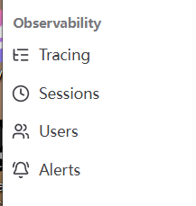

左侧栏 `Observability` 分组下只有四个页面，本章按此顺序逐一说明。登录后先确认左上角的 Organization 和 Project 是自己的项目，再进入具体页面。

| 页面 | 主要用途 |
|---|---|
| `Tracing` | 查看每次请求和内部步骤，定位错误、慢调用和异常输出 |
| `Sessions` | 把同一多轮会话的多次请求放在一起复盘 |
| `Users` | 按业务系统中的终端用户汇总调用和使用情况 |
| `Alerts` | 监控成本、延迟和质量指标，越过阈值时发送通知 |

## 1.1 Tracing：查看一次调用的完整链路

`Tracing` 是日常排查最常使用的页面。Langfuse v4 的列表主体是 Observations：模型调用、工具调用、检索和业务步骤各占一行；共享同一个 Trace ID 的 Observations 共同组成一次完整 Trace。

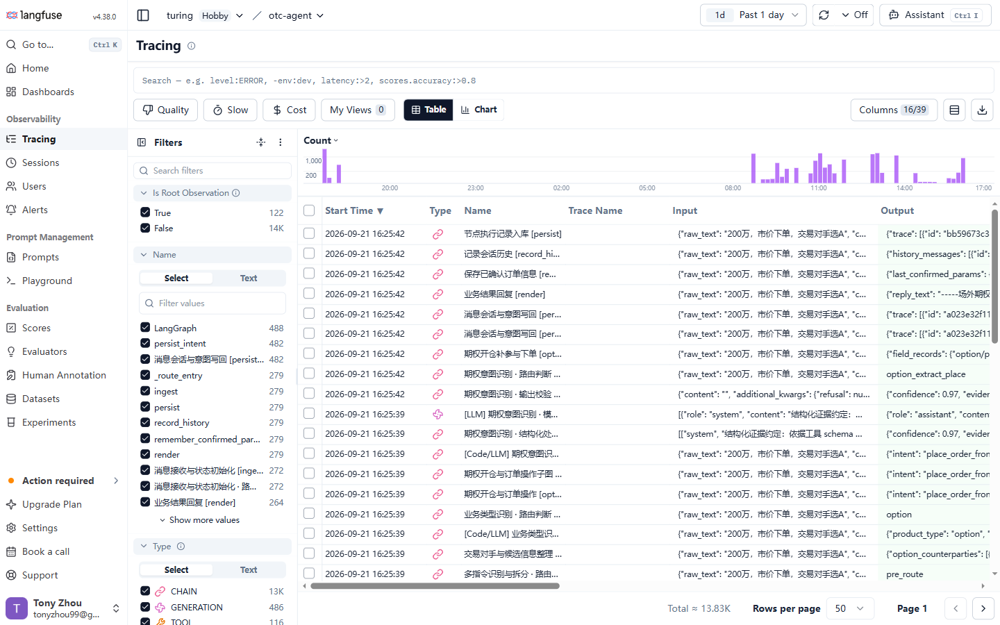

### 1.1.1 列表区域怎么看

- 顶部时间范围：限定查询时间，例如过去 1 天或过去 7 天。
- Search：一行式条件搜索，语法形如 `level:ERROR`、`-env:dev`、`latency:>2`、`scores.accuracy:>0.8`。
- `Quality`、`Slow`、`Cost`：快速切换到质量、慢调用或成本视角。
- `Table` / `Chart`：在明细表和趋势图之间切换。
- `Filters`：左侧筛选面板，见 1.1.1.1。
- `Columns`：选择列表中显示的字段。本项目默认显示 16 / 39，即 39 个可选列里开了 16 个。
- `My Views`：保存常用筛选组合，后续一键复用。

#### 1.1.1.1 Filters 面板

面板顶部有 `Search filters` 输入框，想找哪个维度直接输关键字，不必逐个往下翻。下面每个维度都是一个可折叠分组，点标题展开或收起。

展开后是两种形态之一，可随时切换：

- **Select**：把该字段实际出现过的值连同计数列出来，勾选即筛选。值太多时点 `Show more values` 展开完整列表。
- **Text**：手动输入值或表达式，适合按 ID 精确匹配，或做数值比较（如 `>2`）。

`Select` 模式最大的用处是**不用事先知道字段值**——比如 `Name` 组会直接列出本项目的真实节点名和各自的条数（`业务结果回复 [render]`、`[Code/LLM] 业务类型识别 [intent_route]` 等），照着勾就行。

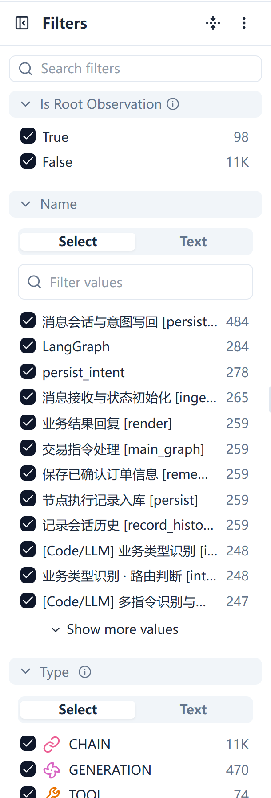

按用途归类，可用维度如下（具体能看到的维度取决于 Langfuse 版本和应用埋点了哪些字段）：

| 用途 | 维度 |
|---|---|
| 定位链路 | `Is Root Observation`、`Trace ID`、`Trace Name`、`Session ID`、`User ID` |
| 定位步骤 | `Name`、`Type`、`Status`、`Status Message` |
| 环境与版本 | `Environment`、`Version`、`Release`、`Ingestion Source`、`SDK Name`、`SDK Version`、`API Key` |
| 模型与提示词 | `Provided Model Name`、`Model ID`、`Prompt Name` |
| 耗时与用量 | `Latency (s)`、`Time To First Token (s)`、`Input Tokens`、`Output Tokens`、`Cached Input Tokens`、`Total Tokens` |
| 成本 | `Input Cost ($)`、`Output Cost ($)`、`Cached Input Cost ($)`、`Cost ($)` |
| 工具调用 | `Tool Calls`、`Tool Names (Called)`、`Tool Names (Available)`、`Available Tools` |
| 评分与标注 | `Numeric Scores`、`Categorical Scores`、`Boolean Scores`、`Comment Count`、`Comment Content` |
| 自定义 | `Metadata`、`Trace Tags` |
| 实验归属 | `Experiment Dataset ID`、`Experiment ID`、`Experiment Name` |

几个常用组合：

- **找一次业务请求的完整链路**：`Session ID` 或 `User ID` 直接定位，再取消 `Is Root Observation` 看全部内部步骤。
- **只找报错**：`Status = ERROR`；配合 `Type = GENERATION` 找模型调用失败。
- **只看某个 LangGraph 节点**：`Name` 组里勾对应节点名。
- **找慢调用 / 高成本**：用 `Latency (s)`、`Cost ($)` 或 `Total Tokens` 做数值过滤，或在表头点列名排序。
- **只看某次评测**：`Environment = sdk-experiment`，或用 `Experiment Name` / `Experiment ID` 精确定位。

**`Is Root Observation` 是本页最容易用错的一项。** v4 默认勾选 `True`，只显示每条应用链路的入口步骤；本项目在当前时间范围内入口步骤只有 98 条，而全部 Observations 有 11K，相差两个数量级。只想找“一次请求”时保留勾选能大幅减少重复行；要追查链路内部哪一步出错，必须取消它，否则看不到下游节点。

### 1.1.2 常用查询

| 目标 | 推荐条件 |
|---|---|
| 查一次指定请求 | Trace ID = 已知 ID |
| 查模型调用 | Type = `GENERATION` |
| 查工具调用 | Type = `TOOL` |
| 查错误 | Level = `ERROR` |
| 查某个会话 | Session ID = 指定值 |
| 查某个终端用户 | User ID = 指定值 |
| 查慢调用 | 按 Latency 降序，或使用 `Slow` 视图 |
| 查高成本调用 | Type = `GENERATION`，按 Total Cost 降序 |
| 查某个环境 | Environment = `production`、`staging` 或 `development` |

### 1.1.3 打开详情后检查什么

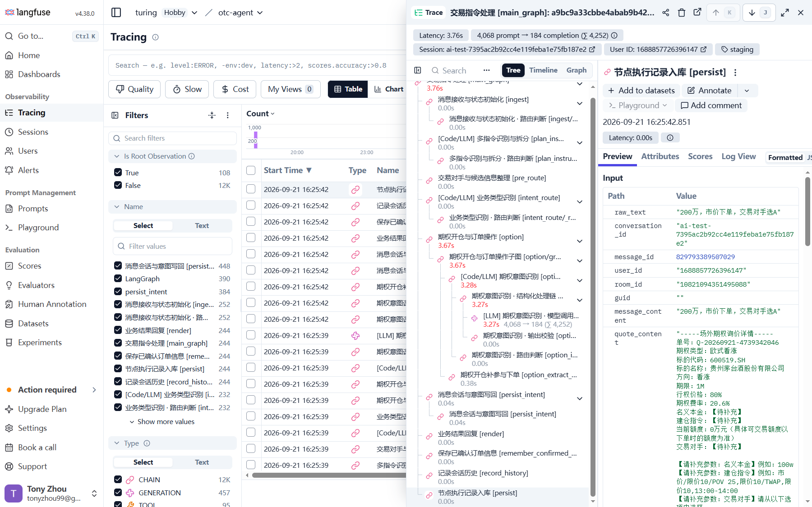

1. 在中间列表点击目标 Observation 所在行（点 `Name` 列文字同样可打开）。
2. 在 Trace tree 中确认整条链路及父子关系。
3. 从上到下检查每个步骤的 Input 和 Output。
4. 检查 Error、Level、Latency、模型、Token 和 Cost。
5. 查看 Metadata、Tags、Session ID、User ID 和 Scores。
6. 找到“输出第一次从正确变成错误”的 Observation，而不是只看最后一步。

判断方法：

- 上一步 Output 正确，下一步 Input 已错误：通常是步骤之间的数据传递问题。
- 模型 Input 正确而 Output 错误：检查 Prompt、模型和参数。
- Tool Input 错误：检查参数生成或路由步骤。
- Tool Input 正确但 Output 报错：检查后端服务或网络。
- 所有业务步骤都正确但最终文字错误：检查汇总或渲染步骤。

### 1.1.4 对记录进行后续处理

打开 Trace 或 Observation 后，可按权限执行：

这些入口集中在详情面板<u>右上角</u>（见上图）：

- `Annotate`：人工打分和填写评论，也可下拉选择加入某个标注队列。
- `+ Add to datasets`：把真实案例沉淀为回归测试用例。
- `Playground`：把这次模型调用带回 Playground 复现和调整。**只有 LLM 节点可用**，见 2.2.1。
- `Add comment`：只留评论不打分。
- 复制或分享当前筛选链接：交给其他人员复核同一视图。

## 1.2 Sessions：复盘多轮会话

Session 用于聚合同一用户交互过程中的多条 Traces，适合排查“前一轮信息在后一轮丢失”“多轮确认后执行错误”等问题。

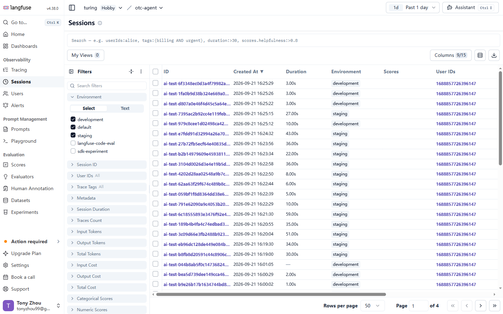

### 1.2.1 查找并打开会话

1. 左侧进入 `Sessions`。
2. 选择时间范围和 Environment。
3. 使用 Search 或 Filters 按 Session ID、User ID、Tags、时长、Trace 数量、Token、Cost 或 Score 筛选。
4. 点击列表中 `Session ID` 列的链接打开详情。
5. 按时间顺序阅读各轮 Trace 的 Input、Output 和 Scores。

### 1.2.2 多轮问题的检查顺序

1. 第一轮是否正确识别用户意图和关键参数。
2. 后续轮次是否沿用同一个 Session ID。
3. 每一轮输入中是否包含应保留的上下文。
4. 用户补充或纠正后，旧值是否被正确覆盖。
5. 最终执行轮是否使用了最新确认值。

如果一个真实多轮对话被拆成多个 Sessions，通常是应用没有稳定上报 Session ID；这不是在 WebUI 中手工合并能解决的问题，应把相关 Trace ID 和时间范围交给技术人员。

## 1.3 Users：按终端用户查看使用情况

这里的 Users 是业务应用传入的终端 User ID（本项目的企微用户），不是能登录 Langfuse 的团队成员。两者入口完全不同，不要在这里找同事账号：

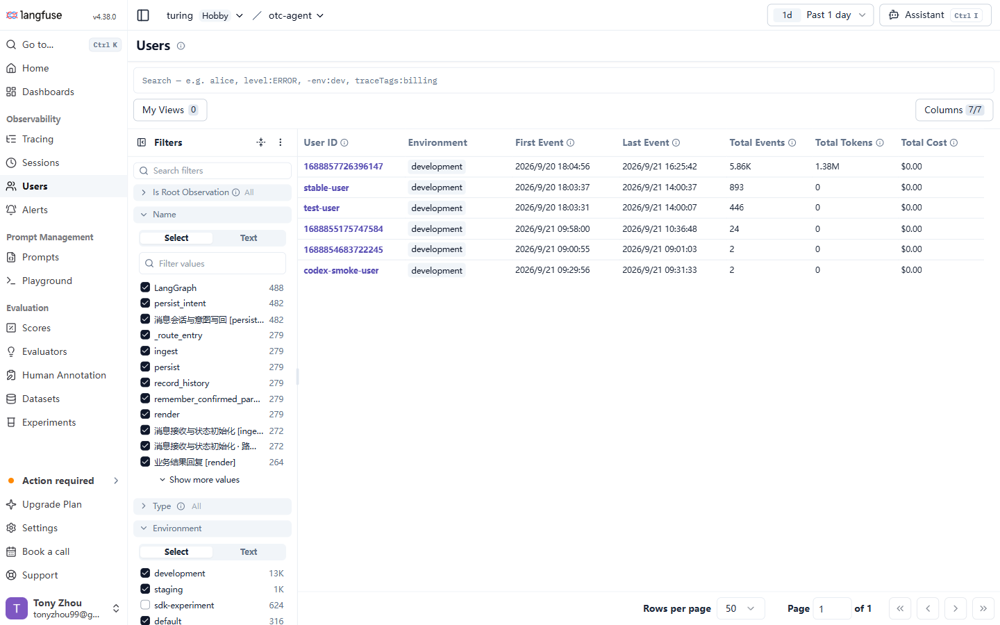

- 查**终端用户**的调用情况：左侧 `Users`，就是本节。
- 管理**能登录 Langfuse 的成员与角色**：在**组织设置**里。点左上角的组织名称（本手册环境为 `turing`），进入 `Settings` → `Members`，右上角 `Add new member` 可邀请成员并分配 `Organization Role`；项目内的角色另在 `Project Settings` → `Members` 分配。

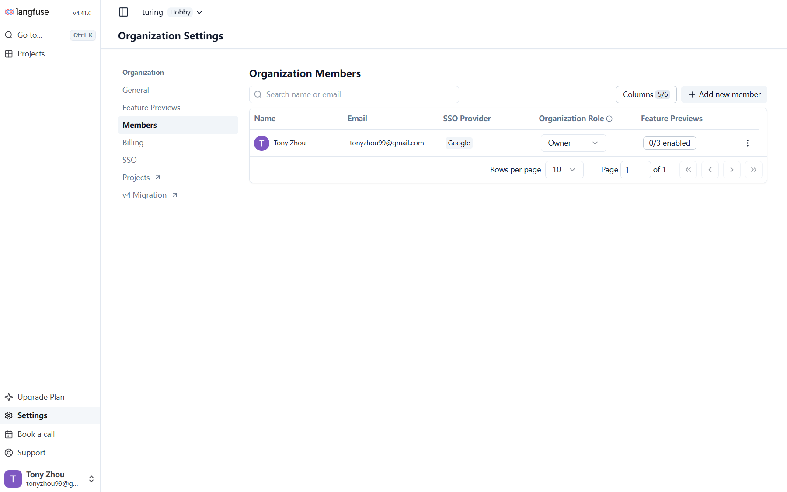

### 1.3.1 常用操作

1. 左侧进入 `Users`。
2. 选择时间范围和 Environment。
3. 按 User ID 搜索，或按 Name、Trace Name、Tags 和 Metadata 筛选。
4. 在列表查看事件数、Token、Cost、首次和最后一次活动时间。
5. 点击列表中 `User ID` 列的链接，查看该用户关联的 Traces、Sessions、反馈和聚合指标。

### 1.3.2 适用场景

- 某位用户持续反馈结果错误：打开该用户近期记录，寻找共同错误模式。
- 某位用户调用量或成本异常：检查是否存在重复请求、超长输入或循环调用。
- 只影响少数用户：比较受影响与正常用户的 Environment、Tags、Metadata 和调用链。

如果 User ID 为空或无法对应业务用户，说明应用未上报或未稳定上报该字段，需要技术人员检查埋点。

## 1.4 Alerts：创建成本、延迟和质量告警

Alerts 会定期检查指标。当指标越过 Warning 或 Alert 阈值时，通过已连接的 Slack、Webhook 或 GitHub Actions 通知相关人员。

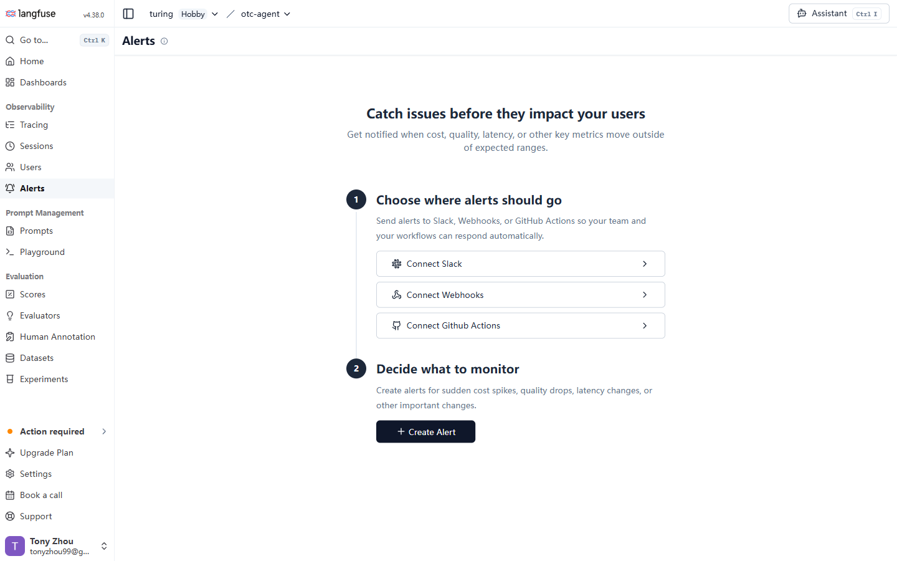

### 1.4.1 创建告警

1. 左侧进入 `Alerts`。
2. 如果尚未配置通知渠道，先连接允许使用的 Slack、Webhook 或 GitHub Actions。
3. 点击页面中部 `Decide what to monitor` 下方的 `+ Create Alert`；已有告警时该按钮位于右上角。
4. 选择 Data source：Observations 或某种 Scores。
5. 选择 Metric，例如 Count、平均延迟、P95 成本或某个 Score 的比例。
6. 添加 Filters，将范围限制到正确的 Environment、模型、业务标签或 Score 名称。
7. 设置 Warning threshold 和 Alert threshold。
8. 设置时间窗口，例如 1 小时或 1 天。
9. 按需设置 No-data handling 和重复通知间隔。
10. 选择通知 Automation，保存并启用。

### 1.4.2 设置阈值时注意

- 先观察一段稳定期数据，再设置阈值；不要凭感觉填写。
- Production 和 Development 应分开监控。
- Boolean Score 的平均值代表 `true` 的比例，先确认 `true` 表示通过还是表示风险。
- “没有数据”与“指标为 0”含义不同，应明确 No-data handling。
- 告警建立后要做一次受控验证，确认通知确实到达负责人。

### 1.4.3 日常维护

从 Alert 列表或详情页可暂停、恢复、编辑或删除告警。业务调整、模型切换或 Score 定义改变后，应重新检查阈值是否仍合理。

## 1.5 可观测性标准排查流程

```text
用户反馈或告警
→ 确定时间、环境、用户或 Trace ID
→ Tracing 找到入口 Observation
→ 打开 Trace tree 定位第一处异常
→ 多轮问题转 Sessions 复盘上下文
→ 个体问题转 Users 比较历史记录
→ 人工评分并留下结论
→ 有复现价值的案例加入 Dataset
```

排查记录至少包含：时间、Environment、Trace ID、Session ID（如有）、异常 Observation 名称、预期结果、实际结果和负责人。

---

# 2. 提示词管理

提示词管理模块用于创建、版本化和试跑 Prompt。`Prompts` 保存正式的版本记录，`Playground` 用于快速试验；批量回归验证仍应使用 Evaluation 中的 Dataset 和 Experiment。

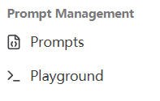

左侧栏 `Prompt Management` 分组下只有两个页面：`Prompts` 管版本，`Playground` 管试跑，两者分工不重叠。

> **本项目特别约束**：生产提示词以 Git 中的 `app/prompts/**/*.md` 为准。Langfuse Prompts 只作为开发和 staging 演练区；在 Langfuse 中移动 `production` label 不代表本项目生产环境已经发布。演练通过后仍需按项目流程晋升到 Git、评审和部署。

## 2.1 Prompts：创建、编辑、版本和标签

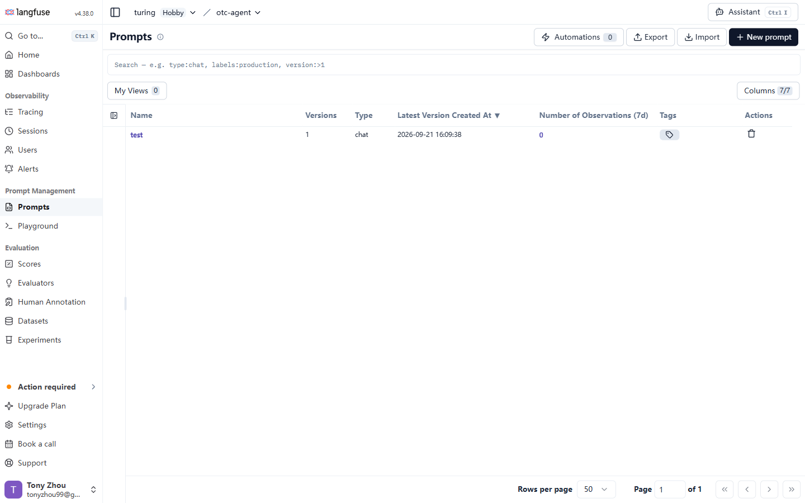

### 2.1.1 页面功能

进入某个 Prompt 后，左上角有 `Versions` / `Metrics` 两个页签：前者看内容和版本，后者看各版本的实际使用情况（见 2.1.5）。`Versions` 页左边是版本列表，右边是选中版本的详情，详情又分 `Prompt`、`Config`、`Linked Generations`、`Use Prompt` 四个子页签。

版本详情页右上角这几个按钮：

| 按钮 | 作用 |
|---|---|
| `Duplicate` | 把整个 Prompt 复制成一个新 Prompt |
| `New version` | 基于当前版本创建下一个版本（在左侧版本列表上方） |
| `Playground ⌄` | 把这个版本载入 Playground 试跑。下拉两个选项的区别见 2.2.1 |
| `Run experiment` | 打开 3.6.2 的实验向导，并**预填好这个 Prompt 和版本**。后续步骤与从 `Experiments` 页进入完全一样——仍要选 Dataset、Evaluator，最后点 `Run Experiment` 才真正执行 |
| `Add comment` | 在版本上留评论 |
| `⋮` | 更多操作，含删除 |

列表页可以搜索，按 Type / Labels / Version 筛选，右上角还有 `Import`、`Export`、`Automations` 三个入口。前两个用于批量导入导出 Prompt，`Automations` 见 2.1.6。

### 2.1.2 新建 Prompt

1. 左侧进入 `Prompts`。
2. 点击<u>右上角</u>的 `+ New prompt`。
3. 填写稳定、能表达业务用途的名称。
4. 选择类型。两者结构不同，**创建后不能改**：

   | 类型 | 长什么样 | 怎么写 |
   |---|---|---|
   | **Text** | 只有一个文本框 | 整段提示词写在一个框里，要插变量就写 `{{变量名}}`。适合"只发一段文本"的 completion 式调用；也可以用 `Add prompt reference` 把别的 Text Prompt 链接进来拼装 |
   | **Chat** | 按角色分行，System / User / Assistant | 规则写 `System`，输入写 `User`，多轮上下文加 `Assistant` 行。结构和 Playground 的消息行一致（见 2.2.2） |

   两种类型都用 `{{变量名}}` 插变量，**变量名只能用字母和下划线**。

   Chat 更贴合现在主流模型的消息接口，新建时没有特殊理由就选 Chat。
   需要从 Text 改成 Chat 时，只能新建 Prompt，并由技术人员确认应用调用方式——这是类型的硬约束，不是界面上的操作限制。

5. 按需填写下面三项（都在这张表单里）：

   - **Config**：可选。附着在这个版本上的任意 JSON，随版本一起版本化。用途是把「提示词」和「配它用的模型参数」绑在一起——调用方读 `prompt.config` 就能拿到该版本的 `model`、`temperature`，不用在代码里硬编码。推荐填 `{"model": "DeepSeek-V4-pro", "temperature": 0}`，也可放 `max_tokens`、`tools` 等；留默认 `{}` 也行。

     **本项目当前不消费它**：模型和温度统一由 `app/config` 决定，所以填什么都不会改变线上行为，价值只在于让版本自解释。另外**不要填密钥、内网地址或客户数据**——Config 随 Prompt 一起存储，任何能读到该 Prompt 的调用方都会拿到。
   - **`Set the "production" label`**：勾上则新版本立刻带 `production` label，**默认勾选**。label 机制见 2.1.4。
   - **Commit message**：这一版改了什么。回滚时靠它辨认版本，建议写清原因而不是只写"更新"。

6. 保存，生成第一个不可变版本。

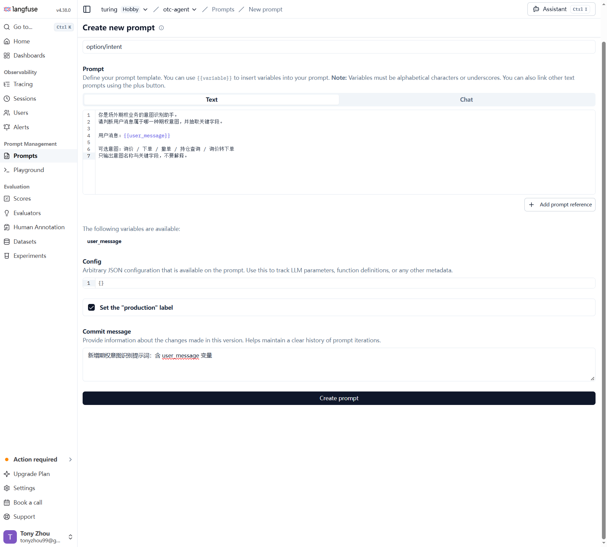

### 2.1.3 编辑 Prompt

Langfuse 不直接覆盖旧版本。编辑并保存会生成新的版本：

1. 打开目标 Prompt。
2. 确认当前查看的 Version 和 Labels。
3. 点击左侧版本列表上方的 `+ New version`；编辑已有版本则点该版本条目右侧的操作图标。
4. 修改 Prompt、Config 或说明。
5. 写清楚变更原因。
6. 保存为新版本。
7. 进入 Playground 做小范围试跑。
8. 使用 Dataset Experiment 与已通过版本做批量比较。

不要在未测试时把新版本直接用于生产。新版本自动成为 `latest`，但 `latest` 不等于已审核或已发布。

### 2.1.4 Labels 与回滚

Labels 是指向某个版本的可移动标记：

| Label | 常见含义 |
|---|---|
| `latest` | 系统自动指向最新保存版本 |
| `staging` | 已进入预发布验证的版本 |
| `production` | 被应用作为生产版本读取的版本 |
| 自定义 Label | A/B 测试、租户或特定实验版本 |

通用 Langfuse 项目发布时，把 `production` label 移到已验证版本；需要回滚时，把它移回旧版本。若 Label 受保护，只有 Admin 或 Owner 能修改。

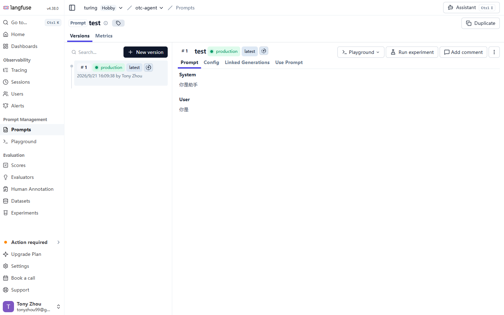

再次提醒：本项目生产环境不从 Langfuse 拉取 Prompt，Label 操作只用于演练和记录，不能替代 Git 发布流程。

### 2.1.5 Metrics 页签

Prompt 详情页左上角是 `Versions` / `Metrics` 两个页签。`Versions` 看内容，`Metrics` 看**每个版本在真实调用里的表现**——按版本汇总引用过它的 Generation。

| 列 | 含义 |
|---|---|
| `Version` | 版本号 |
| `Labels` | 该版本当前带的 label |
| `Median latency` | 该版本生成耗时的中位数 |
| `Median input tokens` | 输入 token 中位数 |
| `Median output tokens` | 输出 token 中位数 |
| `Median cost` | 单次生成成本中位数 |
| `Generations count` | 该版本被引用了多少次，即有多少条 Generation 挂在它上面 |
| `Last used` / `First used` | 最后一次、第一次被使用的时间 |

**中间那一批列是动态的**，项目里已有的 Score 会各占一列，列名格式为：

```text
符号 评分名 (来源) · 对象类型
```

四段分别读：

| 片段 | 取值 | 含义 |
|---|---|---|
| 符号 | `#` | 数值型（Numeric） |
| | `Ⓑ` | 布尔型（Boolean） |
| | `Ⓒ` | 分类型（Categorical） |
| 来源 | `(eval)` | 评测流程自动打分，含 Code Evaluator、LLM Judge、Experiment Evaluator |
| | `(annotation)` | 人工在 UI 或标注队列里打的 |
| | `(api)` | 应用或脚本通过 API / SDK 写入的 |
| 对象类型 | `· Generation` | 分数打在某次模型生成上 |
| | `· Trace` | 分数打在整条链路上 |

来源这三类与 5.2 的 Score Source 是同一套口径。

举例：

- `Ⓑ det_required_text_pass (eval) · Generation` = 布尔评分 `det_required_text_pass`，评测流程自动产生，打在某次 Generation 上。
- `# otc-option-judge (api) · Trace` = 数值评分 `otc-option-judge`，脚本经 API 写入，打在整条 Trace 上。

列太多时用右上角的 `Columns` 增删。

**显示 `No linked generation yet` 是正常的空状态**，不是出错：它表示还没有任何调用引用过这个版本。本项目生产环境从 Git 加载提示词（见 2.3），不会回填 Langfuse 的 Prompt 关联，所以这一页通常就是空的。只有在用 Langfuse Prompt 做过调用或 Experiment 之后，这里才会有数据。

### 2.1.6 Automations：事件触发的自动化

Prompts 页<u>右上角</u>的 `Automations` 进入自动化配置页，解决的是“Langfuse 里发生了某件事，怎么通知到别处”。

一条 Automation 由触发器和动作两部分组成：

| 部分 | 可选值 |
|---|---|
| 触发器 · 事件源 | `Prompt`（Prompt 被创建 / 更新 / 删除）、`Alert`（告警触发） |
| 触发器 · 动作 | `created`、`updated`、`deleted` |
| 触发器 · Filter | 附加条件，缩小触发范围 |
| 动作 · 类型 | `Webhook`、`Slack`、`GitHub Dispatch` |

选 `Webhook` 时需要填 `Webhook URL`：**只接受 HTTPS**，触发时向该地址发 POST。可以另加自定义 Header；Langfuse 会自动带上默认 Header，并用创建时生成的 `Webhook Secret` 给请求签名，签名放在 `x-langfuse-signature` 头里，接收方据此验真。

对本项目的用途是**把 Langfuse 里的 Prompt 变更通知出去**。本项目生产提示词以 Git 为真源（见 2.3），在 Langfuse 里改 Prompt 只是演练；配一条 `Prompt` + `updated` 的 Automation 打到团队群或 CI，能避免“有人在 Langfuse 改了但没人知道”。

当前项目还没有任何 Automation，页面显示 `No automations configured`。

## 2.2 Playground：无代码试跑 Prompt

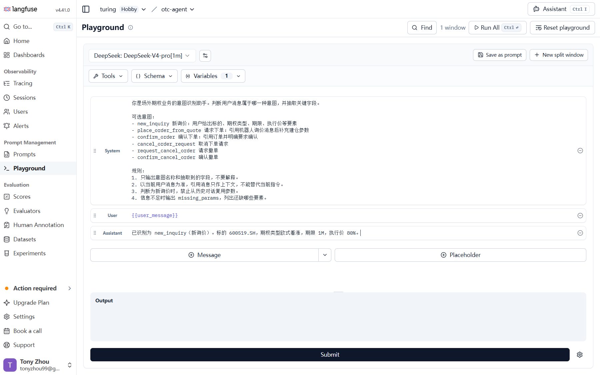

### 2.2.1 进入方式

| 入口 | 会带进去什么 | 适合做什么 |
|---|---|---|
| 左侧 `Playground` | 空白窗口 | 从零搭一条 Prompt，或只想试试某个模型 |
| **Prompt 版本详情 → `Playground ⌄`** | 该版本的 System / User 消息 | 改一版已有 Prompt 并试跑 |
| **LLM 节点详情 → `Playground`（<u>右上角</u>）** | 那次真实调用的输入消息 | 复现线上问题，不用手工照抄用户原话 |

第三种入口**只对 LLM 节点生效**。`Playground` 按钮在其他节点上也会显示，但是**灰的、点不动**——鼠标悬停会提示 *Test in LLM playground is not available since messages are not in valid ChatML format or tool calls have been used*。原因是只有模型调用的输入才是标准的消息数组（ChatML），其他节点（`[persist]`、`[render]` 这类代码节点，或带工具调用的节点）没有可回填的消息结构，带不进 Playground。所以找不到可点的 `Playground` 时，先确认选中的是不是 `[LLM]` 开头的那个节点。

从 Prompt 版本详情进入时，`Playground` 是个下拉，两个选项的区别在**是否保留当前已有的窗口**：

- `Fresh playground`：清空当前 Playground，只用这个版本重建一个窗口。
- `Add to existing`：保留已有窗口，把这个版本加进来一起对比。

要并排比两个版本用 `Add to existing`；只想专心调这一版用 `Fresh playground`，免得把正在改的另一个窗口冲掉。

### 2.2.2 消息与角色

一个 Playground 窗口就是一组按顺序发给模型的消息，每行前面标着角色：

| 角色 | 往这里放什么 |
|---|---|
| `System` | 业务规则。决定整个会话的基调 |
| `User` | 变量（`{{user_message}}`）或固定的示例输入 |
| `Assistant` | 模型上一轮的回复 |
| `Developer` | 也是系统级指令，OpenAI 新规范里用它代替 `System`，换用新模型时按对方要求选 |

**要加消息行，点消息区下方的 `Message`**：每点一次追加一行，角色按 System → User → Assistant 轮换。行右侧 `⊖` 删除该行，行左侧 `⋮⋮` 拖动可调整顺序。

加 `Assistant` 行的典型用途是**造多轮上下文**：手工写一段"机器人上一轮说了什么"，再配一条 `User`，就能测"用户引用上一轮消息时模型判断对不对"这类多轮场景，不用真的先跑一轮。

旁边的 `Placeholder` 是消息占位符，用于运行时整段插入多条消息，日常试跑用不到。

### 2.2.3 执行一次试跑

1. 顶部下拉选模型，显示为 `Provider: Model`，例如 `DeepSeek: DeepSeek-V4-pro[1m]`。
2. 按 2.2.2 写好各角色的消息。
3. 消息里有 `{{变量}}` 时，`Variables` 上会出现角标，点开填本次要试的值。
4. 需要工具调用或固定 JSON 输出时，用 `Tools` 和 `Schema`。
5. 点<u>底部</u>的 `Submit` 运行；开了多个窗口就用顶部的 `Run All`。**每跑一次都是一次真实模型调用**。
6. 在 `Output` 看结果、Token、耗时和错误。

### 2.2.4 并排比较

点<u>右上角</u>的 `+ New split window` 加窗口，每个窗口配不同的 Prompt 或模型，用同一组输入点 `Run All` 一起跑，再比较输出、结构和成本。

每次只改一个变量（Prompt 内容、模型或 Temperature）。同时改多个，即使结果变好也判断不出是哪项起作用。

### 2.2.5 存回 Prompt Management

试跑满意后点<u>右上角</u>的 `Save as prompt`：

- `Save as new prompt`：新建一个 Prompt。
- `Save as new prompt version`：先在弹窗搜索框选中已有 Prompt 再点它，给那个 Prompt 追加新版本；没选中时该按钮是禁用的。

两个选项都会展开和 2.1.2 一样的新建表单，填 `Name`、`Config` 和 `Commit message`。注意表单里的 `Set the "production" label` **默认是勾上的**，不想让新版本带这个 label 要手动取消。

**单条试跑成功不等于可发布**。还要按 3.6.2 用 Dataset 做批量回归，并按 2.3 的流程落到 Git。

## 2.3 提示词变更标准流程

```text
Tracing 找到真实问题
→ 在 LLM 节点点 Playground 复现
→ 只修改一个因素并并排比较
→ 保存为新的 Prompt Version
→ 用相同 Dataset 运行 Experiment
→ 与已审核 Baseline 比较
→ 人工复核关键失败项
→ staging 演练
→ 按项目 Git 流程晋升、评审和发布
→ 上线后回到 Tracing / Scores 观察
```

禁止事项：

- 不为单个错误案例堆叠只对该句生效的特殊规则。
- 不删除旧版本来“清理历史”。
- 不把 Playground 单条成功当成回归测试通过。
- 不在截图、Comment 或 Prompt 中粘贴密码、API Key 或未脱敏客户信息。
- 不绕过本项目 Git 评审流程直接把 Langfuse Prompt 当作生产真理来源。

---

# 3. 评测

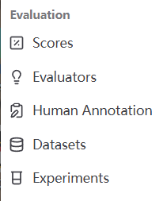

## 3.1 这一模块能完成什么工作

评测模块用于回答四个问题：

1. 我们准备用哪些用例测试？
2. 什么结果算通过？
3. 新版本与已通过版本相比，是变好还是退化？
4. 未通过时，错误发生在整条链路的哪一步？

左侧栏 `Evaluation` 分组下是本章要用的五个页面。它们不是并列的五个工具，而是同一条评测链路上的不同环节，对应六个反复出现的对象：

| 对象 | 是什么 | 在哪个页面 |
|---|---|---|
| Dataset | 一组测试用例，例如“期权询价回归集” | `Datasets` |
| Dataset Item | 一条测试用例，含输入、期望输出和补充信息 | `Datasets` |
| Experiment | 用某个版本跑完整个测试集后形成的一次测试记录 | `Experiments` |
| Evaluator | 评分标准，决定“怎样判断好坏” | `Evaluators` |
| Rule | 自动评分范围，决定“哪些新记录需要调用哪些 Evaluator” | `Evaluators` |
| Score | 最终评分结果，来自自动评分或人工评分 | `Scores` |

对象之间的层级关系：

```text
Dataset（考卷）
  └─ Dataset Item（一道题）
       └─ Experiment Item（某次作答）
            └─ Trace（完整答题过程）
                 └─ Observations（过程中的各个步骤）

Evaluator（评分方法） + Rule（评分对象） → Score（评分结果）
```

两个界面名称上的坑：

- 侧栏叫 `Human Annotation`，但进去后页面标题在 v4 里显示为 `Annotation Queues`，是同一个东西。
- `Evaluators` 页面里有 `Evaluators` 和 `Rules` 两个页签：前者管“怎么评分”，后者管“评谁”。

另外，追踪失败用例还要回到第 1 章的 `Tracing` 展开 Trace 树，它不在 `Evaluation` 分组里。

## 3.2 开始前检查

开始操作前确认：

- 页面顶部显示的是正确的 `Organization` 和 `Project`。
- 你至少能看到 `Datasets`、`Experiments`、`Evaluators` 和 `Scores`。
- 如需新建或修改配置，确认自己不是只读角色。
- 执行 Prompt Experiment 前，项目中已有可用的 Prompt 和 LLM Connection。
- 团队已经约定测试集名称、评分标准、基线版本和发布门槛。

如果页面入口缺失，先联系管理员确认权限、Langfuse 小版本、v4 功能开关和自托管配置，不要直接判断为系统故障。

## 3.3 维护测试集和测试用例

### 3.3.1 新建 Dataset

1. 左侧进入 `Datasets`。
2. 点击<u>右上角</u>的 `+ New dataset`。
3. 填写名称和说明。
4. 保存后进入 Dataset 详情页，打开 `Items` 页签。

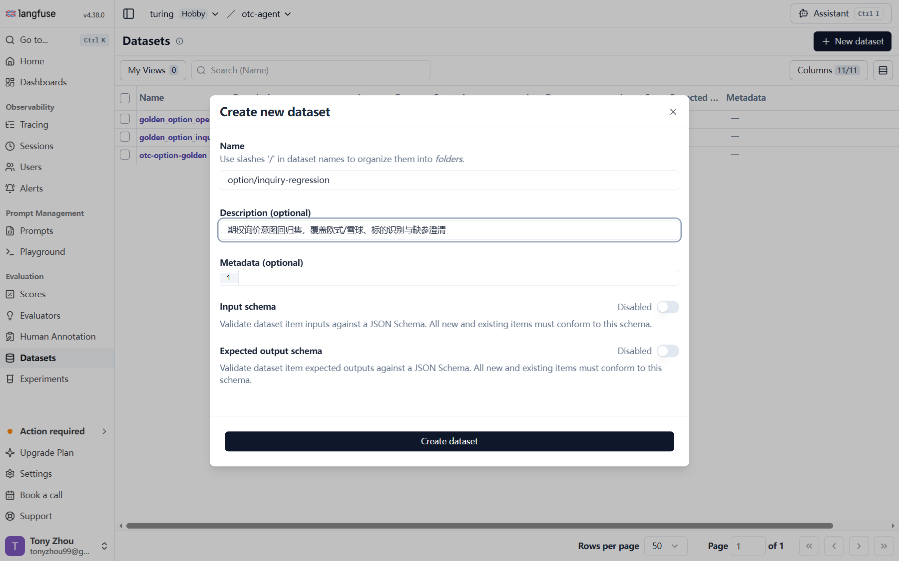

命名建议：

- 名称要能看出业务和用途，例如 `option/inquiry-regression`。
- 名称中使用 `/` 时，Langfuse 会按文件夹形式展示。
- 同一项目内 Dataset 名称不可重复。
- 不要把日期写进长期回归集名称；运行日期应记录在 Experiment 名称中。

### 3.3.2 新增一条测试用例

1. 打开目标 Dataset 的 `Items` 页签。
2. 点击<u>右上角</u>的 `+ New item`（批量导入则点旁边的 `Upload CSV`）。
3. 填写以下内容：

   - `Input`：提交给系统的输入，必须符合团队约定的数据结构。
   - `Expected output`：正确结果或验收标准。
   - `Metadata`：用例编号、业务分类、优先级、来源等辅助信息。

4. 保存后，在 Items 列表确认该项已经出现。

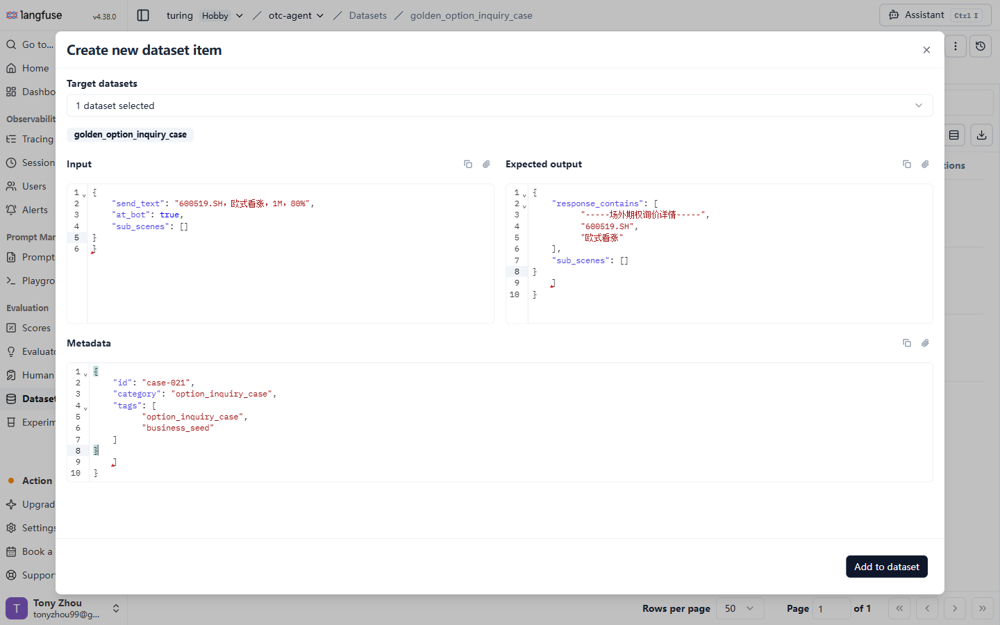

填写原则：

- 一条 Item 只表达一个清晰场景。
- Expected output 应尽量可判断，不要只写“结果正确”。
- 关键用例在 Metadata 中标记优先级，便于失败时优先处理。
- Prompt Experiment 要求 `Input` 是 JSON object，且字段名与 Prompt 中的变量名一致。

### 3.3.3 编辑、归档或删除测试用例

编辑：

1. 在 Items 列表点击第一列 `Item id` 的链接。
2. 修改 Input、Expected output 或 Metadata。
3. 保存后返回列表确认。

归档或删除：

1. 点击 item 行右侧的 `…`。
2. 选择 `Archive` 或 `Delete`。

两者区别：

- `Archive`：保留历史记录，但不再参加后续实验；通常优先使用。
- `Delete`：删除当前测试项；只有确认不再需要时才使用。

每次新增、修改、归档或删除 Item 都会形成新的 Dataset Version。需要复现旧测试时，在 `Items` 页签切换 Version view，选择当时的版本。

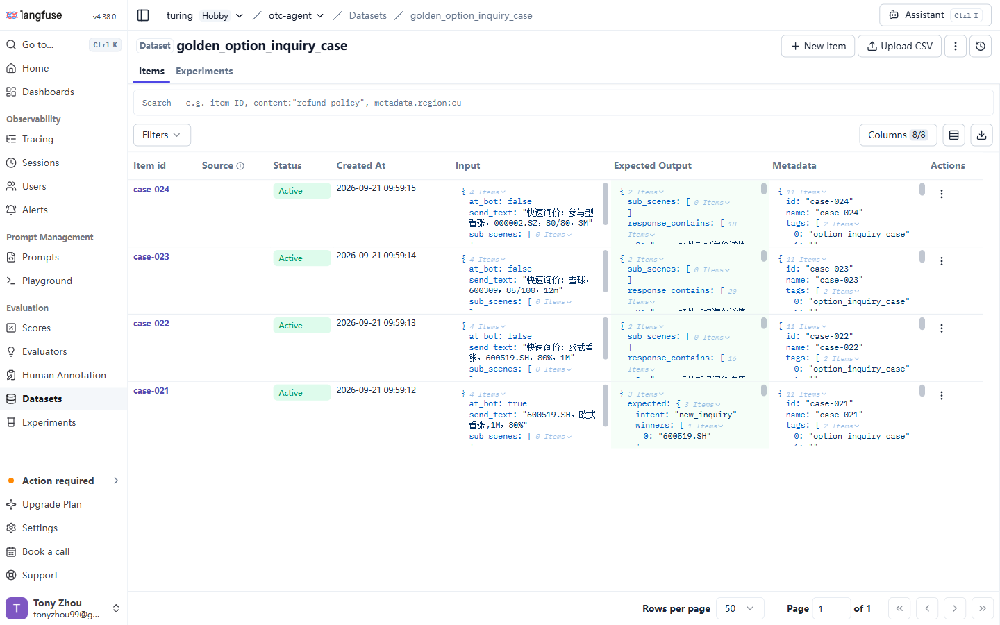

### 3.3.4 从真实失败记录生成测试用例

单条加入：

1. 在 `Tracing` 中打开异常记录。
2. 选择最能代表最终业务结果的 Observation。
3. 点击详情<u>右上角</u>的 `+ Add to datasets`。
4. 选择已有 Dataset 或新建 Dataset。
5. 检查 Input 字段映射，并补充 Expected output。
6. 保存。

批量加入：

1. 在 `Tracing` 的 Observations 列表中筛选目标记录。
2. 勾选目标行最左侧的复选框；表头的复选框可全选当前页。
3. 页面<u>底部</u>会浮出批量操作条，点击 `+ Add to Dataset`（加入人工审核队列则点 `+ Add to Annotation Queue`）。
4. 选择 Dataset，配置字段映射。
5. 预览后确认。

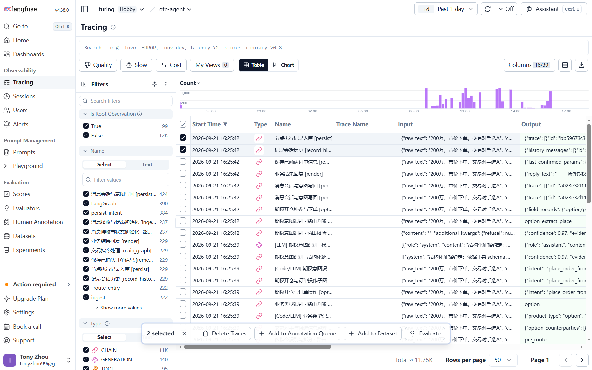

注意：真实记录加入 Dataset 后仍需人工补齐或校对 Expected output，不能把系统当时的错误输出直接当成标准答案。

## 3.4 配置自动评分 Evaluator

### 3.4.1 先选对评分方式

| 需求 | 推荐方式 |
|---|---|
| 判断 JSON 是否合法、字段是否齐全、文本是否精确包含某内容 | Code Evaluator |
| 判断回答是否相关、完整、符合语气或业务规范 | LLM-as-a-Judge |
| 需要业务专家给出最终结论 | 人工 Score / Annotation Queue |

Code Evaluator 需要编写 Python 或 TypeScript 规则，配置方法见 3.4.3。非开发人员可以查看和使用已经验证的规则，不建议直接修改不理解的代码。自托管环境若未配置执行器，Code Evaluator 入口可能不可用，应联系管理员。

### 3.4.2 新建 LLM-as-a-Judge Evaluator

1. 左侧进入 `Evaluators`。
2. 点击<u>右上角</u>的 `+ New evaluator`。
3. 从模板库选择 `LLM-as-a-Judge`，或选择一个接近业务目标的模板再修改。

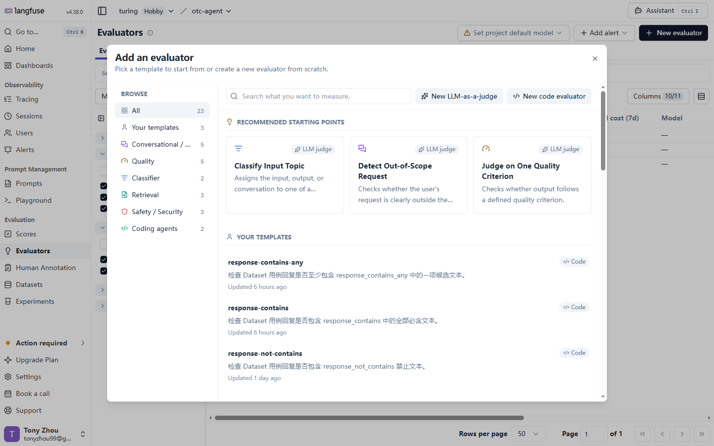

4. 选择用于评分的模型。
5. 编写评分提示词，动态内容使用 `{{变量名}}`。

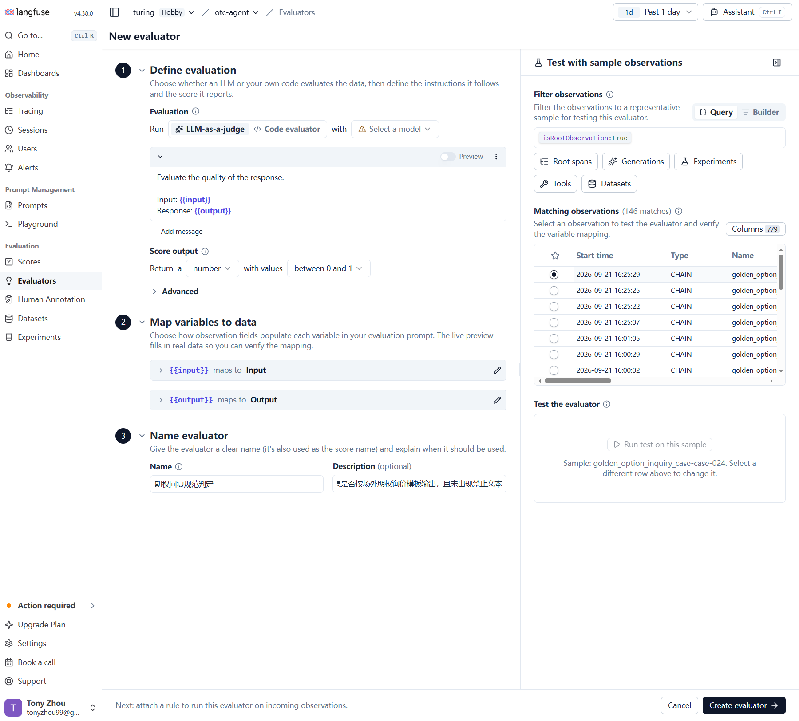

6. 选择 Score 类型：

   - `Boolean`：通过 / 不通过。
   - `Categorical`：正确 / 错误 / 待确认等固定分类。
   - `Numeric`：例如 0–1 或 1–5 分。

7. 将提示词变量映射到需要检查的数据：

   - `Input`
   - `Output`
   - `Metadata`
   - `Tool calls`
   - `Expected Output`（用于 Experiment 时常用）
   - `Experiment Item Metadata`（按需）

8. 在右侧筛选并选择一条有代表性的 Sample Observation。
9. 运行测试，检查 Score 和 reasoning 是否符合人工判断。
10. 调整评分提示词、变量映射或分值定义，直到测试稳定。
11. 保存 Evaluator。

建议至少用以下三类样本校准：一个明确通过、一个明确失败、一个边界或待确认样本。只用一条样本测试，容易得到“看起来能用、实际误判”的评分器。

### 3.4.3 新建 Code Evaluator

判断“回复是否包含必备文本”“字段是否齐全”“JSON 是否合法”这类确定性规则，用 Code Evaluator 比 LLM 判分更稳定也更省钱。

1. 左侧进入 `Evaluators`。
2. 点击<u>右上角</u>的 `+ New evaluator`。
3. 在模板库中点击 `New code evaluator`；非开发人员更推荐从 `Your templates` 里选一条已验证的规则再改。
4. 在 `Run` 一行确认选中的是 `Code evaluator`，再选实现语言：`Python` 或 `TypeScript`。
5. 在代码框中编写规则。函数签名固定，返回值必须是 `scores` 数组：

   ```typescript
   function evaluate(ctx: EvaluationContext): EvaluationResult {
     return {
       scores: [
         { name: "评分名", value: true, dataType: "BOOLEAN", comment: "判分理由" },
       ],
     };
   }
   ```

   - 数据从 `ctx.observation.input` / `ctx.observation.output` 读取；把鼠标悬停在 `ctx` 上可看它的类型定义和当前样本数据。
   - `scores[]` 每条对应一个 Score：`name` 是评分名，`value` 是结果，`dataType` 用 `BOOLEAN` / `NUMERIC` / `CATEGORICAL`，`comment` 写判分理由（排查误判时非常有用）。
   - 返回多个条目会一次写入多个 Score。

6. 在 `Name evaluator` 填 `Name`（同时作为 Score 名）和 `Description`。
7. 在右侧 `Test with sample observations` 选一条样本，点 `Run test on this sample` 验证结果符合预期。

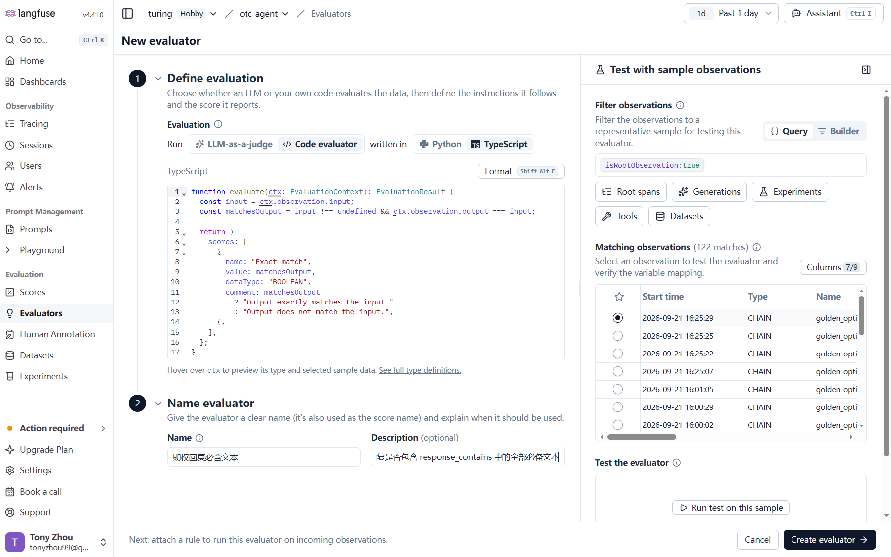

8. 保存后按 3.4.5 配置 Rule，决定它作用在哪些记录上。

本项目已有三个 Code Evaluator，可作参考或直接复用：`response-contains`（回复是否包含全部必备文本）、`response-contains-any`（是否命中任一候选文本）、`response-not-contains`（是否出现禁止文本）。

### 3.4.4 编辑已有 Evaluator

1. 在 `Evaluators` 列表打开目标 Evaluator。
2. 进入编辑状态。具体按钮可能显示为 `Edit`、版本操作或行菜单，以当前部署为准。
3. 修改模型、评分提示词、变量映射或 Score 定义。
4. 用固定的校准样本重新测试。
5. 保存并记录修改目的。

修改 Evaluator 定义会形成新版本。正在使用它的 Rule 会使用最新版本，因此修改前应确认影响范围。不要只用新版 Evaluator 重评候选版本而保留旧基线分数；应让基线和候选使用同一评分定义后再比较。

### 3.4.5 配置 Evaluation Rule

Evaluator 决定“怎么评”，Rule 决定“评谁”。

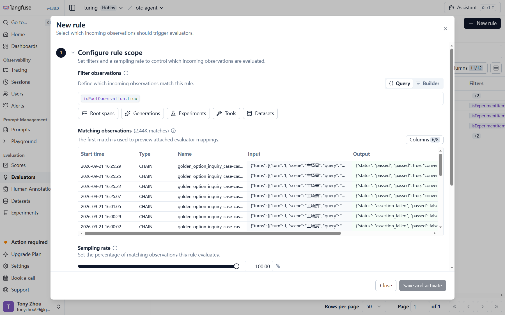

1. 保存 Evaluator 后，选择：

   - 根据刚才测试样本的筛选条件创建新 Rule；或
   - 把 Evaluator 加入已有 Rule。

2. 设置筛选条件，例如 Environment、Observation name、类型、Dataset 等。

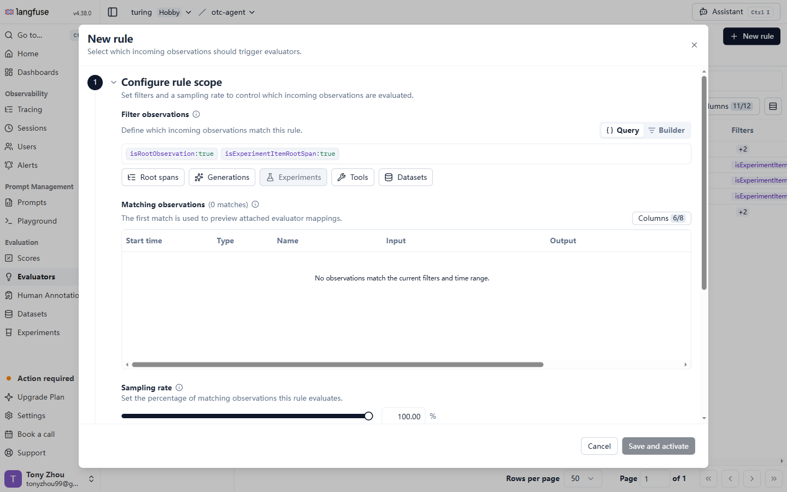

3. 设置 `Sampling rate`。
4. 选择一个或多个 Evaluators。
5. 检查过去 7 天预计匹配量。
6. 使用 LLM-as-a-Judge 时检查预计成本；量过大时降低采样比例或缩小筛选范围。
7. 保存并启用 Rule。

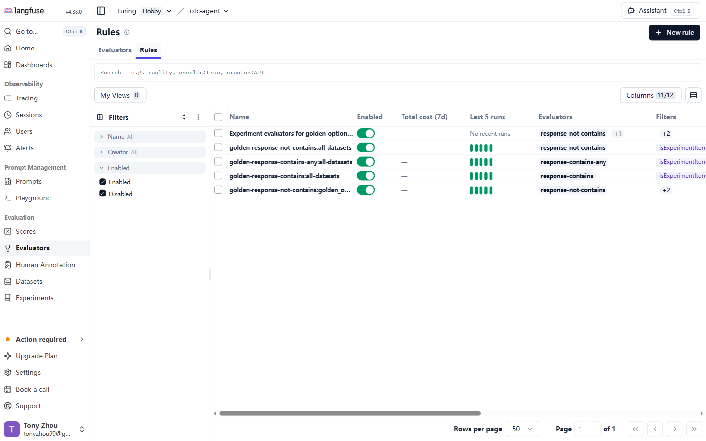

Rule 启用后通常对后续新产生、且符合条件的 Observations 自动评分。自动评分是异步的，记录出现后 Score 可能稍晚显示。

需要补评历史记录时，可使用历史回填选项；只想临时复核少量历史记录时，优先在 `Tracing` 中勾选记录、在底部操作条点 `Evaluate` 做批量评分，避免误开长期 Rule。

## 3.5 准备人工评分标准

人工评分前必须先有 Score Config，它规定评分名称和允许填写的值。

### 3.5.1 创建 Score Config

1. 点击左下角的 `Settings` 进入 `Project Settings`。
2. 在左侧设置导航中点击 `Scores Configs`。
3. 点击<u>右上角</u>的 `Add new score config`。

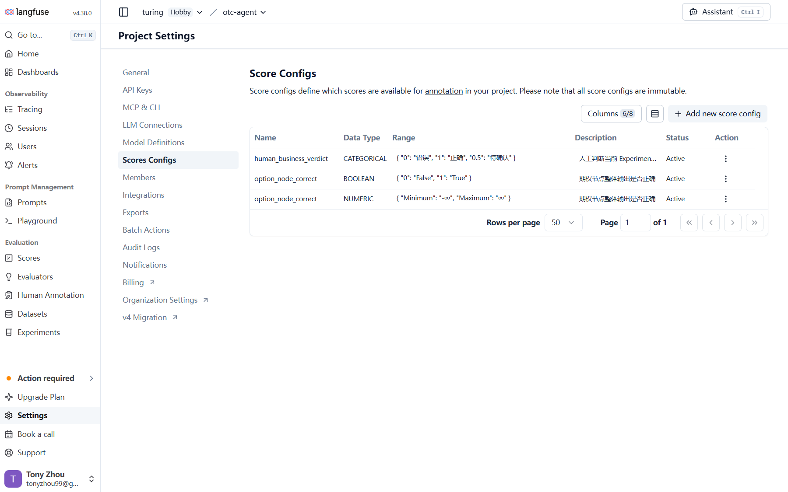

4. 填写 Score 名称。
5. 选择数据类型：

   - `BOOLEAN`：通过 / 不通过。
   - `CATEGORICAL`：自定义分类，如“正确 / 错误 / 待确认”。
   - `NUMERIC`：设置最小值和最大值。
   - `TEXT`：记录文字结论。

6. 保存。

Score Config 一经创建即不可修改（页面原文：*all score configs are immutable*）。需要更换评分标准时，应新建一个 Config 并把旧的归档：归档后它不再出现在人工评分选项中，但历史 Score 仍保留。

## 3.6 从 WebUI 执行一次测试

### 3.6.1 先判断要跑哪一种测试

| 类型 | WebUI 做什么 | 适用场景 |
|---|---|---|
| Prompt Experiment | Langfuse 直接用选定 Prompt、模型和 Dataset 生成结果 | 测试提示词版本、模型或结构化输出 |
| Custom Experiment | WebUI 调用管理员预先配置的远程测试服务，由服务运行完整应用并回传结果 | 测试完整 Agent、LangGraph、检索或业务工具链路 |

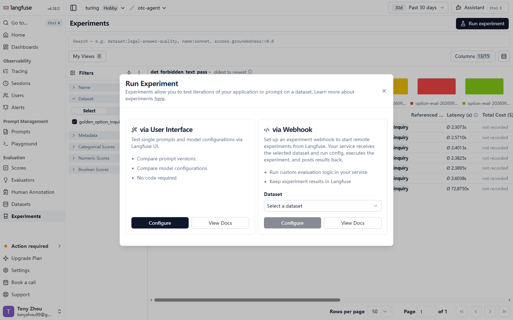

重要：Prompt Experiment 不等于完整业务系统端到端测试。要从 UI 运行本项目完整 LangGraph 流程，必须先由管理员配置 Custom Experiment 的远程触发器。当前项目仓库未发现该触发器的配置资产；目标环境是否已配置，应以 `Run experiment` 弹窗中 `via Webhook` 卡片能否选到可用的 Dataset 为准。

### 3.6.2 执行 Prompt Experiment

前置条件：

- Dataset Item 的 Input 是 JSON object。
- Input 的字段名与所选 Prompt 的变量名一致。
- 项目已有可用的 Prompt 和 LLM Connection。

操作步骤：

向导共 5 步，用弹窗<u>底部</u>的 `Next` 逐步前进：

1. 左侧进入 `Experiments`。
2. 点击<u>右上角</u>的 `Run experiment`。
3. 在弹出的两个卡片中选左边的 `via User Interface`，点击其下方的 `Configure`。
4. **Prompt & Model**：选择要测试的 Prompt 及其 `Version`，再选 `Provider` 和 `Model name`；需要固定 JSON 输出时打开 `Structured output` 并选择 Schema。
5. 点 `Next` 进入 **Dataset**：确认 Dataset；需要复现旧测试时选择指定 Dataset Version，否则用最新版。
6. 点 `Next` 进入 **Evaluators**：按需勾选本次要运行的 Evaluator。
7. 点 `Next` 进入 **Experiment run details**：填写 Experiment name，建议包含版本和日期，例如 `option-prompt-v12-20260921`；可另填 Description。
8. 点 `Next` 进入 **Review**：核对 Prompt 版本、Dataset、Evaluator 与参数。
9. 点击<u>右下角</u>的 `Run Experiment` 开始运行。
10. 页面跳转到 `Experiments` 后，等待状态完成。

部分旧版部署从 Dataset 详情页的 `Start Experiment` 进入，后续字段相同；以目标环境实际显示的入口为准。

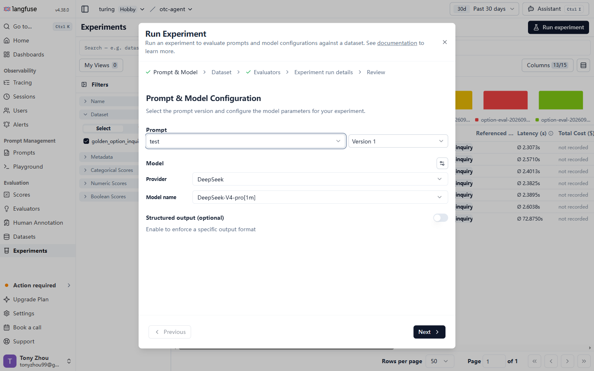

### 3.6.3 执行 Custom Experiment

只有 Dataset 已由管理员配置远程测试服务时，才会出现可运行的 Custom Experiment。

1. 左侧进入 `Experiments`。
2. 点击<u>右上角</u>的 `Run experiment`。
3. 在右侧 `via Webhook` 卡片里先在下拉框选 Dataset（`Configure` 按钮随后才可点），再点击其下方的 `Configure`。

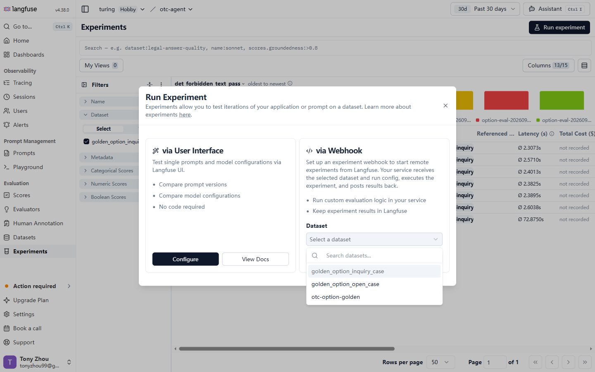

4. 检查管理员提供的默认参数，按授权范围修改本次配置。
5. 确认运行。
6. 等待远程服务生成新的 Experiment，再到 `Experiments` 查看结果。

如果选完 Dataset 后 `Configure` 仍不可用，或进入后只看到填写远程 URL 的入口，说明该 Dataset 尚未完成管理员设置。非开发人员不要自行填写未知地址或认证信息。

## 3.7 查看测试结果

### 3.7.1 先看整次测试

1. 左侧进入 `Experiments`。
2. 找到本次 Experiment。
3. 先检查：

   - 运行状态是否完成；
   - 是否存在 Error 或未执行项；
   - 各 Score 的整体结果；
   - Cost 和 Latency 是否明显异常；
   - 实际执行 Item 数量是否与预期一致。

“没有 Score”不等于“通过”。先确认 Evaluator 是否选中、Rule 是否匹配，以及异步评分是否仍在等待。

### 3.7.2 比较基线与候选版本

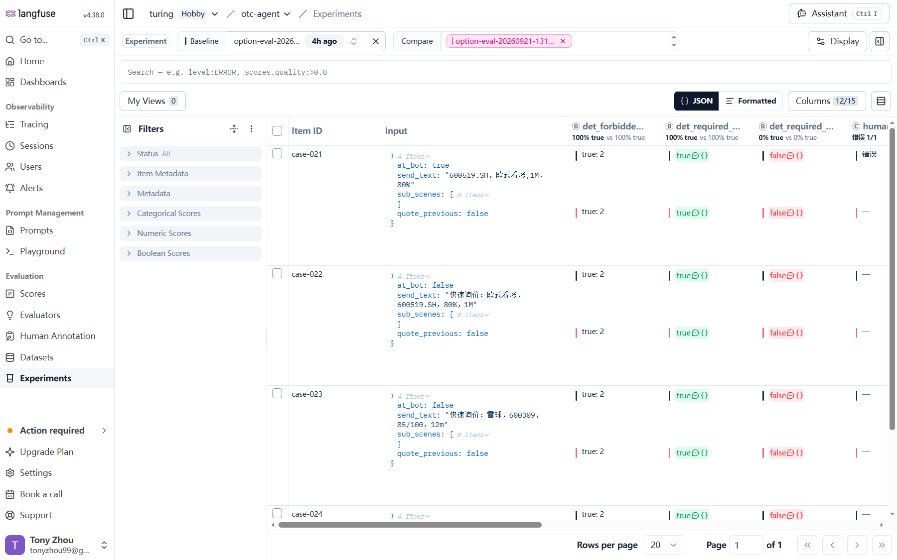

1. 在 `Experiments` 勾选要比较的 Runs。
2. 勾选后点击列表<u>上方</u>出现的 `Compare`。
3. 把已经人工确认、可作为参照的版本设为 Baseline。
4. 确认各 Run 使用相同的 Dataset Version 和 Evaluator 定义。
5. 先看聚合 Score、Cost、Latency，再查看逐条差异。
6. 使用 Score 阈值或错误条件筛出退化项。

不要只看平均分。两个版本平均分相同，也可能出现“普通用例变好、关键用例由通过变失败”的情况。

## 3.8 未通过用例的链路追踪

推荐固定使用下面的顺序：

```text
Experiments 汇总
→ Compare 找到退化项
→ 打开 Experiment Item
→ 对照 Input / Expected Output / 实际 Output / Scores
→ 打开关联 Trace
→ 展开 Observations
→ 找到第一个异常步骤
→ 判断是业务链路错误、模型错误，还是 Evaluator 误判
→ 记录人工结论并安排后续处理
```

### 3.8.1 检查失败项本身

打开失败的 Experiment Item，依次核对：

1. `Input`：本次输入是否正确。
2. `Expected Output`：测试标准是否仍然有效。
3. `Output`：实际结果与期望差在哪里。
4. `Scores`：哪个评分项未通过。
5. Score reasoning/comment：评分器为什么判失败。
6. Error、Cost、Latency：是否有执行异常、成本或耗时异常。

如果 Input 或 Expected Output 本身错误，应先修正测试用例；不要为了让错误用例通过而修改业务或 Evaluator。

### 3.8.2 打开 Trace 并定位第一处异常

1. 从 Experiment Item 打开关联的 Trace。
2. 在 Trace tree 中从上到下查看 Observations。
3. 优先寻找：

   - 标记为 Error 的步骤；
   - Output 从正确变为错误的第一个步骤；
   - 耗时明显异常的步骤；
   - 没有执行但本应出现的步骤。

4. 在 Trace tree 中点击具体 Observation，检查 Input、Output、Metadata、Tool calls、模型信息和 Scores。
5. 记录第一个异常 Observation 的名称、Trace ID、Experiment 名称和 Item ID，交给对应负责人。

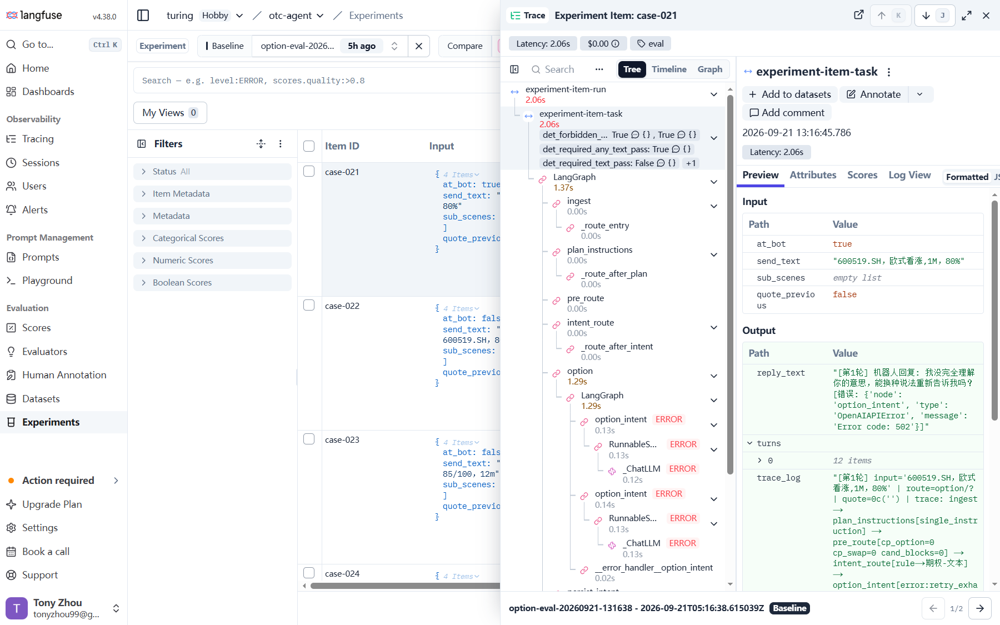

常见判断：

| 现象 | 更可能的问题位置 |
|---|---|
| 最初输入就不符合测试意图 | Dataset Item |
| 期望结果过期或表述含糊 | Expected Output |
| 模型输入正确但输出错误 | Prompt、模型或模型参数 |
| 工具调用参数错误、返回错误 | 工具或业务服务步骤 |
| 中间步骤正确，最终回复错误 | 汇总或渲染步骤 |
| 实际输出合理，但自动分数错误 | Evaluator 提示词、变量映射或 Score 定义 |
| 没有 Score | Evaluator 未选、Rule 未匹配、评分排队或评分执行失败 |

### 3.8.3 判断 Evaluator 是否执行失败

LLM-as-a-Judge 和 Code Evaluator 自己也会生成执行 Trace。

- LLM-as-a-Judge：在 `Tracing` 中筛选 Environment = `langfuse-llm-as-a-judge`。
- Code Evaluator：筛选 Environment = `langfuse-code-eval`。

打开对应执行记录，检查状态：

- `Completed`：评分完成。
- `Error`：评分执行失败，需要查看错误详情。
- `Delayed`：模型限流后正在重试。
- `Pending`：仍在排队。

不要把 Evaluator 的 Error 当成业务用例失败，也不要把 Pending 当成通过。

## 3.9 人工打分

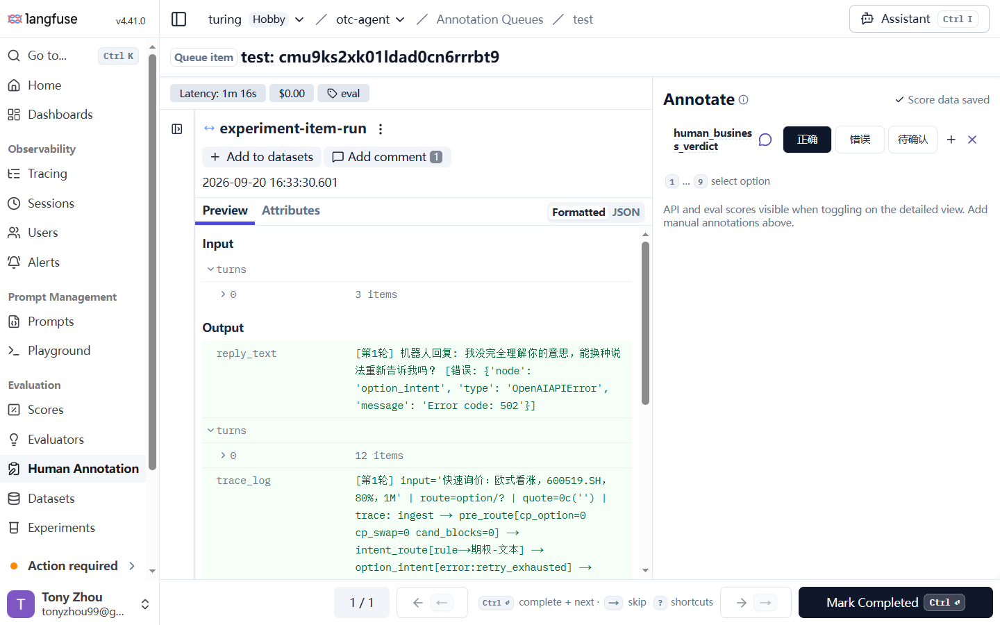

### 3.9.1 对单条记录打分

1. 打开 Trace、Observation、Session 或 Experiment Compare 中的目标记录。
2. 点击详情<u>右上角</u>的 `Annotate`，右侧展开打分面板。
3. 面板按 Score Config 分组，每个配置的取值以按钮形式列出（例如 CATEGORICAL 的 `正确` / `错误` / `待确认`），点击选中即可；点左上角的 `+` 可再加一个评分维度。
4. 在 Comment 中写明判断依据；对失败和待确认项建议必填。
5. 面板右上角出现 `Score data saved` 表示已保存。
6. 到详情的 `Scores` 页签确认结果。

Comment 建议包含“结论 + 证据 + 下一步”，例如：

> 错误。用户询价标的是 600519.SH，系统最终返回 000001.SZ；ticker 解析步骤首次出现偏差，交研发排查。

### 3.9.2 使用 Human Annotation Queue 批量复核

创建队列：

1. 左侧进入 `Human Annotation`。
2. 点击<u>右上角</u>的 `New queue`。Hobby 等基础套餐下该按钮为禁用状态，需升级套餐或换有权限的实例。
3. 选择本次要填写的 Score Configs。
4. 填写 Queue name 和可选说明。
5. 按需分配审核人。
6. 保存。

加入待审核记录：

- 批量：在 `Tracing` 列表勾选记录，在页面<u>底部</u>浮出的操作条里点 `+ Add to Annotation Queue`。
- 单条：打开详情 → `Annotate` 下拉 → 选择目标 Queue。

执行审核：

1. 审核人进入 Queue。
2. 阅读 Input、Output、链路信息和已有 Scores。
3. 填写 Score、Comment；需要给出正确版本时，用 `Correct output` 填写修订后的输出。
4. 点<u>右下角</u>的 `Mark Completed` 完成并进入下一条（快捷键 `Ctrl+E`，按钮上标注为 `complete + next`）；本轮不想打分的项可点 `skip` 跳过。底部的 `1 / 1` 是队列进度。

注意：`Correct output` 不会自动修改 Dataset，也不会自动批准发布。队列完成后，负责人仍需决定哪些案例应更新到 Dataset，并重新执行 Experiment。

## 3.10 测试完成标准

一次测试只有满足以下条件才能标记完成：

- Experiment 状态已结束，Item 数量与预期一致。
- 所有必需 Score 已生成，不存在未解释的空白分数。
- Evaluator 自身没有 Pending、Delayed 或 Error。
- 已与同一 Dataset Version、同一 Evaluator 定义下的 Baseline 比较。
- 关键用例没有未经批准的退化。
- 所有失败项均已判断为业务问题、测试数据问题或 Evaluator 问题。
- 需要人工复核的项目已完成评分并留下 Comment。
- 新发现的有效错例已进入 Dataset 或待办清单。
- 最终结论由有权限的负责人确认；Experiment 完成不等于自动批准发布。
