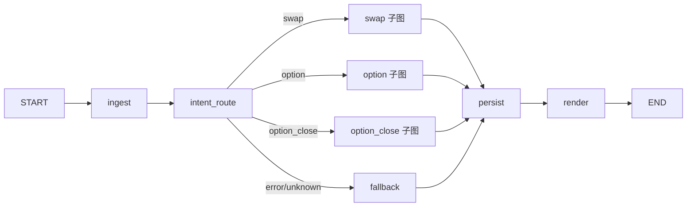

# LangGraph 培训手册 · otc-agent 团队内训版

> **编写者**：图灵科技
> **目标读者**：当前 Dify 工作流团队成员（业务/算法/工程），即将切换到 LangGraph 进行 M2 节点开发
> **配套代码**：`github.com/GZTL-AI/aigc-langgraph` `feature/m2-ticker-subgraph` 分支
> **预期收获**：
>
> 1. 看得懂 `app/` 目录下的每一个文件在做什么
> 2. 能独立认领一个 M2 issue，按"节点级 PR"颗粒度提交
> 3. 知道 Dify 里习惯的每个动作在 LangGraph 里对应到什么代码

---

## ⚡ 快速通道（只有 90 分钟看这里）

**第一次打开这本手册的同学**：先看 [docs/training/README.md](./README.md)，那里有"第 1 天 / 第 1 周"日程。

如果只有 90 分钟，按这个顺序读 4 个章节即可建立全貌：

| 顺序 | 章节 | 时长 |
|---|---|---|
| 1 | 第 0 章（写在前面）+ 第 1.1 节（为什么从 Dify 迁出） | 10 分钟 |
| 2 | 第 2 章（5 个核心概念 + Hello World） | 30 分钟 |
| 3 | 第 3 章（Dify ↔ LangGraph 概念对照表） | 15 分钟 |
| 4 | 第 6.1 节（主图全貌图）+ 第 5.1-5.5 节（swap 子图模板） | 35 分钟 |

读完上面 4 节，再用 5 分钟扫一眼下面的目录，知道"剩下的内容什么时候回头来查"。

---

## 目录

- [第 0 章 · 写在前面](#第-0-章--写在前面)
- [第 1 章 · 为什么是 LangGraph](#第-1-章--为什么是-langgraph)
- [第 2 章 · LangGraph 核心概念（10 分钟版）](#第-2-章--langgraph-核心概念10-分钟版)
- [第 3 章 · Dify ↔ LangGraph 概念对照](#第-3-章--dify--langgraph-概念对照)
- [第 4 章 · 项目代码结构对比（手把手）](#第-4-章--项目代码结构对比手把手)
- [第 5 章 · 一个完整业务子图怎么写](#第-5-章--一个完整业务子图怎么写)
- [第 6 章 · 主图与一级路由](#第-6-章--主图与一级路由)
- [第 7 章 · ticker 子图：ReAct Agent 真实案例](#第-7-章--ticker-子图react-agent-真实案例)
- [第 8 章 · 提示词与 LLM 调用](#第-8-章--提示词与-llm-调用)
- [第 9 章 · 测试与评测台 harness](#第-9-章--测试与评测台-harness)
- [第 10 章 · 团队协作与 PR 颗粒度](#第-10-章--团队协作与-pr-颗粒度)
- [第 11 章 · 上手指南：你的第一次 PR](#第-11-章--上手指南你的第一次-pr)
- [附录 A · 常见陷阱与对策](#附录-a--常见陷阱与对策)
- [附录 B · 命令速查](#附录-b--命令速查)
- [附录 C · 延伸阅读](#附录-c--延伸阅读)

---

## 第 0 章 · 写在前面

### 0.1 这本手册的写作原则

> **每段示例都来自本项目当前主干分支**。我们不教"通用 LangGraph"，我们教"otc-agent 现在长什么样"。读完之后，本仓库里的每一个 import、每一个装饰器、每一个 `@safe_node`、每一段 cascade 防御你都应该认得。

如果你想看通用 LangGraph 文档：<https://langchain-ai.github.io/langgraph/>。
如果你想知道"我们项目里为什么这么写"：请读这本手册。

### 0.2 推荐阅读路径

| 角色 | 路径 |
|---|---|
| 业务/产品 | 第 1 章 → 第 3 章 → 第 10 章 |
| 算法（Prompt 工程） | 第 1-3 章 → 第 8 章 → 第 9 章 |
| 工程（要写节点） | 全本，重点 第 4-7 章 + 第 11 章 |
| Tech Lead / Reviewer | 全本 + 附录 |

### 0.3 学完之后能做什么

- ✅ 独立领一个 issue（如 `feat(swap): 实现 swap.cancel 节点`），按本项目的"节点级 PR"颗粒度走完编码 → 测试 → PR → review 流程
- ✅ 看懂 harness 的输出，定位"哪个节点 fail 了 / 跟 Dify 的输出差在哪"
- ✅ 修改提示词、走灰度、跑 shadow compare
- ✅ 不会犯：在节点函数里 `try: except: pass`、把 LLM 调用放进 conditional 路由函数、`from x import *` 这一类底层错误

### 0.4 学不到什么

- ❌ LangGraph 内部 Pregel runtime 实现细节（用不到，知道有 `recursion_limit` 即可）
- ❌ LangChain 全家桶（我们只用 `langchain_core` + `langchain_openai` + `langgraph`，几乎不用其他 chain/agent）
- ❌ 通用大模型工程（提示词工程是另一门课，本手册只讲"在 LangGraph 里加载提示词的工程模式"）

---

## 第 1 章 · 为什么是 LangGraph

### 1.1 我们为什么从 Dify 迁出

Dify 在过去半年帮我们快速跑通了从 0 到 1 的业务原型——23 个 LLM 节点、一套企微对接、3 类业务流程（互换/期权/期权平仓），都在 Dify 里完成。**我们对 Dify 没有怨言**。但走到今天，我们碰到了 4 类无法在 Dify 内解决的问题：

| 痛点 | 表现 | 根因 |
|---|---|---|
| **无法做严肃测试** | 改动一个提示词，怕影响其他流程，只能靠人工跑几个 case "感觉一下"。回归靠运气 | Dify 是图形化运行时，没有 SDK 层可以被 pytest 驱动；YAML 也没法 mock 内部节点 |
| **协作冲突** | 两个人同时改主干工作流 → YAML 几千行的 diff，merge 几乎不可能 | 整个工作流是一个大 YAML 文件，没有节点级粒度 |
| **观测与定位难** | 客户报"机器人理解错了"，我们要重放整段对话才能知道是哪一步出问题 | Dify 默认 trace 粒度是工作流级，节点级 trace 需要平台版 |
| **Dify 自身在快速迭代** | 升级 Dify 版本时，我们的工作流可能需要适配。生产稳定性受限于 Dify 团队 | 我们对运行时没有控制权 |

LangGraph 是这 4 个问题的直接答案：

- **可测试**：图本质是 Python 函数的组合，pytest 直接驱动，可 mock 任何节点
- **节点级 PR**：每个节点是独立 .py 文件，diff 干净，code review 聚焦
- **结构化追踪**：原生支持回调，每节点输入/输出/耗时都可被 LangFuse / LangSmith 捕获
- **运行时自有**：依赖只是几个 pip 包，行为完全由我们的代码决定

> 注：**Dify 资产并未抛弃**。`dify/yaml/` 目录保留全部 5 个工作流原文（生产环境调优后通过 `python dify/sync.py` 同步进来），所有提示词通过 `scripts/export_dify_prompts.py` 导出到 `app/prompts/**/*.md`。LangGraph 替换的是**运行时**，不是**业务知识**。

### 1.2 LangGraph 在 LangChain 生态中的位置

**LangChain 生态**目前的层次（2026 视角）：

```
┌────────────────────────────────────────────────────────────────┐
│  LangSmith / LangFuse  ← 观测与评测平台（外置）                 │
├────────────────────────────────────────────────────────────────┤
│  LangGraph              ← 多步流程的状态机/编排层（本项目重点） │
├────────────────────────────────────────────────────────────────┤
│  LangChain (chains, agents)  ← 高阶组合，本项目几乎不用         │
├────────────────────────────────────────────────────────────────┤
│  langchain-core         ← Runnable / Message / Tool 抽象基类     │
│  langchain-openai       ← OpenAI 兼容 API 客户端（含 Qwen）      │
└────────────────────────────────────────────────────────────────┘
```

**重要澄清**：

- 我们**不**用 LangChain 旧的 `Chain` / `LLMChain` / `ConversationChain`。这一层在 LangGraph 出现后已被定位为 legacy
- 我们**不**用 `AgentExecutor`。LangGraph 自己有 `langchain.agents.create_agent`（即 ticker 子图用的那个）
- LangGraph 的口号是**"低层级，高灵活"**——它不预设你的 Agent 范式，只提供"图 + 状态 + 检查点"三件套

**LangGraph 的本质**：把多步流程建模为**带类型 State 的有向图**，每个节点是纯函数（输入 state，输出 partial state），框架帮你做：

1. 调度（按边的拓扑跑）
2. 状态合并（reducer）
3. 持久化（checkpointer）
4. 中断与恢复（human-in-the-loop）
5. 流式与回调

### 1.3 与同类方案对比

| 维度 | Dify | n8n / Airflow | LangGraph | 自己撸 |
|---|---|---|---|---|
| 上手成本 | 极低（拖拽） | 低 | 中（需 Python） | 高 |
| 与代码协同 | 差（YAML） | 中 | 优（pure code） | 优 |
| LLM 优化 | 中 | 弱 | 强 | 看实现 |
| 状态/检查点 | 有，但闭源 | 弱 | 一等公民 | 自建 |
| 测试 | 几乎没有 | 有限 | pytest 全覆盖 | 自建 |
| 团队协作 | 难（单文件） | 中 | 优（节点级 PR） | 看规范 |
| 生产部署 | 平台依赖 | 部署运维 | 普通 Python 服务 | 看实现 |

**为什么不用 n8n / Temporal**：它们更偏通用工作流（ETL / 业务流），对 LLM-first 应用的内置支持弱（没有 structured output、没有 ReAct Agent 模板、没有 prompt 管理）。

**为什么不"自己撸"**：状态合并 reducer、检查点、中断恢复、回调这些都是反复踩坑得出的工程经验，不必重新发明。LangGraph 帮我们解决"流程编排骨架"，我们专注业务逻辑。

### 1.4 学习成本预估

| 任务 | 老 Dify 用户预估时间 |
|---|---|
| 读完本手册第 1-4 章 | 1.5 小时 |
| 读完全本 + 跑通 quickstart | 半天 |
| 完成第一个节点的 PR（含 5 条 golden） | 1-2 天 |
| 独立带一个子图 | 1-2 周 |

---

## 第 2 章 · LangGraph 核心概念（10 分钟版）

> **要点先行**：LangGraph 只有 5 个概念你必须熟悉——**State / Node / Edge / Graph / Checkpointer**。其他都是这 5 个的组合。

### 2.1 State：数据在节点间的载体

LangGraph 的**核心抽象**就是 State——一个**类型化的 dict**，所有节点读它、改它、传它。

最简模式：

```python
from typing import TypedDict
from langgraph.graph import StateGraph, START, END

class MyState(TypedDict):
    counter: int
    log: list[str]
```

**State 设计三原则**：

1. **TypedDict（不是 dataclass）**：LangGraph 选 TypedDict 是因为它本质是 dict，序列化、合并、调试都方便。`total=False` 表示所有字段可选
2. **节点返回 partial dict**：节点只返回**它要改的字段**，框架自动 merge 到全局 state
3. **不可变思维**：永远不要 `state["x"] = ...`。返回新 dict，让框架来合并

来看本项目真实的 `AgentState`（节选自 `app/graph/state.py`）：

```python
from operator import add
from typing import Annotated, Literal, TypedDict
from pydantic import BaseModel

class TraceEntry(BaseModel):
    node: str
    decision: str | None = None
    elapsed_ms: int | None = None

ProductType = Literal["swap", "option", "option_close", "unknown"]

class AgentState(TypedDict, total=False):
    # ── 入口（来自 Dify Workflow Run inputs 的 9 个字段）──
    raw_text: str
    conversation_id: str
    quote_content: str | None

    # ── 历史 ──
    history_messages: Annotated[list, add]   # ← reducer：累加而不是覆盖

    # ── 业务路由 ──
    product_type: ProductType
    intent: str

    # ── 业务对象 ──
    place_params: dict | None
    cancel_params: dict | None

    # ── 工程层 ──
    trace: Annotated[list[TraceEntry], add]  # ← reducer：每节点追加自己的 trace
    error: ErrorInfo | None
```

**注意三件事**：

1. `total=False` 让所有字段都是 Optional——节点函数不必关心未用到的字段
2. `Annotated[list, add]` 中的 `add` 是 reducer。**没有 reducer 的字段会被覆盖；有 reducer 的字段会按 reducer 函数合并**。`from operator import add` 的 `add` 对 list 等价于 `+`，即追加
3. **业务对象按业务聚合**（place_params / cancel_params），不按节点扁平铺。这是我们 ADR 0001 D6 的决策——节点 A 和节点 B 都改同一个业务字段时，state 还是干净的

### 2.2 Node：纯函数节点

**节点 = async 函数**。签名固定：

```python
async def my_node(state: MyState) -> dict:
    # 1. 读 state
    n = state["counter"]
    # 2. 干活
    n += 1
    msg = f"counter is now {n}"
    # 3. 返回 partial dict（只含要改的字段）
    return {"counter": n, "log": [msg]}
```

**4 个铁律**（违反就出问题）：

| 铁律 | 反例 | 正例 |
|---|---|---|
| 不要 mutate 入参 | `state["counter"] += 1` | `return {"counter": state["counter"] + 1}` |
| 返回 partial 不返回完整 state | `return state` | `return {"counter": new_val}` |
| 路由函数里不做 IO/LLM | `async def route: r = await llm.invoke(...)` | 路由函数是同步纯函数 |
| 用装饰器统一兜底 | 节点函数裸 try/except | `@safe_node` 装饰器 |

我们项目所有节点都用 `@safe_node` 装饰，下一节看它。

### 2.3 Safe Node：本项目所有节点的统一外衣

`app/graph/safe_node.py`（节选）：

```python
import functools, time, traceback
from app.graph.state import AgentState, ErrorInfo, TraceEntry

def safe_node(fn):
    @functools.wraps(fn)
    async def wrapper(state: AgentState) -> dict:
        node_name = fn.__name__
        t0 = time.perf_counter()
        try:
            update = await fn(state)
            elapsed_ms = int((time.perf_counter() - t0) * 1000)
            # 自动追加 trace（节点没自带 trace 字段时）
            existing = update.setdefault("trace", [])
            if not any(getattr(e, "node", None) == node_name for e in existing):
                existing.append(TraceEntry(node=node_name, elapsed_ms=elapsed_ms))
            return update
        except Exception as exc:
            return {
                "error": ErrorInfo(
                    node=node_name,
                    type=type(exc).__name__,
                    message=str(exc),
                    traceback=traceback.format_exc(),
                ),
                "trace": [TraceEntry(node=node_name, decision="error")],
            }
    return wrapper
```

**为什么强制用它**：

1. **节点失败不让图崩**：异常被捕获写到 `state['error']`，下游节点照常拿到 state，由路由函数判断是否走 fallback
2. **自动 trace**：每节点 elapsed_ms 自动记录，业务节点函数不必手写
3. **调试友好**：traceback 完整保留在 state 里，harness 可以拿来定位

**用法**（看本项目任意节点）：

```python
from app.graph.safe_node import safe_node
from app.graph.state import AgentState

@safe_node
async def my_node(state: AgentState) -> dict:
    # 这里抛异常 → 自动写到 state['error']
    return {"intent": "place_order_request"}
```

### 2.4 Edge & Conditional Edge：流向控制

**普通边**：从 A 节点到 B 节点，无条件。

```python
g.add_edge("ingest", "intent_route")
```

**条件边**：从 A 节点出发，由路由函数决定下一站。

```python
def route_by_product(state: AgentState) -> str:
    return state.get("product_type", "fallback")

g.add_conditional_edges(
    "intent_route",
    route_by_product,
    {
        "swap": "swap",            # 路由函数返回 "swap" → 下一节点 swap
        "option": "option",
        "option_close": "option_close",
        "fallback": "fallback",
    },
)
```

**两个铁律**：

1. **路由函数是同步纯函数**——不要 await、不要 LLM 调用、不要 HTTP 请求。需要这些的话先在 `intent_route` 节点里做完，把决定写到 state，再让路由函数读这个字段
2. **路由函数返回字符串必须是映射表的 key**——返回了不在映射里的字符串 → 抛 ValueError

来看本项目主图的真实路由（`app/graph/main.py`）：

```python
def _route_after_intent(state: AgentState) -> str:
    """intent_route 节点后的路由。"""
    if state.get("error") is not None:        # cascade 防御：上游 fail 走 fallback
        return "fallback"
    pt = state.get("product_type", "unknown")
    if pt == "unknown":                        # LLM 兜底也不确定 → fallback
        return "fallback"
    return pt                                  # 否则按 product_type 选子图
```

注意第一个 `if state.get("error")`——这是我们项目的核心模式 **cascade 防御**（CLAUDE.md 核心原则第 8 条）。任何一个上游节点 fail 后被 `@safe_node` 写入 `state['error']`，所有下游路由都先看这个字段。

### 2.5 Graph：组装与编译

**StateGraph** 是图构造器，**CompiledStateGraph** 是编译产物。

完整模板：

```python
from langgraph.graph import END, START, StateGraph

g: StateGraph = StateGraph(MyState)        # 1. 创建（指定 State schema）

g.add_node("step_a", step_a_fn)             # 2. 加节点
g.add_node("step_b", step_b_fn)
g.add_node("step_c", step_c_fn)

g.add_edge(START, "step_a")                 # 3. 加边
g.add_edge("step_a", "step_b")
g.add_conditional_edges(
    "step_b",
    route_fn,
    {"go": "step_c", "skip": END},
)
g.add_edge("step_c", END)

graph = g.compile()                         # 4. 编译

result = await graph.ainvoke(initial_state) # 5. 执行
```

**START 和 END** 是常量，分别表示入口和出口。一张图有且只有一个 START，可以有多个到 END 的边。

### 2.6 Reducer：并行/累加字段

普通字段被节点 return 后**直接覆盖**全局 state；带 reducer 的字段则按 reducer 函数合并。

```python
from operator import add

class State(TypedDict, total=False):
    counter: int                          # 覆盖型：最后写的赢
    log: Annotated[list[str], add]        # 累加型：用 + 合并（即 list 追加）
    history: Annotated[list, add]         # 同上
```

**为什么需要 reducer**：

1. **trace 字段**：每个节点都要追加自己的 TraceEntry。如果是覆盖型，最后一个节点会把前面的 trace 全冲掉
2. **并行节点**：如果未来用 `g.add_edges_from` 让两个节点并行执行同一字段，reducer 决定如何合并
3. **history_messages**：每轮对话累加，不能覆盖

**自定义 reducer 示例**（高阶，本项目没用）：

```python
def merge_dicts(a: dict, b: dict) -> dict:
    return {**a, **b}

class State(TypedDict, total=False):
    config: Annotated[dict, merge_dicts]
```

### 2.7 Checkpointer：会话持久化

LangGraph 内置"检查点"概念——每次节点跑完，state 快照写到存储。下次同一个 thread_id 再来，自动从最后的 checkpoint 恢复。

**典型用法**：

```python
from langgraph.checkpoint.memory import InMemorySaver
from langgraph.checkpoint.mysql.aio import AIOMySQLSaver

# 测试：内存 checkpointer
graph = build_graph().compile(checkpointer=InMemorySaver())

# 生产：MySQL checkpointer
async with AIOMySQLSaver.from_conn_string(uri) as cp:
    await cp.setup()                     # 首次自动建表
    graph = build_graph().compile(checkpointer=cp)
```

**调用时**：

```python
config = {"configurable": {"thread_id": "user-123-room-456"}}
result = await graph.ainvoke(state, config=config)
```

**项目约定**（CLAUDE.md）：

- **thread_id 固定 = conversation_id**（企微会话 ID）
- 同一群同一客户的对话共享一份 state 历史
- 换群/换客户 → thread_id 不同 → 完全隔离

### 2.8 Subgraph：子图嵌入

**子图是普通节点**——把整个 swap 子图作为主图的一个"节点"来添加：

```python
from app.subgraphs.swap import build_swap_graph

g.add_node("swap", build_swap_graph())   # 整个子图作为一个 node
```

**子图与主图共享 State schema**——两边都用 `AgentState`，所以子图节点可以读主图传下来的 state，子图改的 state 也会回传给主图。

> 子图也可以用**独立的 State schema**（高阶用法），通过 `input` / `output` 转换边界。但本项目所有业务子图都共享 `AgentState`，简化推理。

### 2.9 Interrupt：人机协同

LangGraph 支持在指定节点**前**或**后**暂停，等待人工输入：

```python
graph = g.compile(
    checkpointer=cp,
    interrupt_before=["call_swap_api"],   # 下单前暂停，等人工确认
)
```

调用时：

```python
# 第一次：跑到 interrupt_before 的节点会停下，返回当前 state
result = await graph.ainvoke(state, config=config)

# 人工通过 UI 确认（可选地修改 state）后：
# None 作为输入 = 不新增输入，从上次 checkpoint 继续
result = await graph.ainvoke(None, config=config)
```

**项目用途**（ADR 0006）：HITL 仅用于**业务参数二次确认**（如下单前价格确认），不用于 LLM 解析失败兜底。LLM 失败由 `with_structured_output` 自带 1 次重试 + `@safe_node` 兜底，最终走 fallback 节点。

### 2.10 ReAct Agent：内置子图模板

如果你的子图就是"LLM 思考 → 调工具 → 看结果 → 继续思考"，不必自己组图——用 LangGraph 内置：

```python
from langchain.agents import create_agent
from app.llm.clients import get_qwen_thinking
from app.subgraphs.ticker.tools import TICKER_TOOLS

agent = create_agent(get_qwen_thinking(), tools=TICKER_TOOLS)
```

`agent` 已经是一个 `CompiledStateGraph`，可以直接当节点嵌入主图。本项目 ticker 子图就用了这个（详见第 7 章）。

### 2.11 Hello World 示例（10 行可运行）

```python
import asyncio
from operator import add
from typing import Annotated, TypedDict
from langgraph.graph import END, START, StateGraph

class State(TypedDict, total=False):
    counter: int
    log: Annotated[list[str], add]

async def increment(state: State) -> dict:
    n = state.get("counter", 0) + 1
    return {"counter": n, "log": [f"now {n}"]}

def is_done(state: State) -> str:
    return "done" if state.get("counter", 0) >= 3 else "again"

g = StateGraph(State)
g.add_node("inc", increment)
g.add_edge(START, "inc")
g.add_conditional_edges("inc", is_done, {"again": "inc", "done": END})

graph = g.compile()
result = asyncio.run(graph.ainvoke({"counter": 0}))
print(result)
# {'counter': 3, 'log': ['now 1', 'now 2', 'now 3']}
```

✅ **核心点都在这 30 行里**：State + reducer + Node + Edge + Conditional Edge + Compile + ainvoke。

---

## 第 3 章 · Dify ↔ LangGraph 概念对照

### 3.1 哲学差异

| 维度 | Dify | LangGraph |
|---|---|---|
| **范式** | 配置驱动（DSL/YAML） | 代码驱动（Python） |
| **目标用户** | 业务/产品/算法皆可 | 主要是工程 |
| **修改方式** | 拖拽节点、改连线、填表单 | 写函数、改 import、改 conditional |
| **运行时所有权** | Dify 平台拥有 | 你的代码拥有 |
| **类型安全** | 弱（YAML 字符串 + 运行时校验） | 强（Pydantic + TypedDict + mypy） |
| **测试范式** | 在 Dify 界面里"试运行" | pytest 全套 |
| **抽象基础** | 节点 + 变量 + 边 | State + Node + Edge + Reducer |

**关键认知转变**：

- Dify 里"变量"是**全局可见的命名空间**（`{{#node_id.var#}}`），任何节点都可以读任何上游节点的输出
- LangGraph 里"State"是**显式声明的 schema**，节点只能读 State 中已声明的字段，否则 mypy/pydantic 报错
- Dify 里"节点"是平台预定义的几种类型（LLM/code/HTTP/if-else…），每种有固定 schema
- LangGraph 里"节点"就是**任意 async 函数**，你写什么就是什么

### 3.2 概念映射表

| Dify 概念 | LangGraph 等价物 | 说明 |
|---|---|---|
| 工作流（Workflow） | Graph | 一张完整的图 |
| 节点（Node） | Node 函数 | 每个节点 = 一个 `@safe_node async def` |
| 变量（Variable） | State 字段 | 显式声明在 TypedDict 中 |
| 变量引用 `{{#node.var#}}` | `state["var"]` | 直接 dict 读取 |
| 边（Edge） | `g.add_edge()` | 拓扑连接 |
| 条件分支节点（if-else） | `g.add_conditional_edges()` | 路由函数返回字符串 |
| 开始节点（start） | `g.add_edge(START, ...)` | START 是常量 |
| 结束节点（end） | `g.add_edge(..., END)` | END 是常量 |
| LLM 节点 | 节点内 `llm.with_structured_output(M).ainvoke(...)` | 强类型输出 |
| 代码节点（code） | 普通 Python 函数体 | 任意逻辑 |
| HTTP 请求节点 | 节点内 `httpx.AsyncClient` 或 Protocol Client | 我们走 Protocol |
| 工作流嵌套 | Subgraph | `g.add_node("name", build_sub_graph())` |
| 会话变量（conversation_variable） | Checkpointer 持久化的 State | 自动恢复 |
| 环境变量（environment_variable） | `app.config.Settings`（Pydantic Settings） | 集中读 env |
| Knowledge / RAG 节点 | LangChain Retriever（本项目暂不用） | LangChain 全家桶 |
| 工具（Tool） | `@tool` 装饰器（ReAct 子图用） | langchain_core.tools |
| Agent 节点（ReAct） | `langchain.agents.create_agent` | LangGraph 内置 |

### 3.3 工程能力对比

| 工程能力 | Dify | LangGraph + 本项目 |
|---|---|---|
| **代码 review** | YAML diff 几乎不可读 | Python diff 标准流程 |
| **单元测试** | 几乎做不到 | pytest 直接驱动节点函数 |
| **集成测试** | 平台内"试运行" | InMemorySaver + Mock LLM + Mock 后端 |
| **回归测试** | 人工 | golden set + harness CLI |
| **类型检查** | 无 | mypy strict + Pydantic |
| **静态分析** | 无 | ruff + mypy |
| **节点级 trace** | 平台版才有 | 原生支持，TraceEntry 自动写入 |
| **观测平台** | Dify 自带 | LangFuse / LangSmith 任选 |
| **性能 profiling** | 难 | `@safe_node` 自动记录 elapsed_ms |
| **灰度发布** | 不支持节点级 | `_versions.yaml` + conversation_id hash 分流 |
| **shadow compare** | 不支持 | harness diff 双跑 |

**举一个具体场景**：

> "我改了 swap.intent 提示词，怎么知道有没有回归？"

- Dify 时代：拉群里几个测试 case 复制粘贴到 Dify，肉眼看输出
- LangGraph 时代：
  ```bash
  python -m harness run --category swap          # 跑全部 swap golden case
  python -m harness diff <run-before> <run-after>  # 字段级 diff
  ```

### 3.4 不变的部分

**业务知识没变**——同一段 Dify 提示词，在 LangGraph 里也是同一段提示词，从 `app/prompts/swap/intent.md` 用 `load_prompt()` 加载即可。

**业务参数 schema 没变**——`SwapPlaceOrderParams` 的 19 个字段和 Dify 的 JSON Schema 完全对齐（这是 ADR 0001 D2 的硬约束：与 Java 后端 DTO 1:1）。

**API 协议没变**——FastAPI 暴露的 `POST /v1/workflows/run` 和 Dify Workflow Run API **协议完全一样**，Java 调用方代码零改动（这是 ADR 0001 D3）。

> **核心信息**：从外部看，LangGraph 版"长得像 Dify"。**变的是内部实现，不是外部契约**。

---


## 第 4 章 · 项目代码结构对比（手把手）

### 4.1 Dify 工作流的形态

Dify 一个工作流就是一个 YAML 文件。本项目的 5 个 Dify 工作流：

```bash
$ wc -l dify/yaml/*.yml
   12957 dify/yaml/主干工作流.yml              ← 一级路由 + 23 个 LLM 节点
     416 dify/yaml/场外交易-互换工具.yml       ← swap 后端调用
     799 dify/yaml/场外交易-期权工具.yml       ← option 后端调用
    1619 dify/yaml/标的智能化推断和分词工具.yml  ← ticker 工具
     420 dify/yaml/标的相关性排序工具.yml      ← ticker 排序
   16211 total
```

**主干工作流 12957 行**——这是 Dify 模式下不可避免的"巨型 YAML"。打开它你会看到：

```yaml
# dify/yaml/主干工作流.yml（节选）
workflow:
  conversation_variables:                   # 会话变量（持久化）
  - name: history_query
    value_type: array[string]
  environment_variables:                    # 环境变量
  - name: api_url
    value: https://otcoms-test.gf.com.cn/...
  graph:
    nodes:
    - data:
        type: start                         # ← 节点类型
        title: 开始
        variables: [...]
      id: '1753692099286'                   # ← 节点 ID（数字串）
    - data:
        type: llm
        title: 互换-图片识别
        model:
          provider: openai_api_compatible
          name: qwen2.5-vl-3b-instruct
        prompt_template:
          - role: system
            text: |
              <几千行 prompt...>
      id: '1761213989319'
    - data:
        type: if-else                       # ← 条件分支节点
        cases:
          - case_id: 'true'
            conditions:
              - comparison_operator: contains
                variable_selector: ['1755072896717', 'result']
                value: 期权-文本
      id: '1755072935885'
    edges:
    - source: '1753692099286'               # ← 边
      target: '1755072896717'
      sourceHandle: source
      targetHandle: target
```

**痛点直观呈现**：

1. 节点 ID 是 13 位数字串，没有语义
2. LLM 节点的 prompt 直接嵌在 YAML 里（数千行 indent 后的文本）
3. 条件分支节点是"声明式"的——`comparison_operator: contains`，灵活度有限
4. 跨节点引用变量靠 `variable_selector: ['1755072896717', 'result']`——重命名节点等于重写所有引用
5. 12957 行 YAML 没法 review，也没法 merge

### 4.2 本项目 LangGraph 的形态

```
app/
├── main.py                    # FastAPI 入口（lifespan 编译主图）
├── config.py                  # Pydantic Settings（读 env）
├── api/
│   └── routes.py              # POST /v1/workflows/run 兼容 Dify 协议
├── graph/
│   ├── state.py               # AgentState（TypedDict）
│   ├── safe_node.py           # @safe_node 装饰器
│   ├── cascade.py             # has_error / with_cascade_guard
│   └── main.py                # build_main_graph() 主图组装
├── nodes/                     # 主图顶层节点
│   ├── ingest.py
│   ├── intent_route.py        # 一级路由（订单号正则 / 关键词 / LLM 兜底）
│   ├── persist.py
│   ├── render.py
│   └── fallback.py
├── subgraphs/                 # 业务子图
│   ├── swap/
│   │   ├── intent.py          # swap.intent 节点
│   │   ├── place_order.py
│   │   ├── confirm.py
│   │   ├── cancel.py
│   │   ├── query_order.py
│   │   ├── models.py          # Pydantic Output 模型
│   │   └── graph.py           # build_swap_graph()
│   ├── option/                # option 子图（同结构）
│   ├── close/                 # option_close 子图（同结构）
│   └── ticker/
│       ├── react_agent.py     # ReAct Agent 创建
│       ├── tools.py           # 4 个 @tool 装饰的工具
│       ├── resolver.py        # 业务子图调用接口
│       ├── whitelist.py       # 骨架阶段白名单
│       └── graph.py
├── tools/                     # 后端 HTTP 客户端
│   ├── swap_client.py         # SwapClient Protocol + Httpx 实现
│   ├── option_client.py
│   ├── ticker_client.py
│   └── models.py              # 共享 DTO
├── llm/
│   └── clients.py             # qwen standard / thinking / vl 工厂
├── prompts/                   # 提示词资产
│   ├── swap/
│   │   ├── intent.md          # 从 Dify 导出
│   │   └── place_order.md     # 3059 行
│   ├── option/
│   ├── option_close/
│   ├── ticker/
│   ├── router/
│   │   ├── product_type.md
│   │   └── keywords.yaml      # 第 2 层关键词规则
│   ├── _versions.yaml         # 灰度版本配置
│   └── __init__.py            # load_prompt + resolve_prompt_version
├── checkpointer/
│   └── factory.py             # AIOMySQLSaver 生命周期
└── observability/
    └── tracing.py             # OpenTelemetry（与 LangFuse 互补）
```

**结构特点**：

1. **每个节点独立 .py 文件**——名字即语义，diff 干净，并发改动不冲突
2. **业务子图独立目录**——swap / option / close / ticker 完全解耦
3. **提示词独立 .md 文件**——业务方可以直接改 `.md`，不用动 Python
4. **HTTP 客户端集中在 tools/**——业务节点不直接 `httpx.AsyncClient`，走 Protocol（依赖反转）
5. **State / safe_node / cascade 在 graph/**——所有子图共享同一套基础设施

### 4.3 节点类型逐一对照

#### 4.3.1 LLM 节点

**Dify 写法**（YAML 里嵌一段巨型 prompt）：

```yaml
- data:
    type: llm
    title: swap-意图识别
    model:
      provider: openai_api_compatible
      name: qwen3-30b-a3b
      completion_params:
        temperature: 0.0
    prompt_template:
      - role: system
        text: |
          你是一个互换交易意图识别器，输入用户原话和上下文，
          输出意图类型，必须是以下 7 个之一：
          - place_order_request
          - cancel_order_request
          - confirm_order
          ...
          [大约 200 行 prompt]
      - role: user
        text: |
          raw_content: {{#1753692099286.raw_content#}}
          quote_content: {{#1753692099286.quote_content#}}
          history_query_str: {{#1756283976410.history_query_str#}}
    structured_output:
      enabled: true
      schema:
        type: object
        required: [type]
        properties:
          type:
            type: string
            enum: [place_order_request, cancel_order_request, ...]
  id: '1761010000001'
```

**LangGraph 写法**（节点 = 函数 + Pydantic Output 模型 + `with_structured_output`）：

`app/subgraphs/swap/models.py`：
```python
from typing import Literal
from pydantic import BaseModel, ConfigDict

SwapIntentType = Literal[
    "place_order_request", "cancel_order_request",
    "confirm_order", "confirm_cancel_order", "confirm_modify_order",
    "query_order_status", "unknown_intent",
]

class SwapIntentOutput(BaseModel):
    """swap.intent 节点的 LLM 输出 schema。"""
    model_config = ConfigDict(extra="forbid")
    type: SwapIntentType
```

`app/subgraphs/swap/intent.py`（完整节点）：
```python
from app.graph.safe_node import safe_node
from app.graph.state import AgentState, TraceEntry
from app.llm.clients import get_qwen_structured
from app.prompts import load_prompt, resolve_prompt_version
from app.subgraphs.swap.models import SwapIntentOutput


@safe_node
async def swap_intent(state: AgentState) -> dict:
    conversation_id = state.get("conversation_id")
    prompt_name = resolve_prompt_version("swap", "intent", conversation_id)
    prompt = load_prompt("swap", prompt_name)
    llm = get_qwen_structured().with_structured_output(SwapIntentOutput)

    user_message = (
        f"raw_content: {state.get('raw_text', '')}\n"
        f"quote_content: {state.get('quote_content') or ''}\n"
        f"history_query_str: {_format_history(state.get('history_messages'))}\n"
        f"bot_name_list: []"
    )
    result = await llm.ainvoke([
        ("system", prompt.system),
        ("user", user_message),
    ])

    return {
        "intent": result.type,
        "trace": [TraceEntry(
            node="swap_intent",
            decision=f"intent={result.type} prompt={prompt_name}",
            llm_output={"type": result.type, "prompt_name": prompt_name},
        )],
    }
```

**对照点**：

| Dify | LangGraph |
|---|---|
| `prompt_template[0].text` 嵌 YAML | `load_prompt("swap", "intent")` 读 .md |
| `structured_output.schema` 内嵌 JSON Schema | `Pydantic SwapIntentOutput` |
| 变量引用 `{{#node.var#}}` | `state.get("raw_text")` |
| 模型配置 `model.completion_params` | `get_qwen_structured()`（统一工厂） |
| 输出自动写到 `node.text` 变量 | 节点 return `{"intent": ...}` 框架合并到 state |
| 失败行为：默认 retry，最终崩 | `@safe_node` 自动捕获 → cascade 防御 |

**为什么这样写更好**：

- **强类型**：`SwapIntentOutput` 是 Pydantic 模型，Python 静态分析能告诉你字段拼错了
- **可测试**：直接 import 这个函数，pytest 用 mock LLM 跑
- **可灰度**：`resolve_prompt_version("swap", "intent", conversation_id)` 按 conversation_id hash 分流到 v1/v2
- **可观测**：`trace` 自动记录哪个 prompt 被加载、LLM 输出是什么

#### 4.3.2 条件分支节点

**Dify 写法**（声明式 if-else）：

```yaml
- data:
    type: if-else
    title: 条件分支
    cases:
      - case_id: 3edacf31-876a-45cf-958d-a5e4a5545ce8
        conditions:
          - comparison_operator: contains
            variable_selector: ['1755072896717', 'result']
            value: 期权平仓-文本
        logical_operator: and
      - case_id: 'true'
        conditions:
          - comparison_operator: is
            variable_selector: ['1755072896717', 'result']
            value: 期权-文本
        logical_operator: and
      - case_id: c88d12f1-...
        conditions:
          - comparison_operator: contains
            variable_selector: ['1755072896717', 'result']
            value: 互换-图片
  id: '1755072935885'
```

每个 case 后面挂一条边到对应的下游节点。

**LangGraph 写法**（路由函数 + 映射表）：

```python
def _route_after_intent(state: AgentState) -> str:
    if state.get("error") is not None:           # cascade 防御
        return "fallback"
    pt = state.get("product_type", "unknown")
    if pt == "unknown":
        return "fallback"
    return pt

g.add_conditional_edges(
    "intent_route",
    _route_after_intent,
    {
        "swap": "swap",
        "option": "option",
        "option_close": "option_close",
        "fallback": "fallback",
    },
)
```

**对照点**：

| Dify | LangGraph |
|---|---|
| `comparison_operator: contains/is/...` 几种固定 | 路由函数任意 Python 逻辑 |
| 配置式，弱类型 | 函数式，强类型 |
| case 嵌入 YAML，难复用 | 路由函数可独立测试 |
| 加新分支 = 改 YAML + 拖新边 | 加新分支 = 字典加一条 |

**复杂路由**示例（swap 子图按 intent 分发到 5 个真节点 + 1 个兜底）：

```python
_INTENT_TO_NODE: dict[str, str] = {
    "place_order_request": "swap_place_order",
    "cancel_order_request": "swap_cancel",
    "confirm_order": "swap_confirm",
    "confirm_cancel_order": "swap_confirm",
    "confirm_modify_order": "swap_confirm",
    "query_order_status": "swap_query_order",
}

def _route_after_swap_intent(state: AgentState) -> str:
    if has_error(state):
        return "swap_unknown"
    intent = state.get("intent") or "unknown_intent"
    return _INTENT_TO_NODE.get(intent, "swap_unknown")
```

读这段比读上面 Dify 的 YAML 直观得多——一个 dict 看完所有意图分发。

#### 4.3.3 代码节点

**Dify 写法**（YAML 嵌一段 Python 字符串）：

```yaml
- data:
    type: code
    title: 互换参数聚合
    code: "\"\"\"\n互换文本、多模态数据聚合，统一使用一个LLM节点处理\n\"\"\"\n\
      import requests\n\ndef main(\n    swap_type, query, conversationId,\n    \
      userId, roomId, apiUrl, otcSecret) -> dict:\n\n    url = f\"{apiUrl}/admin-api/swap-order/get-conversation-orders\"\
      \n    headers = {\"Content-Type\": \"application/json\", \"Authorization\": otcSecret}\n\
      \    payload = {\"conversationId\": conversationId, \"userId\": userId, \"roomId\": roomId}\n\
      \    orders = []\n    try:\n        response = requests.post(url, json=payload, headers=headers, timeout=10)\n\
      \        response.raise_for_status()\n        ..."
    code_language: python3
    outputs:
      swap_orders:
        type: string
      swap_query:
        type: string
  id: '1755072896716'
```

YAML escape 的 Python 代码——**几乎不可维护**。

**LangGraph 写法**：直接是 Python 函数，没"代码节点"这个概念，需要逻辑就写函数。

```python
@safe_node
async def swap_place_order(state: AgentState) -> dict:
    raw_text = state.get("raw_text", "") or ""

    # 1. LLM 提取下单参数
    prompt = load_prompt("swap", "place_order")
    llm = get_qwen_structured().with_structured_output(SwapPlaceOrderParams)
    params = await llm.ainvoke([
        ("system", prompt.system),
        ("user", _build_user_message(state)),
    ])

    # 2. ticker resolver 识别标的（独立通道）
    tickers = await resolve_ticker(raw_text)

    action = _expected_action(params)
    return {
        "expected_action": action,  # AgentState 顶层字段（ADR 0024 D2）
        "place_params": {"orderList": [item.model_dump() for item in params.orderList]},
        "tickers": tickers,
        "trace": [TraceEntry(node="swap_place_order", decision=f"action={action}")],
    }
```

代码节点本质上就是普通函数，**LangGraph 不区分"代码节点 / LLM 节点"**——所有节点都是函数。

#### 4.3.4 HTTP 请求节点

**Dify 写法**（HTTP 节点配置 URL/method/body 模板）：

```yaml
- data:
    type: http-request
    title: 调用互换下单
    method: post
    url: "{{#env.api_url#}}/admin-api/swap-order/operate"
    headers: |
      Content-Type: application/json
      Authorization: {{#env.otc_secret#}}
    body:
      type: json
      data: |
        {
          "type": "place_order_request",
          "orderList": {{#1761010000007.orderList#}},
          "conversationId": "{{#sys.user#}}"
        }
    timeout:
      connect: 10
      read: 30
  id: '1761010000099'
```

**LangGraph 写法**（Protocol 定义 + Httpx 实现，业务节点只 import Protocol）：

`app/tools/swap_client.py`：
```python
from typing import Protocol
import httpx
from pydantic import BaseModel, ConfigDict

class SwapOrderOpenApiSaveReqVO(BaseModel):
    """对齐 Java DTO 1:1。"""
    model_config = ConfigDict(extra="allow")
    type: SwapIntentionType
    orderList: list[SwapOrderOpenApiBaseSaveReqVO] = Field(default_factory=list)
    conversationId: str
    messageId: int
    # ... 9 个机器人上下文字段

class SwapClient(Protocol):
    """互换操作客户端协议（依赖反转的接口）。"""
    async def operate(self, req: SwapOrderOpenApiSaveReqVO) -> CommonResult: ...
    async def get(self, order_id: str) -> CommonResult: ...

class SwapClientHttpx:
    """走 httpx 的实现。"""
    def __init__(self, base_url: str, timeout: float = 30.0, token: str | None = None):
        self._base_url = base_url.rstrip("/")
        self._timeout = timeout
        self._token = token

    async def operate(self, req):
        url = f"{self._base_url}/admin-api/swap-order/operate"
        async with httpx.AsyncClient(timeout=self._timeout) as client:
            r = await client.post(url, json=req.model_dump(mode="json"), headers=self._headers)
            r.raise_for_status()
            return CommonResult.model_validate(r.json())
```

业务节点不关心实现，只依赖 Protocol：

```python
async def call_backend(state: AgentState, client: SwapClient) -> dict:
    req = SwapOrderOpenApiSaveReqVO(...)
    result = await client.operate(req)
    return {"backend_result": result.model_dump()}
```

测试时塞一个 fake：

```python
class FakeSwapClient:
    async def operate(self, req):
        return CommonResult(code=0, data={"orderId": "test-123"})

await call_backend(state, FakeSwapClient())
```

**对照点**：

| Dify HTTP 节点 | LangGraph Protocol Client |
|---|---|
| URL/headers/body 是 YAML 字符串 | Pydantic ReqVO |
| 错误处理：节点失败默认 retry | tenacity + raise_for_status |
| 测试：mock 不可能 | Protocol 替换为 FakeClient |
| 对外 DTO 与 Java 后端的对齐：靠人 | Pydantic ConfigDict + 严格类型 |

> **核心模式**：CLAUDE.md 绝对禁止"直接 `httpx.AsyncClient` 调后端"——必须走 `OptionClient` / `SwapClient` / `TickerClient` 三个 Protocol（ADR 0001 D2 修订版）。这是依赖反转，让单元测试可 mock，让生产可换实现。

### 4.4 数据流：Dify 变量 vs LangGraph State

#### Dify 变量传递

```
[Start 节点 vars: raw_content, conversationId, ...]
   ↓ Dify 自动把 start vars 注册为 {{#1753692099286.raw_content#}}
[LLM 节点 1：意图识别]
   ↓ output: text → {{#1761010000001.text#}}
[Code 节点：拼接]
   ↓ output: result → {{#1755072896716.result#}}
[If-else 节点]
   ↓ 分到不同分支
[LLM 节点 2：参数提取]
   ↓ output: structured_output → {{#1761010000005.structured_output#}}
[HTTP 节点：调后端]
```

所有变量是**全局命名空间**，节点 ID 拼变量名作为 key，跨节点引用都靠 `{{#id.var#}}`。

#### LangGraph State 传递

```python
class AgentState(TypedDict, total=False):
    # 入口
    raw_text: str
    conversation_id: str
    quote_content: str | None

    # 路由
    product_type: ProductType
    intent: str

    # 业务对象
    place_params: dict | None
    tickers: list[TickerCandidate]

    # 工程
    trace: Annotated[list[TraceEntry], add]
    error: ErrorInfo | None
```

每个节点：

```python
@safe_node
async def some_node(state: AgentState) -> dict:
    x = state["raw_text"]           # 显式读
    return {"intent": "..."}        # 显式写
```

**两边的关键差异**：

| 维度 | Dify 变量 | LangGraph State |
|---|---|---|
| 命名空间 | 平铺，全局可见 | 显式 schema，编译期可知 |
| 重命名 | 改变量名 = 改全图引用 | 改 TypedDict 字段 = mypy 报错 |
| 类型 | 弱（string / number / array / object） | 强（任意 Python 类型，含 Pydantic） |
| 可发现性 | 看 YAML 找节点 ID | IDE 跳转 |
| 默认值 | 平台决定 | TypedDict total=False，自己处理 |
| 持久化 | 会话变量手动声明 | Checkpointer 全 state 自动持久 |

#### 我们的"按业务对象聚合"原则

ADR 0001 D6 决定：State 字段**按业务对象聚合**，不按节点扁平铺。

❌ 反例（按节点扁平）：
```python
class State(TypedDict):
    swap_intent_output: dict
    swap_place_order_output: dict
    swap_cancel_output: dict
    option_intent_output: dict
    # ... 24 个字段一个节点一个
```

✅ 正例（按业务对象聚合）：
```python
class State(TypedDict):
    intent: str                       # 所有意图节点共用
    place_params: dict | None         # 下单/改单共用
    cancel_params: dict | None        # 撤单
    confirm: dict | None              # 三个 confirm 子意图共用
    tickers: list[TickerCandidate]    # ticker resolver 输出
```

好处：
1. State schema 短小可记
2. swap 和 option 同类节点（如 confirm）共用同字段
3. render 节点写回复时直接读业务字段，不用关心它来自哪个节点

### 4.5 错误处理：Dify 默认行为 vs `@safe_node`

#### Dify 默认

- 节点抛错 → 平台自动重试 N 次 → 仍失败 → 整个工作流失败 → 返回错误响应给调用方
- 想做"节点失败兜底"需要在每个分支后挂"代码节点 + try/except"，或者用"错误处理节点"——配置复杂

#### LangGraph + `@safe_node`

- 节点抛错 → `@safe_node` 捕获 → 写 `state['error']` → 节点正常返回（partial state）
- 下游 conditional 路由检查 `state['error']` → 跳到 `fallback` 节点
- `fallback` 节点输出友好回复（"我没完全理解你的意思..."），同时 trace 记录原 fail 节点名
- 整个图永远不崩，调用方拿到 status="failed" 但有可读的错误信息

**这就是 cascade 防御**——CLAUDE.md 核心原则第 8 条。代码体现：

`app/graph/cascade.py`：
```python
def has_error(state: AgentState) -> bool:
    return state.get("error") is not None

def with_cascade_guard(next_node: str, fallback_node: str = "fallback"):
    def router(state: AgentState) -> str:
        return fallback_node if has_error(state) else next_node
    return router
```

业务子图任意 conditional 边都可以挂上：
```python
g.add_conditional_edges(
    "swap_intent",
    with_cascade_guard("swap_place_order"),
    {"swap_place_order": "swap_place_order", "fallback": "fallback"},
)
```

主图也是同样模式（`app/graph/main.py`）：
```python
def _route_after_intent(state: AgentState) -> str:
    if state.get("error") is not None:
        return "fallback"
    pt = state.get("product_type", "unknown")
    if pt == "unknown":
        return "fallback"
    return pt
```

`fallback` 节点本身（`app/nodes/fallback.py`）记录"由谁触发的 fallback"，方便后续 harness 定位：

```python
@safe_node
async def fallback(state: AgentState) -> dict:
    err = state.get("error")
    err_node = err.node if err else "no_error"
    return {
        "trace": [TraceEntry(
            node="fallback",
            decision=f"triggered_by:{err_node}",
        )],
    }
```

### 4.6 测试体系：Dify 0 vs LangGraph 100

#### Dify 时代

- 唯一"测试"方式：Dify 界面 → 试运行 → 输入 → 看输出
- 没法 mock LLM、没法 mock 后端
- 改提示词后跑回归靠人工
- 改了一个分支不知道有没有影响其他分支

#### LangGraph + 本项目

三层测试金字塔（`.claude/rules/testing.md`）：

```
   E2E 集成测试（tests/test_smoke.py / test_api.py）
   ────────────────────────────
   子图/节点测试（tests/subgraphs/test_*.py）
   ────────────────────────────
   模型与路由测试（tests/test_models.py）
```

加上 harness（评测台）：

```bash
python -m harness run                 # 跑 golden 全集
python -m harness run --case g042     # 单 case
python -m harness run --category swap # 按子图过滤
python -m harness diff <run-a> <run-b># 比对两次 run
```

详细在第 9 章展开。

### 4.7 文件大小对照（直观感受）

| 内容 | Dify | LangGraph |
|---|---|---|
| 整个主干工作流 | 1 个文件 12957 行 YAML | 1 个 `app/graph/main.py` 97 行 + 几十个独立 .py |
| 一个 LLM 节点 | YAML 中数百行嵌套 | `swap/intent.py` 92 行 + `swap/intent.md` (从 Dify 导出) |
| 主路由 | If-else 节点 + 边配置约 80 行 YAML | `intent_route.py` 161 行（含 3 层路由 + LLM 兜底） |
| 加一个新意图 | 改主干 YAML + 改 if-else | 在子图 `_INTENT_TO_NODE` dict 加一行 + 写新节点 .py |

---


## 第 5 章 · 一个完整业务子图怎么写

> **目标**：用 swap 子图作为模板，逐行讲完"从 Pydantic 模型 → 节点函数 → 子图组装 → 主图嵌入"的完整流程。读完这一章你应该能照葫芦画瓢实现一个新子图。

### 5.1 swap 子图的全貌

`app/subgraphs/swap/` 目录下有 8 个文件：

```
swap/
├── __init__.py        # 暴露 build_swap_graph
├── models.py          # Pydantic Output 模型（5 个意图共享）
├── intent.py          # swap.intent 节点
├── place_order.py     # swap.place_order 节点
├── confirm.py         # swap.confirm 合并节点（3 个 confirm 子意图）
├── cancel.py          # swap.cancel 节点
├── query_order.py     # swap.query_order 节点
└── graph.py           # build_swap_graph() 子图组装入口
```

子图的逻辑流（见 `graph.py` 顶部 docstring）：

```
START → swap_intent → [route_by_intent]
    → swap_place_order  (place_order_request)
    → swap_confirm      (confirm_order / confirm_cancel_order / confirm_modify_order)
    → swap_cancel       (cancel_order_request)
    → swap_query_order  (query_order_status)
    → swap_unknown      (unknown_intent + cascade 错误兜底)
    → END
```

7 个 SwapIntentionType 全覆盖，5 个真节点 + 1 个 unknown 兜底。

### 5.2 第 1 步：定义 Pydantic Output 模型

`app/subgraphs/swap/models.py`：

```python
from typing import Literal
from pydantic import BaseModel, ConfigDict, Field

# 1️⃣ 意图枚举（与 Java SwapIntentionType 7 值对齐）
SwapIntentType = Literal[
    "place_order_request",   # 下单/改单（共用，靠 orderId 区分）
    "cancel_order_request",
    "confirm_order",
    "confirm_cancel_order",
    "confirm_modify_order",
    "query_order_status",
    "unknown_intent",
]

# 2️⃣ swap.intent 节点的输出 schema
class SwapIntentOutput(BaseModel):
    """LLM with_structured_output 的目标 schema。"""
    model_config = ConfigDict(extra="forbid")
    type: SwapIntentType

# 3️⃣ 业务参数枚举（与 Java DTO 对齐）
SwapTransactionType = Literal["A_SHARE", "HK_STOCK", "US_STOCK", "FUTURES",
                               "FUND", "INDEX", "BOND", "OTHERS"]
SwapOrderDirection = Literal["BUY", "SELL"]
SwapPriceType = Literal["LimitOrder", "MarketOrder"]

# 4️⃣ swap.place_order 单个订单条目（19 个字段，全部 Optional）
class SwapOrderItem(BaseModel):
    """与 Dify place_order.md prompt 字段一一对齐。"""
    model_config = ConfigDict(extra="ignore")  # 容忍 LLM 多输出顶层字段
    orderId: str | None = None
    placeOrderWindCode: str | None = None
    placeOrderTransactionType: SwapTransactionType | None = None
    placeOrderQuantity: int | None = None
    placeOrderOrderDirection: SwapOrderDirection | None = None
    placeOrderPriceType: SwapPriceType | None = None
    placeOrderPrice: float | int | None = None
    # ... 其余 12 个字段

# 5️⃣ swap.place_order 节点的输出
class SwapPlaceOrderParams(BaseModel):
    model_config = ConfigDict(extra="ignore")
    orderList: list[SwapOrderItem] = Field(default_factory=list)
```

**3 个关键决策**：

1. **Literal 枚举优于 str 枚举**：mypy 能检查路由表 `_INTENT_TO_NODE` 的 key 全在 Literal 集合内
2. **`extra="ignore"` 容忍多余字段**：LLM 有时输出 `{"type": "place_order_request", "orderList": [...]}`，顶层 `type` 不在我们 schema 里，`extra="ignore"` 让 Pydantic 不报错
3. **`extra="forbid"` 用于强约束 schema**（如 SwapIntentOutput）：意图必须严格匹配，多余字段直接 ValidationError 让 `@safe_node` 走 cascade

> **对照 Dify**：Dify 里 LLM 节点的 `structured_output.schema` 用 JSON Schema 表达，每次改约束都要在 YAML 里改 JSON Schema。LangGraph 用 Pydantic，IDE 自动补全 + mypy 检查 + Pythonic 修改。

### 5.3 第 2 步：写最简单的节点（swap.intent）

`app/subgraphs/swap/intent.py`：

```python
"""swap.intent 节点 · 互换二级意图分类。"""
from __future__ import annotations
from typing import Any

from app.graph.safe_node import safe_node
from app.graph.state import AgentState, Message, TraceEntry
from app.llm.clients import get_qwen_structured
from app.prompts import load_prompt, resolve_prompt_version
from app.subgraphs.swap.models import SwapIntentOutput


def _format_history(history: list[Message] | None) -> str:
    """把 history_messages 拼成 'user: ...\\nassistant: ...' 格式。"""
    if not history:
        return ""
    lines = []
    for msg in history:
        role = msg.role if hasattr(msg, "role") else msg.get("role", "user")
        content = msg.content if hasattr(msg, "content") else msg.get("content", "")
        lines.append(f"{role}: {content}")
    return "\n".join(lines)


def _build_user_message(state: AgentState) -> str:
    """组装 user message（4 个 Dify 输入变量）。"""
    return (
        f"raw_content: {state.get('raw_text', '')}\n"
        f"quote_content: {state.get('quote_content') or ''}\n"
        f"history_query_str: {_format_history(state.get('history_messages'))}\n"
        f"bot_name_list: []"
    )


@safe_node
async def swap_intent(state: AgentState) -> dict[str, Any]:
    """swap.intent 节点。

    出参：
    - intent: SwapIntentType 之一（小写下划线）
    - trace: 单条 TraceEntry，记录 LLM 输出 + 实际加载的 prompt name
    """
    # 1. 决定加载哪个版本的 prompt（灰度）
    conversation_id = state.get("conversation_id")
    prompt_name = resolve_prompt_version("swap", "intent", conversation_id)
    prompt = load_prompt("swap", prompt_name)

    # 2. 拿一个 with_structured_output 的 LLM
    llm = get_qwen_structured().with_structured_output(SwapIntentOutput)

    # 3. 调用 LLM
    result = await llm.ainvoke([
        ("system", prompt.system),
        ("user", _build_user_message(state)),
    ])

    # 4. 返回 partial state（intent + trace）
    return {
        "intent": result.type,
        "trace": [TraceEntry(
            node="swap_intent",
            decision=f"intent={result.type} prompt={prompt_name}",
            llm_output={"type": result.type, "prompt_name": prompt_name},
        )],
    }
```

**逐行解读**：

| 行 | 作用 |
|---|---|
| `@safe_node` | 整个节点的异常会被捕获写到 `state['error']`，自动追加 trace |
| `resolve_prompt_version` | 按 `conversation_id` hash 决定加载 v1 还是 v2（灰度） |
| `load_prompt("swap", prompt_name)` | 从 `app/prompts/swap/<name>.md` 加载 system + user_template |
| `get_qwen_structured()` | 工厂函数，返回 lru_cache 单例 ChatOpenAI（standard 模型） |
| `.with_structured_output(SwapIntentOutput)` | 强制 LLM 输出符合 Pydantic schema 的 JSON，自动解析 |
| `await llm.ainvoke([...])` | 异步调用；`("system", ...)` `("user", ...)` 是 LangChain message 标准格式 |
| `return {"intent": result.type, "trace": [...]}` | partial state，框架自动 merge |

**与 Dify LLM 节点的对照**：

| Dify | LangGraph 这一行 |
|---|---|
| YAML 配置 model name | `get_qwen_structured()` 内部读 settings |
| YAML 配置 temperature/timeout | 同上 |
| YAML 嵌入 system prompt | `load_prompt("swap", "intent").system`（外置 .md） |
| YAML 嵌入 user template + 变量引用 | `_build_user_message(state)`（Python f-string） |
| `structured_output.schema` JSON Schema | `with_structured_output(SwapIntentOutput)` |
| 自动写 `node.text` 变量 | `return {"intent": result.type}` |

### 5.4 第 3 步：写复杂节点（swap.place_order，含 ticker resolver）

`app/subgraphs/swap/place_order.py`：

```python
"""swap.place_order 节点 · 互换下单/改单参数提取（P0 核心，最大节点）。

关键约定：
- 互换下单/改单在 Java 端共用同一个 place_order_request 类型
  靠 orderList[i].orderId 是否存在区分
- expected_action 由调用方推导：有 orderId → "modify"；否则 → "place"
- 含 ticker resolver 集成（与 option.extract_inquiry 同模板）
"""
from __future__ import annotations
from typing import Any

from app.graph.safe_node import safe_node
from app.graph.state import AgentState, TraceEntry
from app.llm.clients import get_qwen_structured
from app.prompts import load_prompt
from app.subgraphs.swap.models import SwapPlaceOrderParams
from app.subgraphs.ticker.resolver import resolve_ticker


def _expected_action(params: SwapPlaceOrderParams) -> str:
    """根据 orderList 中是否有 orderId 推导 expected_action。"""
    if any(item.orderId for item in params.orderList):
        return "modify"
    return "place"


@safe_node
async def swap_place_order(state: AgentState) -> dict[str, Any]:
    """swap.place_order 节点。"""
    raw_text = state.get("raw_text", "") or ""

    # 1. LLM 提取下单参数
    prompt = load_prompt("swap", "place_order")
    llm = get_qwen_structured().with_structured_output(SwapPlaceOrderParams)
    params = await llm.ainvoke([
        ("system", prompt.system),
        ("user", _build_user_message(state)),
    ])

    # 2. ticker resolver 识别标的（独立通道，与 LLM 提取的 placeOrderWindCode 互补）
    tickers = await resolve_ticker(raw_text)

    action = _expected_action(params)
    return {
        "expected_action": action,  # AgentState 顶层字段（ADR 0024 D2）
        "place_params": {"orderList": [item.model_dump() for item in params.orderList]},
        "tickers": tickers,
        "trace": [TraceEntry(
            node="swap_place_order",
            decision=f"action={action}, orders={len(params.orderList)}, tickers={len(tickers)}",
            llm_output={"params": params.model_dump(), "tickers_count": len(tickers)},
        )],
    }
```

**新增的关键模式**：

1. **多通道融合**：LLM 提取参数（`SwapPlaceOrderParams`） + ticker resolver 独立识别标的（`resolve_ticker`），两边都写到 state，下游自由组合
2. **Dump 时机**：`item.model_dump()` 转 dict 后再写 state——确保 state 是 JSON-serializable，便于 LangFuse trace 序列化
3. **业务推导**：`_expected_action()` 是纯函数，不在 LLM prompt 里要求"判断 action"，而是在节点函数里推导。**降低 LLM 负担，提升确定性**

### 5.5 第 4 步：组装子图（`graph.py`）

`app/subgraphs/swap/graph.py`：

```python
"""swap 子图编译入口。"""
from __future__ import annotations
from typing import Any

from langgraph.graph import END, START, StateGraph
from langgraph.graph.state import CompiledStateGraph

from app.graph.cascade import has_error
from app.graph.safe_node import safe_node
from app.graph.state import AgentState, TraceEntry
from app.subgraphs.swap.cancel import swap_cancel
from app.subgraphs.swap.confirm import swap_confirm
from app.subgraphs.swap.intent import swap_intent
from app.subgraphs.swap.place_order import swap_place_order
from app.subgraphs.swap.query_order import swap_query_order


@safe_node
async def swap_unknown(state: AgentState) -> dict[str, Any]:
    """unknown_intent + cascade 错误兜底节点。"""
    intent = state.get("intent") or "unknown_intent"
    return {"trace": [TraceEntry(
        node="swap_unknown",
        decision=f"unhandled_intent={intent}",
    )]}


# intent → 真节点 key 路由表（7 个意图全覆盖）
_INTENT_TO_NODE: dict[str, str] = {
    "place_order_request": "swap_place_order",
    "cancel_order_request": "swap_cancel",
    "confirm_order": "swap_confirm",
    "confirm_cancel_order": "swap_confirm",
    "confirm_modify_order": "swap_confirm",
    "query_order_status": "swap_query_order",
}


def _route_after_swap_intent(state: AgentState) -> str:
    """swap.intent 后路由：cascade 防御 + intent 分发。"""
    if has_error(state):
        return "swap_unknown"
    intent = state.get("intent") or "unknown_intent"
    return _INTENT_TO_NODE.get(intent, "swap_unknown")


def build_swap_graph() -> CompiledStateGraph:
    """构建 swap 子图。"""
    g: StateGraph = StateGraph(AgentState)

    # 1. 加节点
    g.add_node("swap_intent", swap_intent)
    g.add_node("swap_place_order", swap_place_order)
    g.add_node("swap_confirm", swap_confirm)
    g.add_node("swap_cancel", swap_cancel)
    g.add_node("swap_query_order", swap_query_order)
    g.add_node("swap_unknown", swap_unknown)

    # 2. 入口边
    g.add_edge(START, "swap_intent")

    # 3. 条件分发
    g.add_conditional_edges(
        "swap_intent",
        _route_after_swap_intent,
        {
            "swap_place_order": "swap_place_order",
            "swap_confirm": "swap_confirm",
            "swap_cancel": "swap_cancel",
            "swap_query_order": "swap_query_order",
            "swap_unknown": "swap_unknown",
        },
    )

    # 4. 所有真节点都直达 END
    for n in ("swap_place_order", "swap_confirm", "swap_cancel",
              "swap_query_order", "swap_unknown"):
        g.add_edge(n, END)

    return g.compile()
```

**5 步建图模板**（任何子图都长这样）：

| 步 | 代码 | 作用 |
|---|---|---|
| 1 | `g = StateGraph(AgentState)` | 用主图 State schema（共享） |
| 2 | `g.add_node(name, fn)` 多次 | 注册节点 |
| 3 | `g.add_edge(START, "first_node")` | 入口 |
| 4 | `g.add_conditional_edges(...)` | 路由 |
| 5 | `g.compile()` | 编译为 CompiledStateGraph |

### 5.6 第 5 步：注册到主图（`app/subgraphs/swap/__init__.py`）

`app/subgraphs/swap/__init__.py`：
```python
from app.subgraphs.swap.graph import build_swap_graph

__all__ = ["build_swap_graph"]
```

主图组装时（`app/graph/main.py`）：
```python
from app.subgraphs.swap import build_swap_graph

g.add_node("swap", build_swap_graph())   # ← 整个子图作为一个节点
```

> **关键**：子图就是一个 `CompiledStateGraph`，可以像普通节点一样 `add_node`。运行时 LangGraph 会自动展开子图内部的图，整个主图 trace 包含子图内每个节点的 trace。

### 5.7 第 6 步：写测试

最简单的节点单测：

```python
# tests/subgraphs/swap/test_intent.py
import pytest
from unittest.mock import AsyncMock, MagicMock, patch

from app.subgraphs.swap.intent import swap_intent
from app.subgraphs.swap.models import SwapIntentOutput


@pytest.mark.asyncio
async def test_swap_intent_returns_place_order():
    state = {
        "raw_text": "下单 600519 1000 股",
        "conversation_id": "conv-123",
    }

    # Mock LLM 返回值
    mock_llm = MagicMock()
    mock_llm.ainvoke = AsyncMock(
        return_value=SwapIntentOutput(type="place_order_request"),
    )

    with patch("app.subgraphs.swap.intent.get_qwen_structured") as mock_get:
        mock_get.return_value.with_structured_output.return_value = mock_llm
        result = await swap_intent(state)

    assert result["intent"] == "place_order_request"
    assert any(e.node == "swap_intent" for e in result["trace"])
```

子图集成测试：

```python
# tests/subgraphs/swap/test_graph.py
from langgraph.checkpoint.memory import InMemorySaver
from app.subgraphs.swap import build_swap_graph

@pytest.mark.asyncio
async def test_swap_graph_routes_to_place_order(mock_llms, mock_backend):
    """mock_llms 和 mock_backend 是 conftest.py 提供的 fixture。"""
    graph = build_swap_graph()  # 子图自带 START/END

    state = {"raw_text": "下单 600519 1000 股", "conversation_id": "conv-1"}
    config = {"configurable": {"thread_id": "conv-1"}}

    final = await graph.ainvoke(state, config=config)

    assert final["intent"] == "place_order_request"
    assert "place_params" in final
    assert final["expected_action"] == "place"
```

> **第 9 章会详细讲 conftest.py + mock_llms + mock_backend fixture 怎么写**。

### 5.8 子图模板速查

写一个新业务子图的 6 步：

1. 在 `app/subgraphs/<name>/` 建目录
2. `models.py` 定义 Pydantic Output 模型 + 意图 Literal 枚举
3. 每个意图一个 `<intent>.py`，节点函数模板：
   ```python
   @safe_node
   async def my_node(state: AgentState) -> dict[str, Any]:
       prompt = load_prompt("<category>", "<name>")
       llm = get_qwen_structured().with_structured_output(MyOutput)
       result = await llm.ainvoke([("system", prompt.system), ("user", ...)])
       return {"<business_field>": result.model_dump(), "trace": [...]}
   ```
4. `graph.py` 套用第 5.5 节的 5 步建图模板
5. `__init__.py` 暴露 `build_<name>_graph`
6. 在 `app/graph/main.py` 加 `g.add_node("<name>", build_<name>_graph())` + 路由

---

## 第 6 章 · 主图与一级路由

> **目标**：理解从 HTTP 请求进来到响应出去，整条链路上每个节点在做什么。

### 6.1 主图全貌

`app/graph/main.py`：

```python
def build_main_graph(checkpointer=None) -> CompiledStateGraph:
    """组装并编译主图。

    流程：
        START → ingest → intent_route → [route_after_intent] →
            swap | option | option_close | fallback → persist → render → END
    """
    g: StateGraph = StateGraph(AgentState)

    g.add_node("ingest", ingest)
    g.add_node("intent_route", intent_route)
    g.add_node("swap", build_swap_graph())            # ← 子图作为节点
    g.add_node("option", build_option_graph())
    g.add_node("option_close", build_close_graph())
    g.add_node("fallback", fallback)
    g.add_node("persist", persist)
    g.add_node("render", render)

    g.add_edge(START, "ingest")
    g.add_edge("ingest", "intent_route")
    g.add_conditional_edges(
        "intent_route",
        _route_after_intent,
        {
            "swap": "swap",
            "option": "option",
            "option_close": "option_close",
            "fallback": "fallback",
        },
    )
    for sub in ("swap", "option", "option_close", "fallback"):
        g.add_edge(sub, "persist")
    g.add_edge("persist", "render")
    g.add_edge("render", END)

    if checkpointer is not None:
        return g.compile(checkpointer=checkpointer)
    return g.compile()
```

**Mermaid 流程图**：



### 6.2 ingest：薄入口节点

`app/nodes/ingest.py`：

```python
@safe_node
async def ingest(state: AgentState) -> dict[str, Any]:
    """入口节点：薄入口。

    上游已由 app/api/routes.py 把 Dify inputs 解构成 9 个字段放进 state。
    本节点不做任何业务决策，product_type 路由完全交给 intent_route。
    """
    return {}
```

**为什么这么薄**：

- API 层（`app/api/routes.py`）已经把 Dify inputs 解构成 9 个 state 字段，ingest 不必再做
- product_type 路由是 ADR 0015 的三层规则（订单号 / 关键词 / LLM），统一在 `intent_route` 节点里
- 留这个节点作为"扩展点"——未来想做"统一预处理"（如脱敏、限流）放这里

### 6.3 intent_route：三层一级路由（ADR 0015）

最复杂、最重要的主图节点。流程：

```
1️⃣ 订单号正则匹配（H-XXXXXXXX-XXX → swap、OPT- → option、CO-/OPTG- → option_close）
   ↓ 命中即返回，否则继续
2️⃣ 关键词优先级表（YAML 维护，业务方可改）
   ↓ 命中即返回，否则继续
3️⃣ LLM 兜底（standard 模型 + structured output）
   ↓ 输出 product_type ∈ {swap, option, option_close, unknown}
```

完整代码（`app/nodes/intent_route.py`，节选）：

```python
import re
from pathlib import Path
import yaml
from pydantic import BaseModel
from typing import Literal

# ─── 第 1 层：订单号正则 ───
_ORDER_NO_PATTERNS = [
    (re.compile(r"H-\d{8}-[A-Z0-9]+"), "swap"),
    (re.compile(r"OPT-\d{8}-[A-Z0-9]+"), "option"),
    (re.compile(r"CO-\d{8}-[A-Z0-9]+"), "option_close"),
    (re.compile(r"OPTG-[A-Z0-9]+"), "option_close"),
]

def _match_order_no(text: str) -> ProductType | None:
    for pattern, pt in _ORDER_NO_PATTERNS:
        if pattern.search(text):
            return pt
    return None

# ─── 第 2 层：关键词 YAML ───
_KEYWORDS_YAML = Path(__file__).parent.parent / "prompts" / "router" / "keywords.yaml"
_KEYWORD_RULES = yaml.safe_load(_KEYWORDS_YAML.read_text(encoding="utf-8"))["priority_rules"]

def _match_keywords(text: str) -> ProductType | None:
    for rule in _KEYWORD_RULES:
        pt = rule["product_type"]
        for kw in rule.get("keywords", []) or []:
            if kw in text:
                return pt
        for pat in rule.get("regex_patterns", []) or []:
            if re.search(pat, text):
                return pt
    return None

# ─── 第 3 层：LLM 兜底 ───
class ProductTypeOutput(BaseModel):
    product_type: Literal["swap", "option", "option_close", "unknown"]

async def _classify_with_llm(text: str, quote_content: str | None = None) -> ProductType:
    prompt = load_prompt("router", "product_type")
    llm = get_qwen_structured().with_structured_output(ProductTypeOutput)
    user_text = prompt.render_user(raw_text=text)
    if quote_content:
        user_text += f"\n\n引用消息（上下文）：\n{quote_content}"
    result = await llm.ainvoke([("system", prompt.system), ("user", user_text)])
    return result.product_type

# ─── 节点 ───
@safe_node
async def intent_route(state: AgentState) -> dict[str, Any]:
    text = state.get("raw_text", "") or ""

    # 第 1 层
    pt = _match_order_no(text)
    if pt is not None:
        return {"product_type": pt,
                "trace": [TraceEntry(node="intent_route", decision=f"rule:order_no→{pt}")]}

    # 第 2 层
    pt = _match_keywords(text)
    if pt is not None:
        return {"product_type": pt,
                "trace": [TraceEntry(node="intent_route", decision=f"rule:keyword→{pt}")]}

    # 第 3 层
    pt = await _classify_with_llm(text, quote_content=state.get("quote_content"))
    return {"product_type": pt,
            "trace": [TraceEntry(node="intent_route", decision=f"llm→{pt}")]}
```

**为什么三层**：

| 层 | 准确率 | 延迟 | 适用场景 |
|---|---|---|---|
| 1. 订单号正则 | 100%（业务硬约定） | < 1ms | 客户复制订单号过来 |
| 2. 关键词 | 高（业务维护） | < 1ms | 高频固定话术 |
| 3. LLM | 中（受 prompt 影响） | 100-300ms | 自由表达 |

**关键模式**：

- `keywords.yaml` 让业务方维护，不用改 Python
- LLM 输出 unknown → 上层主图 `_route_after_intent` 走 fallback（cascade 防御）
- trace decision 字段记录"决策来源"，harness 一目了然

### 6.4 cascade 防御：主图路由

主图 `_route_after_intent` 的设计：

```python
def _route_after_intent(state: AgentState) -> str:
    """优先级：
    1. state['error'] 存在 → fallback（cascade 防御）
    2. product_type == 'unknown' → fallback
    3. 否则按 product_type 选子图
    """
    if state.get("error") is not None:
        return "fallback"
    pt = state.get("product_type", "unknown")
    if pt == "unknown":
        return "fallback"
    return pt
```

**fallback 节点本身**（`app/nodes/fallback.py`）：

```python
@safe_node
async def fallback(state: AgentState) -> dict[str, Any]:
    err = state.get("error")
    err_node = err.node if err else "no_error"
    return {
        "trace": [TraceEntry(
            node="fallback",
            decision=f"triggered_by:{err_node}",
        )],
    }
```

`triggered_by:` 让 harness 能定位"真正失败的节点"，不会被 fallback 节点本身误导。

### 6.5 persist + render：尾节点

`app/nodes/persist.py`（M1 占位）：
```python
@safe_node
async def persist(state: AgentState) -> dict[str, Any]:
    """M1 占位：log trace 摘要。M3 阶段接通 node_trace MySQL 表。"""
    trace = state.get("trace", [])
    logger.info(
        "persist trace_count=%d conversation_id=%s product_type=%s intent=%s",
        len(trace),
        state.get("conversation_id"),
        state.get("product_type"),
        state.get("intent"),
    )
    return {}
```

`app/nodes/render.py`（M1 占位）：
```python
@safe_node
async def render(state: AgentState) -> dict[str, Any]:
    """M1 占位：API 层直接从 final state 构造 Dify outputs。"""
    return {}
```

> 这两个节点目前是占位符，M2/M3 会接通"trace 写 MySQL"和"业务回复 LLM 生成"。设计成节点而不是 hook 的原因——可以被 cascade 防御覆盖、可以单测、可以 trace。

### 6.6 API 入口：兼容 Dify Workflow Run API

`app/api/routes.py`（节选）：

```python
@router.post("/v1/workflows/run", response_model=DifyWorkflowRunResponse)
async def run_workflow(req: DifyWorkflowRunRequest, request: Request):
    """模拟 Dify 的 Workflow Run API，把请求路由到 LangGraph 主图。"""
    if req.response_mode != "blocking":
        raise HTTPException(status_code=400, detail="Only blocking mode is supported.")

    graph = request.app.state.main_graph
    workflow_run_id = str(uuid.uuid4())

    # 1. 把 Dify inputs 解构成 AgentState
    initial_state = _inputs_to_state(req.inputs, fallback_conversation_id=req.user)

    # 2. thread_id 固定 = conversation_id
    config = {"configurable": {"thread_id": req.user}}

    # 3. 跑主图
    t0 = time.perf_counter()
    try:
        final_state = await graph.ainvoke(initial_state, config=config)
        status = "failed" if final_state.get("error") else "succeeded"
        error_msg = final_state["error"].message if final_state.get("error") else None
    except Exception as exc:
        final_state = {}
        status = "failed"
        error_msg = f"{type(exc).__name__}: {exc}"

    # 4. 把 final state 渲染成 Dify outputs
    elapsed = time.perf_counter() - t0
    outputs = _state_to_outputs(final_state)
    return DifyWorkflowRunResponse(
        workflow_run_id=workflow_run_id,
        task_id=str(uuid.uuid4()),
        data=DifyWorkflowRunData(
            id=workflow_run_id,
            status=status,
            outputs=outputs,
            error=error_msg,
            elapsed_time=elapsed,
            total_steps=len(final_state.get("trace", [])),
        ),
    )
```

**关键点**：

1. **协议 1:1 兼容 Dify**——Java 调用方代码零改动（ADR 0001 D3）
2. **inputs → state**：`_inputs_to_state` 把 9 个字段（rawContent / conversationId / messageId / ...）映射到 state
3. **outputs ← state**：`_state_to_outputs` 提取业务字段输出（intent / product_type / tickers / place_params / ...）
4. **thread_id = conversation_id**：同一会话的多轮对话自动复用 checkpoint

### 6.7 lifespan：图编译时机

`app/main.py`：
```python
@asynccontextmanager
async def lifespan(app: FastAPI) -> AsyncGenerator[None, None]:
    """编译主图 + LangFuse 接入。"""
    logger.info("starting otc-agent-langgraph")

    # 编译一次主图，挂到 app.state
    app.state.main_graph = build_main_graph(checkpointer=None)
    logger.info("main graph compiled")

    if _is_enabled("ENABLE_LANGFUSE"):
        try:
            from harness.langfuse_client import get_callback_handler
            app.state.langfuse_handler = get_callback_handler()
            logger.info("LangFuse callback handler registered")
        except Exception as exc:
            logger.warning("LangFuse init skipped: %s", exc)
            app.state.langfuse_handler = None

    yield
    logger.info("stopping otc-agent-langgraph")


app = FastAPI(title="otc-agent-langgraph", lifespan=lifespan)
app.include_router(api_router)
```

**为什么图在 lifespan 编译**：

- 编译有成本（图的 dag 校验、节点检查），不应在每个请求都做
- `app.state.main_graph` 是单例，所有请求共享
- 生命周期跟随 FastAPI app（启动建、关闭释）

---

## 第 7 章 · ticker 子图：ReAct Agent 真实案例

> **为什么单独一章**：ticker 子图是本项目唯一的 **ReAct Agent**，模式与 swap/option/close 完全不同，但又是业务上不可或缺的"标的识别"能力。理解它能让你掌握"什么时候该用 ReAct、什么时候不该"。

### 7.1 业务背景

OTC 衍生品的客户发来一句"下单贵州茅台 1000 股"——AI 必须把"贵州茅台"识别为标准 windCode `600519.SH`，否则 Java 后端拒绝下单。

**难点**：

- 同一个标的有多种叫法：贵州茅台 / 茅台 / 茅 / 600519 / 600519.SH
- 港股有"代码 + 后缀"：腾讯 / 0700.HK / 00700.HK
- 期货有月份合约：WTI 2 月 / WTI2402
- 同名不同标的：长江 → 长江电力（600900）vs 长江证券（000783）

### 7.2 为什么用 ReAct 而不是普通 LLM 节点

**普通 LLM 节点的局限**（如果用一个 LLM 节点解决）：

- 提示词里要塞所有规则、所有标的库 → 几万 token，每次都跑
- LLM 凭"印象"猜 windCode，没有"先查再答"的机会
- 多命中歧义（如"长江"）没法和用户交互

**ReAct（Reasoning + Acting）模式**：让 LLM 带着工具去解决问题，每一步：

```
Thought: 我需要先把用户原话拆成 token
Action: tokenize(raw_text="下单 贵州茅台 1000 股")
Observation: ["贵州茅台", "1000"]

Thought: "贵州茅台"不是完整代码，需要查
Action: completeness(keyword="贵州茅台")
Observation: {is_complete: false, candidates: 0}

Thought: 用 rank 拿候选
Action: rank(keyword="贵州茅台")
Observation: {winner: "600519.SH", needs_hitl: false, ...}

Thought: 拿到了，结束
```

LangGraph 的 `create_agent` 内置实现了这个循环。

### 7.3 4 个工具的角色分工（`app/subgraphs/ticker/tools.py`）

| 工具 | 类型 | 职责 |
|---|---|---|
| `tokenize` | 纯规则 | 把用户原话切成 token 候选（多分隔符 / 后缀剥离 / 嵌入数字） |
| `completeness` | HTTP 后端 | 调 `securities-instrument/select?isFull=true`，判断是否唯一命中 |
| `rank` | HTTP 后端 + 业务规则 | 拿候选 + 按 score 排 + top1/top2 分差 ≥ 10 自动选 |
| `infer_code` | LLM 调用 | 凭借后端动态 prompt 片段 + thinking 模型推断 |

**设计原则**（ADR 0008 + grill-with-docs）：

> 工具单职责，确定性优先（HTTP / 词典 / 规则）。LLM 调用集中在 `infer_code`（推断）+ ReAct Agent 自身的 think 层。tokenize / completeness / rank 不调 LLM，避免 token 浪费 + 死循环。

#### 工具示例：tokenize（纯规则）

```python
from langchain_core.tools import tool
from typing import Annotated
import re

_DELIM_RE = re.compile(r"[\s,，;；、/|@#\t\n]+")
_CODE_SUFFIXES = (".SH", ".SZ", ".HK", ".HKEX", ".SHF", ".DCE", ...)
_EMBEDDED_DIGIT_RE = re.compile(r"(\d{4,6})")


@tool
def tokenize(raw_text: Annotated[str, "用户原话"]) -> list[str]:
    """把用户原话拆分为标的关键词候选 list（去重保持顺序）。

    规则（ADR 0008 b：保守提取，不做证券识别）：
    1. 多分隔符切割
    2. 带后缀的代码同时输出完整代码 + 无后缀片段
    3. 4-6 位独立数字识别为代码 keyword
    4. 名称中嵌入 4-6 位数字 → 拆出数字 + 剩余文本
    5. 不调 LLM、不映射名称↔代码、不脑补完整信息

    例：
    >>> tokenize("买 02513智谱 1000 股")
    ['02513', '智谱', '1000']
    >>> tokenize("0700.HK")
    ['0700.HK', '0700']
    """
    if not raw_text or not raw_text.strip():
        return []
    raw_tokens = [t for t in _DELIM_RE.split(raw_text) if t]

    out, seen = [], set()
    for tok in raw_tokens:
        with_suffix = _split_token_with_suffix(tok)
        if len(with_suffix) > 1:
            for piece in with_suffix:
                if piece and piece not in seen:
                    out.append(piece)
                    seen.add(piece)
            continue
        for piece in _extract_embedded_codes(tok):
            if piece and piece not in seen:
                out.append(piece)
                seen.add(piece)
    return out
```

**关键点**：

- `@tool` 装饰器（来自 `langchain_core.tools`）把函数注册为 LangChain Tool
- `Annotated[str, "用户原话"]` 提供给 LLM 的工具描述（参数语义）
- 函数 docstring 是工具描述，**LLM 看 docstring 决定是否调用**
- 给 docstring 写 `>>>` 例子是好习惯——LLM 能从样例学到调用方式

#### 工具示例：rank（业务规则 + HITL 触发）

```python
RANK_AUTO_PICK_GAP = 10  # 业务约定：top1 与 top2 分差 ≥ 10 自动选


@tool
def rank(keyword: Annotated[str, "标的关键词"]) -> dict:
    """查 securities-instrument/select 候选 → 按 relevanceScore 排序 → 自动选/HITL。

    业务约定（ADR 0008 c）：
    - top1 与 top2 分差 ≥ 10 → 自动选 top1
    - 分差 < 10 → 触发 HITL（needs_hitl=True）

    返回：
        {
          "keyword": str,
          "winner": str | None,          # 自动选中的 windCode，HITL 时 None
          "candidates": list[dict],
          "needs_hitl": bool,            # True 时调用方应触发 LangGraph interrupt
          "reason": str,
        }
    """
    keyword = (keyword or "").strip()
    if not keyword:
        return {"keyword": "", "winner": None, "candidates": [], "needs_hitl": False,
                "reason": "empty_keyword"}

    try:
        client = _make_client()
        req = SecuritiesInstrumentReqVO(
            keywordItems=[KeywordItem(keyword=keyword, isFull=False)]
        )
        results = _run_async(client.search_securities_instrument(req))
    except Exception as exc:
        return {"keyword": keyword, "winner": None, "candidates": [], "needs_hitl": False,
                "reason": f"backend_error: {exc!r}"}

    if not results:
        return {"keyword": keyword, "winner": None, "candidates": [], "needs_hitl": False,
                "reason": "no_match"}

    candidates = [
        {"windCode": r.windCode, "insShtDesc": r.insShtDesc,
         "relevanceScore": r.relevanceScore or 0}
        for r in results
    ]

    if len(candidates) == 1:
        return {"keyword": keyword, "winner": candidates[0]["windCode"],
                "candidates": candidates, "needs_hitl": False, "reason": "single_match"}

    top1, top2 = candidates[0], candidates[1]
    gap = (top2["relevanceScore"] or 0) - (top1["relevanceScore"] or 0)
    if gap >= RANK_AUTO_PICK_GAP:
        return {"keyword": keyword, "winner": top1["windCode"],
                "candidates": candidates, "needs_hitl": False, "reason": f"auto_pick_gap={gap}"}
    return {"keyword": keyword, "winner": None, "candidates": candidates,
            "needs_hitl": True, "reason": f"hitl_gap={gap}<{RANK_AUTO_PICK_GAP}"}
```

### 7.4 ReAct Agent 创建（`react_agent.py`）

短到夸张：

```python
from langchain.agents import create_agent
from langgraph.graph.state import CompiledStateGraph

from app.llm.clients import get_qwen_thinking
from app.subgraphs.ticker.tools import TICKER_TOOLS

TICKER_MAX_STEPS = 8                          # 业务步数上限
TICKER_RECURSION_LIMIT = TICKER_MAX_STEPS * 2 # LangGraph recursion_limit


def build_ticker_react_agent() -> CompiledStateGraph:
    """创建 ticker 子图的 ReAct Agent。"""
    llm = get_qwen_thinking()                 # 用 thinking 模型，能链式推理
    agent = create_agent(llm, tools=TICKER_TOOLS)
    return agent.with_config({"recursion_limit": TICKER_RECURSION_LIMIT})
```

**`create_agent` 做了什么**：

- 内置实现了 ReAct loop（Thought → Action → Observation → Thought → ...）
- 自动处理工具调用、结果回填、终止条件
- 返回的 `CompiledStateGraph` 用 `MessagesState`（`{"messages": [...]}`），与主图 AgentState 不同
- `with_config({"recursion_limit": 16})` 设置最大跳转数防止死循环

### 7.5 `recursion_limit` 与业务 cap

LangGraph 的 `recursion_limit` 是**节点跳转次数上限**，不是业务步数。每次工具调用 ≈ 2 个跳转（agent 思考 + tool 执行）。

业务约定：8 个业务步够用（4 基础 + 4 reflection/重试 buffer）。
对应的 `recursion_limit = 8 × 2 = 16`。

超 cap → LangGraph 抛 `GraphRecursionError` → `@safe_node` 捕获 → state['error'] → 主图 cascade 走 fallback。

### 7.6 业务子图怎么调 ticker

**关键设计**：业务子图（swap/option/close）**不直接调 ReAct Agent**，而是通过 `resolve_ticker(raw_text)` 接口：

`app/subgraphs/ticker/resolver.py`（骨架阶段）：
```python
async def resolve_ticker(raw_text: str) -> list[TickerCandidate]:
    """标的识别接口（骨架阶段：白名单实现）。

    - 输入 raw_text，遍历 TICKER_WHITELIST 关键词
    - 命中 → TickerCandidate(from_goats=True, relevanceScore=100)
    - 同一 windCode 出现多次只保留一条
    - 0 命中 → 返回空 list
    """
    if not raw_text:
        return []
    seen, candidates = set(), []
    for keyword, (wind_code, sht_desc) in TICKER_WHITELIST.items():
        if keyword in raw_text and wind_code not in seen:
            candidates.append(TickerCandidate(
                windCode=wind_code,
                insShtDesc=sht_desc,
                relevanceScore=100,
                from_goats=True,
            ))
            seen.add(wind_code)
    return candidates
```

后续 PR 会让 `resolve_ticker` 默认走真 ReAct Agent，harness `--mock-ticker` 开关切回白名单。

业务子图调用就是一行：

```python
from app.subgraphs.ticker.resolver import resolve_ticker

@safe_node
async def swap_place_order(state: AgentState) -> dict[str, Any]:
    # ... LLM 提取参数 ...
    tickers = await resolve_ticker(state.get("raw_text", ""))
    return {"place_params": ..., "tickers": tickers, ...}
```

### 7.7 ticker 子图独有的几个约束

| 约束 | 来源 | 实现位置 |
|---|---|---|
| **必须 from_goats=True** | CLAUDE.md 硬约束 | `TickerCandidate.from_goats=True` |
| **业务步数 ≤ 8** | ADR 0008 a + grill-with-docs | `TICKER_MAX_STEPS=8` |
| **infer_code 用 thinking 模型** | ADR 0010 | `get_qwen_thinking()` |
| **后端动态 prompt 片段 5min LRU** | ADR 0013 | `_INFER_PROMPT_CACHE` |
| **多命中 gap < 10 触发 HITL** | ADR 0008 c | `RANK_AUTO_PICK_GAP=10` |
| **后端不可达降级到后缀规则** | grill-with-docs 弹性约束 | `completeness` 的 except 分支 |

### 7.8 什么时候该用 ReAct，什么时候不该

| 场景 | ReAct vs 普通 LLM 节点 |
|---|---|
| 有清晰的工具集，每步用 1 个 | ReAct ✓ |
| 步骤数无法预知，需要"试错"思维 | ReAct ✓ |
| 一次 LLM 推理就能搞定 | 普通 LLM 节点 ✓（避免 ReAct overhead） |
| 业务流程已知，固定走 N 步 | 显式建图（多个节点 + 边）✓ |
| 需要严格控制每步行为 | 显式建图 ✓（ReAct 给 LLM 太多自由） |

**本项目里**：
- swap / option / close 子图 = 显式建图（流程固定）
- ticker 子图 = ReAct（需要试错）
- 主图 = 显式建图（业务流程是确定的）

---


## 第 8 章 · 提示词与 LLM 调用

> **目标**：让你掌握"提示词从哪来 → 怎么加载 → 怎么调用 LLM → 怎么强约束输出 → 怎么做灰度"的完整链路。

### 8.1 提示词的生命周期

```
[Dify YAML]
   │  scripts/export_dify_prompts.py
   ▼
[app/prompts/<category>/<name>.md]
   │  load_prompt("category", "name")
   ▼
[Prompt 对象 (system + user_template)]
   │  llm.with_structured_output(M).ainvoke([("system", p.system), ("user", ...)])
   ▼
[Pydantic Output 模型]
   │  result.model_dump() / result.<field>
   ▼
[State 字段]
```

3 个关键文件：

- `app/prompts/__init__.py` — `load_prompt()` / `compose_prompt()` / `resolve_prompt_version()` 的实现
- `app/prompts/_versions.yaml` — 灰度配置（哪些节点开 v2，权重多少）
- `app/llm/clients.py` — qwen 模型工厂（standard / thinking / vl）

### 8.2 .md 提示词文件格式

`app/prompts/swap/intent.md` 节选：

```markdown
# swap.intent
- **node_id**: `1761010000001`（来源 Dify 节点 ID）
- **model**: `qwen3-30b-a3b`

## [system]
```
你是一个互换交易意图识别器，输入用户原话和上下文，
输出意图类型，必须是以下 7 个之一：
- place_order_request
- cancel_order_request
- confirm_order
- confirm_cancel_order
- confirm_modify_order
- query_order_status
- unknown_intent

【判定规则】
... (省略具体规则 200 行)
```

## [user]
```
raw_content: {{#1753692099286.raw_content#}}
quote_content: {{#1753692099286.quote_content#}}
history_query_str: {{#1756283976410.history_query_str#}}
bot_name_list: {{#17616325512320.bot_name_list#}}
```
```

**3 个约定**：

1. `## [system]` 段是 LLM 系统提示词
2. `## [user]` 段是用户消息模板（占位符可有可无）
3. **Dify 原始占位符 `{{#node_id.var#}}` 保留原样**——LLM 能理解为上下文标记，不要 regex 替换它们（CLAUDE.md prompt-management.md 规则）

### 8.3 `load_prompt`：加载 + 缓存 + LangFuse 优先

`app/prompts/__init__.py`（节选）：

```python
@dataclass(frozen=True)
class Prompt:
    name: str
    system: str
    user_template: str
    config: dict | None = None    # LangFuse 附带的 model/temperature 等

    def render_user(self, **kwargs: str) -> str:
        text = self.user_template
        for k, v in kwargs.items():
            text = text.replace("{{" + k + "}}", str(v) if v is not None else "")
        return text


@lru_cache(maxsize=128)
def load_prompt(category: str, name: str) -> Prompt:
    """加载提示词，Langfuse 优先 + 本地 .md 兜底。"""
    settings = get_settings()
    if settings.enable_langfuse and settings.use_langfuse_prompts:
        lf_prompt = _load_from_langfuse(category, name)
        if lf_prompt is not None:
            return lf_prompt

    # 本地 .md 兜底
    path = PROMPTS_DIR / category / f"{name}.md"
    text = path.read_text(encoding="utf-8")
    system, user_template = _parse_prompt_md(text)
    return Prompt(name=f"{category}/{name}", system=system, user_template=user_template)
```

**为什么这么设计**：

- **`@lru_cache(128)`**：启动后重复加载零成本，测试要清缓存调 `clear_cache()`
- **LangFuse 优先**（ENABLE_LANGFUSE=true 且 use_langfuse_prompts=true 时）：运行时可热更，无需重启
- **本地 .md 兜底**：LangFuse 不可达不影响生产
- **`Prompt` 是 frozen dataclass**：不可变，避免被业务代码意外修改

### 8.4 `with_structured_output`：强约束 LLM 输出

**这是本项目最重要的 LLM 模式之一**（CLAUDE.md 核心原则第 2 条）。

旧的"手工解析 JSON"方式：

```python
# ❌ 反例
response = await llm.ainvoke([...])
data = json.loads(response.content)        # 失败概率高
intent = data.get("type")                  # 字段名拼错也不会报错
```

`with_structured_output` 方式：

```python
# ✅ 正例
class SwapIntentOutput(BaseModel):
    type: SwapIntentType                    # Literal 强约束 7 个值

llm = get_qwen_structured().with_structured_output(SwapIntentOutput)
result = await llm.ainvoke([("system", ...), ("user", ...)])

intent = result.type                        # mypy 知道 type 是 SwapIntentType
```

**底层做了什么**：

1. LangChain 把 Pydantic schema 转成 OpenAI function calling spec（或 json_mode）
2. 调 LLM 时自动加 `tools=[{type: "function", function: {...}}]` 或 `response_format: {type: "json_object"}`
3. LLM 返回时自动 `Pydantic.model_validate(response_json)`
4. **失败时自动重试 1 次**（默认）
5. 仍失败 → 抛 `OutputParserException` → `@safe_node` 捕获走 cascade

**ConfigDict 选项**：

```python
class SwapPlaceOrderParams(BaseModel):
    model_config = ConfigDict(extra="ignore")  # ← 关键
    orderList: list[SwapOrderItem] = Field(default_factory=list)
```

| 选项 | 行为 | 用法 |
|---|---|---|
| `extra="ignore"` | 多余字段被忽略 | LLM 经常输出顶层 `type` 字段，我们不需要它 |
| `extra="forbid"` | 多余字段抛错 | 严格意图分类节点，强制 LLM 只输出 `type` |
| `extra="allow"` | 多余字段保留 | 极少用，调试时才需要 |

### 8.5 LLM 模型选择（`app/llm/clients.py`）

ADR 0010 规定：

| 工厂 | 模型 | 用途 | 关键参数 |
|---|---|---|---|
| `get_qwen_standard()` | qwen3-30b-a3b | 意图识别、路由 | temperature=0.0, timeout=30 |
| `get_qwen_thinking()` | qwen3-30b-a3b（思考型） | 复杂参数提取、Agent 推理 | enable_thinking=True, timeout=60 |
| `get_qwen_structured()` | 同 standard | with_structured_output 专用 | temperature=0.0, timeout=60 |
| `get_qwen_vl()` | qwen2.5-vl-3b-instruct | 图片 OCR | timeout=60 |

**为什么 structured 单独一个工厂**：thinking 模型内部有 reasoning，对 function calling 支持不稳定；structured output 必须用 standard 模型。

**所有工厂都是 `@lru_cache(maxsize=1)`**——单例，避免每次创建 ChatOpenAI 实例的开销。

### 8.6 Prompt 灰度（`_versions.yaml` + `resolve_prompt_version`）

**ADR 0003** 决定：版本化通过文件共存（同目录下 `intent.md` + `intent_v2.md`）。

`app/prompts/_versions.yaml`（示例）：
```yaml
overrides:
  swap.intent:
    versions:
      - name: intent       # v1（生产默认）
        weight: 0.95
      - name: intent_v2    # v2（A/B 测试）
        weight: 0.05
  option.extract_inquiry:
    versions:
      - name: extract_inquiry
        weight: 1.0        # 100% v1
```

`resolve_prompt_version` 决策顺序：

```python
def resolve_prompt_version(category, base_name, conversation_id=None) -> str:
    # 1. 环境变量强制覆盖（开发调试）
    env_name = _resolve_env_override(category, base_name)
    if env_name is not None:
        return env_name

    # 2. _versions.yaml overrides
    overrides = _load_versions_config()
    cfg = overrides.get(f"{category}.{base_name}")
    if not cfg:
        return base_name

    # 3. 按 conversation_id sha256 hash 分桶分流
    bucket_pos = _hash_bucket(conversation_id) / _HASH_BUCKETS  # 0.0..1.0
    cumulative = 0.0
    for v in cfg["versions"]:
        cumulative += v["weight"] / total_weight
        if bucket_pos < cumulative:
            return v["name"]
```

**关键点**：

- 同一 conversation_id **永远命中同一版本**（hash 稳定）
- 业务节点函数零改动，只要在 `_versions.yaml` 加配置
- 节点 trace 自动记录 `prompt_name`，评估时可按版本分桶对比准确率
- 开发时可用环境变量强制：`OTC_PROMPT_SWAP_INTENT_VERSION=v2 pytest tests/`

### 8.7 Prompt 拆分（已退役的 `compose_prompt` 模式）

早期设想过 `compose_prompt("swap", "place_order", version="v2")` 把 `swap/v2/_base.md` + 意图片段拼装成 system prompt。该路径在 `app/` 内从未接线（#159），`swap/v2/` 目录也从未创建，已随 ADR 0022 删除。

现在**唯一**的版本化形态是 8.6 的同目录并存（`intent.md` / `intent_v2.md` + `_versions.yaml` 灰度）。要把巨型 prompt 拆成"共享规范 + 各链前置段"，做法是在 `.md` 层面拆文件、由节点代码按需拼接；加载点登记与契约守护由 PromptSpec 注册表承担（ADR 0023，`tests/test_prompt_spec.py` 交叉核对），manifest / `prompt_inventory.py` 机制已随 ADR 0022 废弃移除（2026-09-16）。

### 8.8 LangFuse 接入（运行时观测 + Prompt 管理）

ADR 0014：LangFuse 作为 harness 后端 + 提示词运行时来源。

**3 个能力**：

1. **Trace**：每次主图调用的所有节点输入/输出/耗时自动写 LangFuse
2. **Prompt 热更**：在 LangFuse UI 改 prompt → 下次 `load_prompt` 自动拉新版（lru_cache 失效需重启或 clear_cache）
3. **Dataset 评测**：`python -m harness sync-golden` 把 golden case 同步到 LangFuse Dataset，UI 可视化跑

**两种部署模式**（按环境选）：

| 模式 | 何时用 | LANGFUSE_HOST |
|---|---|---|
| **Cloud · SaaS（团队开发期默认）** | 本地开发、团队共享 trace、无客户合规约束 | `https://cloud.langfuse.com` |
| **Self-hosted（客户私有化部署）** | 客户内网、合规要求 trace 不出网 | `http://<内部地址>:3000` 或客户自部署的实例地址 |

> 团队当前开发期约定：默认用 **LangFuse Cloud**，所有人共享 workspace、trace 互相可见，避免本地起 docker。客户私有化阶段（#33 Epic）才切回 self-hosted。

启用方式（`.env`）：
```
ENABLE_LANGFUSE=true
# Cloud 模式（开发期默认）
LANGFUSE_HOST=https://cloud.langfuse.com
# Self-hosted 模式（客户私有化）
# LANGFUSE_HOST=http://localhost:3000
LANGFUSE_PUBLIC_KEY=pk-lf-xxxxx
LANGFUSE_SECRET_KEY=sk-lf-xxxxx
USE_LANGFUSE_PROMPTS=true   # 是否优先从 LangFuse 拉 prompt
```

`app/main.py` 的 lifespan 会自动注册 callback handler：
```python
if _is_enabled("ENABLE_LANGFUSE"):
    from harness.langfuse_client import get_callback_handler
    handler = get_callback_handler()
    app.state.langfuse_handler = handler
```

API 路由调用主图时挂 handler（`harness/runner.py` 也类似）：
```python
config = {
    "configurable": {"thread_id": user_id},
    "callbacks": [handler] if handler else [],
}
final = await graph.ainvoke(state, config=config)
```

LangFuse UI 可看到完整的 trace tree，每个节点的 LLM 调用、工具调用、耗时一目了然。

### 8.9 Dify ↔ LangGraph 提示词管理对照

| 维度 | Dify | LangGraph + 本项目 |
|---|---|---|
| 提示词存储 | YAML 内嵌 | `app/prompts/**/*.md` 独立文件 |
| 修改门槛 | 改 YAML 重新部署 | 改 .md 立即生效（dev），prod 走 LangFuse 热更 |
| 团队协作 | YAML diff 难读 | .md diff 标准 |
| 版本管理 | Dify 平台版本 | git + `_versions.yaml` + LangFuse |
| 灰度 | 平台版功能 | conversation_id hash 分流 |
| 评测 | 人工 | golden + harness + LangFuse Dataset |
| 输出 schema | YAML JSON Schema | Pydantic + Literal |

---

## 第 9 章 · 测试与评测台 harness

> **目标**：让你掌握"改完代码 → 5 分钟内知道有没有回归"的能力。

### 9.1 三层测试金字塔

`.claude/rules/testing.md` 规定：

```
   ┌──────────────────────────────────┐
   │  E2E 集成测试 (test_smoke.py)    │  ← 慢，少，Mock LLM + Mock 后端
   ├──────────────────────────────────┤
   │  子图/节点测试 (test_*.py)       │  ← 中，多，覆盖关键路径
   ├──────────────────────────────────┤
   │  模型与路由测试 (test_models.py) │  ← 快，最多，纯函数单测
   └──────────────────────────────────┘
```

加上**评测台 harness**（独立于 pytest，但用同一份代码）：

```
[Golden Set (jsonl)]
   │
   ▼
[harness CLI: python -m harness run]
   │
   ├─→ JSON 报告 + Markdown 报告
   └─→ LangFuse trace（如启用）
```

### 9.2 pytest fixture 模板

`tests/conftest.py` 提供两个核心 fixture：

```python
# tests/conftest.py（节选）
import pytest
from unittest.mock import AsyncMock, MagicMock


@pytest.fixture
def mock_llms(monkeypatch):
    """统一 mock 所有 LLM 工厂。"""
    mock_intent_llm = MagicMock()
    mock_intent_llm.ainvoke = AsyncMock()
    # ... 其他 LLM mock

    mock_std = MagicMock()
    mock_std.with_structured_output.return_value = mock_intent_llm

    monkeypatch.setattr("app.llm.clients.get_qwen_structured", lambda: mock_std)
    monkeypatch.setattr("app.llm.clients.get_qwen_thinking", lambda: mock_std)
    return mock_intent_llm


@pytest.fixture
def mock_backend(monkeypatch):
    """统一 mock 后端 HTTP 客户端。"""
    class FakeSwapClient:
        async def operate(self, req):
            return CommonResult(code=0, data={"orderId": "test-123"})

    factory = lambda *a, **kw: FakeSwapClient()
    # 关键：patch 所有使用点
    for target in (
        "app.tools.swap_client.SwapClientHttpx",
        "app.subgraphs.swap.cancel.SwapClientHttpx",  # 如果有 import
    ):
        monkeypatch.setattr(target, factory)
    return factory
```

**Mock 陷阱提醒**（CLAUDE.md testing.md 强调）：

> Mock 必须 patch "where it's looked up"，不是定义处。

❌ 反例：
```python
monkeypatch.setattr("app.tools.swap_client.SwapClientHttpx", factory)
# 但 swap.py 里已经 `from app.tools.swap_client import SwapClientHttpx`
# 名字绑到 swap 模块了，改原模块不生效
```

✅ 正例：
```python
for target in (
    "app.tools.swap_client.SwapClientHttpx",          # 原定义
    "app.subgraphs.swap.cancel.SwapClientHttpx",      # 使用点 1
    "app.subgraphs.swap.confirm.SwapClientHttpx",     # 使用点 2
):
    monkeypatch.setattr(target, factory)
```

### 9.3 节点单测示例

`tests/subgraphs/swap/test_intent.py`：

```python
import pytest
from unittest.mock import AsyncMock, MagicMock, patch

from app.subgraphs.swap.intent import swap_intent
from app.subgraphs.swap.models import SwapIntentOutput


@pytest.mark.asyncio
async def test_swap_intent_place_order_keyword():
    """关键词 '下单' → place_order_request"""
    state = {"raw_text": "下单 600519 1000 股", "conversation_id": "c-1"}

    mock_llm = MagicMock()
    mock_llm.ainvoke = AsyncMock(
        return_value=SwapIntentOutput(type="place_order_request"),
    )
    with patch("app.subgraphs.swap.intent.get_qwen_structured") as mock_get:
        mock_get.return_value.with_structured_output.return_value = mock_llm
        result = await swap_intent(state)

    assert result["intent"] == "place_order_request"
    assert any(e.node == "swap_intent" for e in result["trace"])


@pytest.mark.asyncio
async def test_swap_intent_handles_llm_error():
    """LLM 抛错 → @safe_node 捕获 → state['error'] 写入"""
    state = {"raw_text": "无意义输入", "conversation_id": "c-2"}

    mock_llm = MagicMock()
    mock_llm.ainvoke = AsyncMock(side_effect=ValueError("LLM unavailable"))
    with patch("app.subgraphs.swap.intent.get_qwen_structured") as mock_get:
        mock_get.return_value.with_structured_output.return_value = mock_llm
        result = await swap_intent(state)

    assert "error" in result
    assert result["error"].node == "swap_intent"
    assert result["error"].type == "ValueError"
```

### 9.4 子图集成测试示例

`tests/subgraphs/swap/test_graph.py`：

```python
import pytest
from langgraph.checkpoint.memory import InMemorySaver

from app.subgraphs.swap import build_swap_graph
from app.subgraphs.swap.models import SwapIntentOutput, SwapPlaceOrderParams, SwapOrderItem


@pytest.mark.asyncio
async def test_swap_graph_e2e_place_order(monkeypatch):
    # Mock 两个 LLM 调用：intent 节点 + place_order 节点
    intent_llm = MagicMock(ainvoke=AsyncMock(
        return_value=SwapIntentOutput(type="place_order_request"),
    ))
    place_llm = MagicMock(ainvoke=AsyncMock(
        return_value=SwapPlaceOrderParams(orderList=[
            SwapOrderItem(placeOrderWindCode="600519.SH", placeOrderQuantity=1000),
        ]),
    ))

    factory = MagicMock()
    factory.with_structured_output.side_effect = [intent_llm, place_llm]
    monkeypatch.setattr("app.subgraphs.swap.intent.get_qwen_structured", lambda: factory)
    monkeypatch.setattr("app.subgraphs.swap.place_order.get_qwen_structured", lambda: factory)

    graph = build_swap_graph()
    state = {"raw_text": "下单 600519 1000 股", "conversation_id": "c-1"}
    config = {"configurable": {"thread_id": "c-1"}}

    final = await graph.ainvoke(state, config=config)

    assert final["intent"] == "place_order_request"
    assert "place_params" in final
    assert final["expected_action"] == "place"
    assert len(final["place_params"]["orderList"]) == 1
```

### 9.5 主图 E2E 测试示例

`tests/test_smoke.py`（已存在）：

```python
@pytest.mark.asyncio
async def test_main_graph_compiles():
    """smoke: 主图能编译，不依赖任何外部资源。"""
    graph = build_main_graph(checkpointer=None)
    assert graph is not None


@pytest.mark.asyncio
async def test_main_graph_handles_swap_input(mock_llms, mock_backend):
    """E2E: 输入互换文本 → product_type=swap → swap 子图正确路由。"""
    graph = build_main_graph(checkpointer=InMemorySaver())

    state = {
        "raw_text": "下单 600519 1000 股",
        "conversation_id": "smoke-1",
        "message_id": 1,
    }
    config = {"configurable": {"thread_id": "smoke-1"}}

    final = await graph.ainvoke(state, config=config)

    assert final["product_type"] == "swap"
    assert final["intent"] == "place_order_request"
    assert "place_params" in final
    assert "error" not in final or final["error"] is None
```

### 9.6 Golden Set：业务级回归

`tests/fixtures/golden.jsonl`（每行一个 case）：

```json
{"id": "g001", "category": "swap", "raw_content": "下单 600519 1000 股", "expected": {"product_type": "swap", "intent": "place_order_request"}, "source": "B"}
{"id": "g002", "category": "swap", "raw_content": "撤单 H-20260101-ABC123", "expected": {"product_type": "swap", "intent": "cancel_order_request"}, "source": "B"}
{"id": "g003", "category": "ticker", "raw_content": "买 贵州茅台 1000 股", "expected": {"tickers": [{"windCode": "600519.SH", "from_goats": true}]}, "source": "B"}
```

**字段说明**：

| 字段 | 含义 |
|---|---|
| `id` | 全局唯一（`g001`-`g999`） |
| `category` | 子图分类（swap/option/option_close/ticker） |
| `raw_content` | 用户原话 |
| `quote_content` | 引用消息（可选） |
| `expected` | 期望的 final state 部分字段 |
| `source` | `B` = 业务方手写种子；`C` = LLM 对抗式生成 |

**source 桶**（CLAUDE.md M2 golden case 来源策略）：

- B 桶 PASS 率必须 ≥ 90%（业务方种子，质量高）
- C 桶 PASS 率 ≥ 80%（容忍 LLM 同质化抖动）
- harness reporter 按桶分别统计

### 9.7 harness CLI

```bash
# 跑全集
python -m harness run

# 单 case
python -m harness run --case g042

# 按子图过滤
python -m harness run --category swap

# 比对两次 run
python -m harness diff <run-a> <run-b>

# 同步 golden 到 LangFuse Dataset
python -m harness sync-golden

# 生成新 case（LLM paraphrase）
python -m harness.case_generator --seed g001 --count 5
```

### 9.8 harness 内部架构

```
[Golden JSONL]
  │ harness/golden.py 加载
  ▼
[GoldenCase 对象]
  │ harness/runner.py:run_case()
  │   │ build_main_graph()
  │   │ graph.ainvoke(initial, config={
  │   │   "configurable": {"thread_id": ...},
  │   │   "callbacks": [langfuse_handler],
  │   │   "metadata": {"harness_case_id": ..., "harness_category": ...},
  │   │ })
  ▼
[RunResult (final_state + elapsed_ms + error)]
  │
  ├─→ harness/differ.py：与 expected 字段级 diff
  │   ├─→ PASS / FAIL
  │   └─→ suspected_node 启发式（如果走了 fallback，trace 找 triggered_by）
  │
  └─→ harness/reporter.py：JSON + Markdown 报告
      ├─→ .harness-runs/<run-id>/result.json
      ├─→ .harness-runs/<run-id>/report.md
      └─→ stdout 摘要（PASS 率、慢 case top-N、失败定位）
```

### 9.9 shadow compare（M3 阶段）

ADR 0014 D7 + grill-with-docs：M3 上线前必须跑双跑对比。

```bash
# 1. Dify 端跑同一份 case 集（保留生产路径）
# 2. LangGraph 端跑同一份 case 集
python -m harness run --target dify-prod    # 调 Dify Workflow Run API
python -m harness run --target langgraph    # 调本地 LangGraph 主图

# 3. diff
python -m harness diff dify-prod-run-id langgraph-run-id
```

**输出格式**：

```
RUN A: dify-prod-run-id     (Dify 生产)
RUN B: langgraph-run-id     (LangGraph M2)

总 case: 317
完全一致: 285 (89.9%)
关键字段差异: 24 (7.6%)
非关键字段差异: 8 (2.5%)

字段级差异 top 10：
  1. swap.place_params.orderList[0].placeOrderQuantity   12 cases
  2. tickers[0].windCode                                  6 cases
  ...
```

**目标**：M3 灰度发布门槛 = 关键字段差异 ≤ 1%（业务方定）。

### 9.10 LangFuse trace 查看

启用 LangFuse 后，每次 harness run 自动写 trace。LangFuse UI 提供：

- **Trace tree**：完整看到 ingest → intent_route → swap → swap_intent → swap_place_order → ... 的层级
- **每节点延迟**：找到慢节点
- **LLM 调用详情**：每次 prompt + completion + token 数 + 成本
- **错误定位**：cascade 触发时一眼看出原 fail 节点
- **Dataset 评测**：把 golden 当 dataset 跑，UI 可视化

### 9.11 测试编写最佳实践

| 场景 | 推荐做法 |
|---|---|
| 新增节点 | 至少一条单测 + 5 条 golden case |
| 修复 bug | **先写复现测试**，再改代码 |
| 改提示词 | 跑 `python -m harness run --category <prefix>` 确认 PASS 率不降 |
| 改 State | mypy strict 检查所有读这个字段的地方 |
| 改路由表 | mypy + 单测覆盖每个分支 |

---

## 第 10 章 · 团队协作与 PR 颗粒度

> **目标**：让你写出"易 review、易合并、易回滚"的 PR。

### 10.1 节点级 PR 是核心规约

**CLAUDE.md M2 PR 颗粒度**（grill-with-docs 2026-05-10）规定：

> 工作单元 = 节点为单位，一节点一 PR。

具体两条约束：

1. **同子图首个 PR 含骨架**——该子图第一个被实施的节点 PR 必须同时建立 `app/subgraphs/<name>/graph.py` + `models.py` 骨架；后续节点 PR 只挂自己的 `<node>.py` + 在 graph.py 加边
2. **golden 同枝合入**——节点 PR 的"绿"标准 = 该节点至少 5 条 golden 全 PASS（PASS 率，不是行覆盖率）。禁止"先合代码、稍后补 case"

**为什么这么规定**：

- M2 真正工作量在节点函数 + Pydantic + 提示词 + golden，正好对应一节点一 PR 的天然单元
- shadow 双跑（M3）的"节点级 diff"机制天然要求节点级 PR 颗粒度，可一一定位回归来源
- code review 聚焦——一个 PR 只看一个节点，不会被无关 diff 淹没

### 10.2 PR 模板

```markdown
## What
实现 swap.cancel 节点（cancel_order_request 意图）。

## Why
M2 P1 优先级，互换撤单是高频意图（占 swap 调用量 ~25%）。

## Changes
- `app/subgraphs/swap/cancel.py` - 新节点
- `app/subgraphs/swap/models.py` - 加 SwapCancelParams
- `app/subgraphs/swap/graph.py` - 在路由表加 cancel_order_request → swap_cancel
- `app/prompts/swap/cancel.md` - 从 Dify 导出
- `tests/subgraphs/swap/test_cancel.py` - 单测 4 个 + 1 个 cascade case
- `tests/fixtures/golden.jsonl` - +5 条 swap.cancel golden case (g101-g105)

## Test
- [x] `pytest tests/subgraphs/swap/test_cancel.py -v` 全过
- [x] `python -m harness run --category swap` PASS 率不降（86% → 88%）
- [x] `ruff check app/ tests/` 零警告

## ADR
- ADR 0001 D5（合并/拆分策略 - 撤单不合并）
- ADR 0006（HITL 边界 - 撤单不需要二次确认）
```

### 10.3 提交信息约定（`.claude/rules/git-workflow.md`）

```
<type>(<scope>): <简短描述>
```

| type | 含义 |
|---|---|
| `feat` | 新功能 |
| `fix` | bug 修复 |
| `refactor` | 重构（不改外部行为） |
| `test` | 加测试 |
| `docs` | 文档 |
| `chore` | 杂项 |
| `prompt` | 提示词调整（本项目专属） |

| scope | 含义 |
|---|---|
| `swap` / `option` / `close` / `ticker` | 对应子图 |
| `api` / `graph` / `checkpointer` / `prompts` | 顶层模块 |
| `infra` / `test` / `ci` | 基础设施 |

**示例**：

```
feat(swap): 实现 swap.cancel 节点 + 5 条 golden
fix(ticker): 修复期货合约 YYMM 格式误入结果的 bug
prompt(close): 更新平仓意图识别提示词到 Dify v2.3
test(e2e): 新增 2 条雪球询价的 golden case
```

### 10.4 分支策略

```
main               ← 生产，受保护，只接 PR
├── develop        ← 集成测试分支（可选）
└── feature/xxx    ← 业务功能分支
    fix/xxx        ← bug 修复
    chore/xxx      ← 杂项
    prompt/xxx     ← 提示词调优（特殊分支类型）
```

**Rebase vs Merge**：

- feature → develop：**rebase** 保持线性历史
- develop → main：**merge commit**（保留 feature 边界）
- 同一 feature 分支内部：小步提交 OK，合并前 `git rebase -i` squash 干净

### 10.5 提示词管理纪律（`.claude/rules/prompt-management.md`）

**当前阶段（重构期内）**：允许定向改写 prompt，但每一处改写必须在 ADR 0001 D5 的"处置表"中登记。

已登记的允许改写：

- **合并**：swap 三个"确认 X"节点 → 1 个 `swap.confirm(expected_action)` 统一
- **拆分**：option 单一 2870 行 intent_extract → 1 个 intent + 5 个 extract

**重构完成后**（shadow PASS）：恢复"只读资产"纪律——只做加载，不改内容。

**冲突解决**：

- 提示词文件冲突：**永远选 Dify 原始版本**，不要手工 merge
- 若两个 PR 同时更新提示词：重新跑一次 `scripts/export_dify_prompts.py`

### 10.6 Reviewer 检查清单

收到 PR 时，按这个清单走：

#### 业务正确性
- [ ] Pydantic Output 字段与 Java DTO 对齐（看 `docs/api-contracts/java-backend.md`）
- [ ] 新意图字符串在 `_INTENT_TO_NODE` 路由表里
- [ ] 提示词文件存在，且在 `_versions.yaml` 配置（如要灰度）
- [ ] golden case 标了 source（B/C），数量达标（≥5）

#### 工程质量
- [ ] `@safe_node` 装饰所有节点函数
- [ ] 路由函数纯同步，无 IO
- [ ] 节点返回 partial state，不返回完整 state
- [ ] 没有硬编码 secret / API key
- [ ] mypy / ruff 零警告

#### 测试
- [ ] 节点单测覆盖正常路径 + 异常路径（LLM 失败）
- [ ] 子图 E2E 测试用 InMemorySaver
- [ ] mock 在所有使用点 patch（不只是定义点）
- [ ] golden case PASS 率不降

#### 文档
- [ ] commit message 类型正确
- [ ] PR 描述含 What/Why/Test/ADR

### 10.7 上线节奏

```
节点开发（feature/xxx）
   ↓ PR + review
合入 main
   ↓ harness 自动跑（CI）
shadow compare（M3 阶段）
   ↓ 关键字段差异 ≤ 1%
灰度（10% → 30% → 100%）
   ↓ 持续观测 LangFuse + 告警
全量
```

---


## 第 11 章 · 上手指南：你的第一次 PR

> **场景**：你领到了 issue `#42 实现 swap.cancel 节点（cancel_order_request 意图）`。本章手把手带你走完整流程。

### 11.1 准备环境

```bash
# 1. clone 仓库
git clone git@github.com:GZTL-AI/aigc-langgraph.git
cd aigc-langgraph

# 2. 装依赖（含 dev）
pip install -e ".[dev]"

# 3. 配 .env
cp .env.example .env
# 编辑 .env：填 QWEN_API_KEY、MYSQL_URI、LANGFUSE_*

# 4. 启动业务依赖
docker compose up -d mysql
docker compose -f infra/langfuse/docker-compose.yml --env-file infra/langfuse/.env up -d

# 5. 跑 smoke 测试确认环境 OK
pytest tests/test_smoke.py -v

# 6. 拉新分支
git checkout -b feature/m2-swap-cancel
```

### 11.2 第 1 步：理解 issue + 看 Dify 原节点

```bash
# 看 Dify 的 swap.cancel 提示词长什么样（已导出）
cat app/prompts/swap/cancel.md

# 看 Java DTO 字段对齐
grep -A 30 "SwapCancelParams\|swap-order/operate" docs/api-contracts/java-backend.md
```

读完你应该知道：
- 输入：raw_text + history（用户原话 + 上次报价上下文）
- 输出：`{orderList: [{orderId: "H-XXXXXXXX-XXX"}]}`
- 期望意图：`cancel_order_request`

### 11.3 第 2 步：先写 Pydantic 模型

打开 `app/subgraphs/swap/models.py`，确认 `SwapCancelParams` 已经存在（在第 5.2 节我们看到了）：

```python
class SwapOrderRefItem(BaseModel):
    """轻量订单引用。"""
    model_config = ConfigDict(extra="ignore")
    orderId: str | None = None


class SwapCancelParams(BaseModel):
    """swap.cancel 输出（cancel_order_request 意图）。"""
    model_config = ConfigDict(extra="ignore")
    orderList: list[SwapOrderRefItem] = Field(default_factory=list)
```

> 如果 issue 是新意图（如 swap.adjust_hedge），你要在这里加新 Output 模型 + 在 `SwapIntentType` Literal 里加新值。

### 11.4 第 3 步：写节点函数

新建 `app/subgraphs/swap/cancel.py`：

```python
"""swap.cancel 节点 · 互换撤单参数提取。

输入：raw_text + quote_content + history_messages
输出：state['cancel_params'] = {orderList: [{orderId}]}

LLM：standard 模型 + with_structured_output。
prompt：app/prompts/swap/cancel.md（Dify 原文）。
"""
from __future__ import annotations
from typing import Any

from app.graph.safe_node import safe_node
from app.graph.state import AgentState, Message, TraceEntry
from app.llm.clients import get_qwen_structured
from app.prompts import load_prompt, resolve_prompt_version
from app.subgraphs.swap.models import SwapCancelParams


def _format_history(history: list[Message] | None) -> str:
    if not history:
        return ""
    lines = []
    for msg in history:
        role = msg.role if hasattr(msg, "role") else msg.get("role", "user")
        content = msg.content if hasattr(msg, "content") else msg.get("content", "")
        lines.append(f"{role}: {content}")
    return "\n".join(lines)


def _build_user_message(state: AgentState) -> str:
    return (
        f"raw_content: {state.get('raw_text', '')}\n"
        f"quote_content: {state.get('quote_content') or ''}\n"
        f"history_query_str: {_format_history(state.get('history_messages'))}\n"
        f"bot_name_list: []"
    )


@safe_node
async def swap_cancel(state: AgentState) -> dict[str, Any]:
    """swap.cancel 节点。

    出参：
    - cancel_params: {orderList: [{orderId}]}
    - trace: 单条 TraceEntry，记录撤单数 + prompt name
    """
    conversation_id = state.get("conversation_id")
    prompt_name = resolve_prompt_version("swap", "cancel", conversation_id)
    prompt = load_prompt("swap", prompt_name)
    llm = get_qwen_structured().with_structured_output(SwapCancelParams)

    params = await llm.ainvoke([
        ("system", prompt.system),
        ("user", _build_user_message(state)),
    ])

    n = len(params.orderList)
    return {
        "cancel_params": {
            "orderList": [item.model_dump() for item in params.orderList],
        },
        "trace": [TraceEntry(
            node="swap_cancel",
            decision=f"cancel orders={n} prompt={prompt_name}",
            llm_output={"params": params.model_dump(), "prompt_name": prompt_name},
        )],
    }


__all__ = ["swap_cancel"]
```

**写完检查**：

- [x] `@safe_node` 装饰
- [x] 入参类型 `AgentState`，返回类型 `dict[str, Any]`
- [x] `load_prompt` + `resolve_prompt_version`
- [x] `get_qwen_structured().with_structured_output(SwapCancelParams)`
- [x] 返回 partial state（`cancel_params` + `trace`）
- [x] `model_dump()` 而不是直接传 Pydantic 对象（保证 JSON serializable）

### 11.5 第 4 步：注册到子图

打开 `app/subgraphs/swap/graph.py`：

确认两件事——

1. **import 你的节点**（如果没有就加）：
   ```python
   from app.subgraphs.swap.cancel import swap_cancel
   ```

2. **路由表已经有 `cancel_order_request` → `swap_cancel`**（如果是新意图就加）：
   ```python
   _INTENT_TO_NODE: dict[str, str] = {
       "place_order_request": "swap_place_order",
       "cancel_order_request": "swap_cancel",   # ← 这一行
       ...
   }
   ```

3. **`add_node` 已经注册**：
   ```python
   g.add_node("swap_cancel", swap_cancel)
   ```

4. **conditional_edges 映射表里有 `swap_cancel`**：
   ```python
   g.add_conditional_edges(
       "swap_intent",
       _route_after_swap_intent,
       {
           "swap_cancel": "swap_cancel",        # ← 这一行
           ...
       },
   )
   ```

5. **`add_edge(node, END)` 有这一条**：
   ```python
   for n in ("swap_place_order", "swap_confirm", "swap_cancel", ...):
       g.add_edge(n, END)
   ```

### 11.6 第 5 步：写单测

新建 `tests/subgraphs/swap/test_cancel.py`：

```python
import pytest
from unittest.mock import AsyncMock, MagicMock, patch

from app.subgraphs.swap.cancel import swap_cancel
from app.subgraphs.swap.models import SwapCancelParams, SwapOrderRefItem


@pytest.mark.asyncio
async def test_swap_cancel_extracts_order_id():
    """正常路径：用户给出订单号 → 提取出来"""
    state = {
        "raw_text": "撤单 H-20260101-ABC123",
        "conversation_id": "c-1",
    }
    mock_llm = MagicMock()
    mock_llm.ainvoke = AsyncMock(return_value=SwapCancelParams(
        orderList=[SwapOrderRefItem(orderId="H-20260101-ABC123")],
    ))
    with patch("app.subgraphs.swap.cancel.get_qwen_structured") as mock_get:
        mock_get.return_value.with_structured_output.return_value = mock_llm
        result = await swap_cancel(state)

    assert result["cancel_params"]["orderList"][0]["orderId"] == "H-20260101-ABC123"
    assert any(e.node == "swap_cancel" for e in result["trace"])


@pytest.mark.asyncio
async def test_swap_cancel_handles_no_order_id():
    """边界：用户没给订单号 → orderList 含 orderId=None"""
    state = {"raw_text": "撤上一笔", "conversation_id": "c-2"}
    mock_llm = MagicMock()
    mock_llm.ainvoke = AsyncMock(return_value=SwapCancelParams(
        orderList=[SwapOrderRefItem(orderId=None)],
    ))
    with patch("app.subgraphs.swap.cancel.get_qwen_structured") as mock_get:
        mock_get.return_value.with_structured_output.return_value = mock_llm
        result = await swap_cancel(state)

    assert result["cancel_params"]["orderList"][0]["orderId"] is None


@pytest.mark.asyncio
async def test_swap_cancel_llm_error_caught_by_safe_node():
    """异常路径：LLM 抛错 → state['error']"""
    state = {"raw_text": "无意义", "conversation_id": "c-3"}
    mock_llm = MagicMock()
    mock_llm.ainvoke = AsyncMock(side_effect=ValueError("LLM down"))
    with patch("app.subgraphs.swap.cancel.get_qwen_structured") as mock_get:
        mock_get.return_value.with_structured_output.return_value = mock_llm
        result = await swap_cancel(state)

    assert "error" in result
    assert result["error"].node == "swap_cancel"
    assert result["error"].type == "ValueError"
```

跑一下：
```bash
pytest tests/subgraphs/swap/test_cancel.py -v
```

期望全绿。

### 11.7 第 6 步：加 golden case

打开 `tests/fixtures/golden.jsonl`，追加 5 条：

```json
{"id": "g101", "category": "swap", "raw_content": "撤单 H-20260101-ABC123", "expected": {"product_type": "swap", "intent": "cancel_order_request", "cancel_params": {"orderList": [{"orderId": "H-20260101-ABC123"}]}}, "source": "B"}
{"id": "g102", "category": "swap", "raw_content": "把刚才那笔撤了", "quote_content": "订单号：H-20260101-XYZ789，已挂单", "expected": {"product_type": "swap", "intent": "cancel_order_request", "cancel_params": {"orderList": [{"orderId": "H-20260101-XYZ789"}]}}, "source": "B"}
{"id": "g103", "category": "swap", "raw_content": "撤H20260102DEF456", "expected": {"product_type": "swap", "intent": "cancel_order_request"}, "source": "B"}
{"id": "g104", "category": "swap", "raw_content": "撤上面三笔", "quote_content": "订单：H-...001, H-...002, H-...003", "expected": {"product_type": "swap", "intent": "cancel_order_request"}, "source": "B"}
{"id": "g105", "category": "swap", "raw_content": "把昨天下的茅台都撤了", "expected": {"product_type": "swap", "intent": "cancel_order_request"}, "source": "B"}
```

跑 harness 验证：

```bash
python -m harness run --category swap --case-prefix g10
# 期望：5/5 PASS
```

### 11.8 第 7 步：检查 + 提交

```bash
# 1. lint
ruff check app/ tests/

# 2. type check
mypy app/

# 3. 全套测试
pytest tests/ -v

# 4. 全集 harness（确认没影响其他 case）
python -m harness run

# 5. commit
git add app/subgraphs/swap/cancel.py \
        app/subgraphs/swap/graph.py \
        tests/subgraphs/swap/test_cancel.py \
        tests/fixtures/golden.jsonl

git commit -m "feat(swap): 实现 swap.cancel 节点 + 5 条 golden

- 提取 cancel_order_request 意图的订单号
- 支持纯订单号 / 引用消息上下文 / 模糊指代 三种触发场景
- 5 条 B 桶 golden case (g101-g105)，全 PASS

Closes #42"

# 6. push + 开 PR
git push -u origin feature/m2-swap-cancel
gh pr create --title "feat(swap): 实现 swap.cancel 节点" --body-file PR_BODY.md
```

### 11.9 第 8 步：响应 review

收到 review 意见后：

1. 仔细看每条评论，分类：
   - 必改（CRITICAL/HIGH）→ 立刻改
   - 建议（MEDIUM/LOW）→ 评估后改或回复
2. 改完之后**新增 commit**，不要 amend（除非 reviewer 明确要求）
3. 在 PR 评论里 reply "已处理：<commit hash>"
4. 重新请求 review

### 11.10 常见 review 反馈

| 反馈 | 含义 |
|---|---|
| "Pydantic Output 字段没对齐 Java DTO" | 看 `docs/api-contracts/java-backend.md` |
| "节点没用 @safe_node" | 必须装饰，统一异常处理 |
| "mock 没 patch 使用点" | 看本手册第 9.2 节 Mock 陷阱 |
| "golden case 不够 5 条" | M2 PR 颗粒度规约硬要求 |
| "修改了 prompt 但没在 ADR D5 处置表登记" | 重构期内仍需登记 |
| "trace decision 字段太简略" | 让 harness suspected_node 启发式更准 |

---

## 附录 A · 常见陷阱与对策

### A.1 节点函数返回了完整 state

**症状**：节点行为正常，但 trace 里同节点出现两次。

**原因**：
```python
# ❌ 反例
async def my_node(state):
    state["intent"] = "..."
    return state    # 返回完整 state，框架以为你要全量更新
```

LangGraph 会把 `state["trace"]` 也合并进去，因为 `trace` 字段有 `Annotated[..., add]` reducer，相当于 `trace + trace`。

**对策**：永远返回 partial state。
```python
# ✅ 正例
async def my_node(state):
    return {"intent": "..."}   # 只返回要改的字段
```

### A.2 LLM 调用放进路由函数

**症状**：路由函数报错"event loop is already running"。

**原因**：
```python
# ❌ 反例
def route_by_intent(state):
    result = await llm.invoke(...)   # 路由函数不能 async
    return result.type
```

**对策**：把决策逻辑放节点里，路由函数只读 state 字段。
```python
# ✅ 正例
@safe_node
async def classify(state):
    result = await llm.ainvoke(...)
    return {"intent": result.type}

def route_by_intent(state):
    return state.get("intent", "unknown")
```

### A.3 Mock 没生效（patch 错位置）

**症状**：测试跑到节点函数仍然走真 LLM。

**原因**：CLAUDE.md testing.md 强调过——节点用 `from app.llm.clients import get_qwen_structured`，名字绑到节点模块了，patch 原模块不生效。

**对策**：patch 到节点模块。
```python
# ❌ 反例
monkeypatch.setattr("app.llm.clients.get_qwen_structured", fake)

# ✅ 正例
monkeypatch.setattr("app.subgraphs.swap.intent.get_qwen_structured", fake)
```

### A.4 State 字段没声明就用

**症状**：mypy 报 `TypedDict has no key 'xxx'`。

**对策**：先在 `app/graph/state.py` AgentState 里声明字段，再用。
```python
class AgentState(TypedDict, total=False):
    new_field: str | None        # ← 在这里加
```

### A.5 Pydantic schema 拒绝 LLM 多余字段

**症状**：LLM 返回了 `{"type": "...", "orderList": [...]}`，Pydantic 报 `extra fields not permitted`。

**对策**：业务模型用 `ConfigDict(extra="ignore")`，意图分类用 `extra="forbid"`。
```python
class SwapPlaceOrderParams(BaseModel):
    model_config = ConfigDict(extra="ignore")  # 容忍 LLM 多输出 type
    orderList: list[SwapOrderItem]
```

### A.6 子图 ReAct Agent state 与主图不通

**症状**：`build_ticker_react_agent()` 直接挂主图后，主图 AgentState 字段在 ReAct 里读不到。

**原因**：ReAct Agent 的内部 state 是 `MessagesState`（`{"messages": [...]}`），与主图 `AgentState` 不同。

**对策**：写 wrapper 节点做转换（项目里 `resolve_ticker` 接口就是这个角色）。

```python
@safe_node
async def ticker_wrapper(state: AgentState) -> dict:
    # 把主图字段转成 ReAct 输入
    messages = [HumanMessage(content=state.get("raw_text", ""))]
    react = build_ticker_react_agent()
    react_result = await react.ainvoke({"messages": messages})

    # 把 ReAct 输出转回主图字段
    tickers = parse_react_output(react_result["messages"][-1])
    return {"tickers": tickers}
```

### A.7 thread_id 设错导致会话串了

**症状**：客户 A 的对话突然出现客户 B 的历史。

**原因**：thread_id 没用 conversation_id，或者用了 user_id（同一用户在两个群里 thread_id 一样）。

**对策**：CLAUDE.md 硬约定——`thread_id = conversation_id`（企微会话 ID）。
```python
config = {"configurable": {"thread_id": req.conversation_id}}
```

### A.8 checkpointer 在每个请求都新建

**症状**：MySQL 连接数爆炸。

**原因**：
```python
# ❌ 反例
async def handle_request(req):
    cp = AIOMySQLSaver.from_conn_string(uri)   # 每次新建！
    graph = build_graph(cp)
    return await graph.ainvoke(...)
```

**对策**：checkpointer 是应用级单例，在 lifespan 里建，挂到 `app.state`。
```python
# ✅ 正例（项目实际做法）
@asynccontextmanager
async def lifespan(app):
    async with AIOMySQLSaver.from_conn_string(uri) as cp:
        await cp.setup()
        app.state.main_graph = build_main_graph(checkpointer=cp)
        yield
```

### A.9 LangFuse handler 阻塞主流程

**症状**：LangFuse 不可达时整个 API 挂掉。

**原因**：handler 注册时没 try/except。

**对策**：handler 注册必须容错，不让观测系统拖垮主流程。
```python
if _is_enabled("ENABLE_LANGFUSE"):
    try:
        handler = get_callback_handler()
        app.state.langfuse_handler = handler
    except Exception as exc:
        logger.warning("LangFuse init skipped: %s", exc)
        app.state.langfuse_handler = None
```

### A.10 修改了提示词但 lru_cache 没失效

**症状**：改了 `app/prompts/swap/intent.md`，跑 harness 仍是旧 prompt。

**原因**：`load_prompt` 用了 `@lru_cache(maxsize=128)`，进程内不重读文件。

**对策**：测试或开发时调 `clear_cache()`。
```python
from app.prompts import clear_cache
clear_cache()    # 清空缓存
```

或者重启服务。

### A.11 ruff format 改坏 markdown 提示词

**症状**：ruff 把 .md 文件的 `[system]` 段缩进改了，prompt 内容被破坏。

**原因**：`.md` 不应被 ruff 处理。

**对策**：检查 `pyproject.toml` 的 `[tool.ruff]` `extend-include` / `extend-exclude`，确保只处理 .py。

### A.12 import 循环

**症状**：`ImportError: cannot import name 'X' from partially initialized module`。

**原因**：A.py import B，B import A。常见于 `app/graph/*` 与 `app/subgraphs/*` 互引。

**对策**：
1. 把共享类型移到独立模块（如 `app/graph/state.py`）
2. 必要时函数体内延迟 import：
   ```python
   def my_fn():
       from app.subgraphs.swap import build_swap_graph   # 函数内
       ...
   ```

---

## 附录 B · 命令速查

### B.1 开发常用

```bash
# 安装
pip install -e ".[dev]"

# 启动业务依赖
docker compose up -d mysql
docker compose -f infra/langfuse/docker-compose.yml --env-file infra/langfuse/.env up -d

# 启动应用
uvicorn app.main:app --reload

# 启动 mock_api（M2 测试期间）
uvicorn mock_api.server:app --reload --port 8099
```

### B.2 测试

```bash
# 全套
pytest tests/ -v

# 单子图
pytest tests/subgraphs/swap/ -v

# smoke
pytest tests/test_smoke.py -v

# 单 case 反复试
pytest tests/subgraphs/swap/test_intent.py::test_swap_intent_place_order -v --tb=short

# 跳过慢测试
pytest -v -k "not e2e"

# last-failed
pytest -v --lf

# 遇到第一个失败就停
pytest -v -x

# 覆盖率
pytest --cov=app.subgraphs.swap --cov-report=term-missing
```

### B.3 harness（评测台）

```bash
# 跑全集
python -m harness run

# 单 case
python -m harness run --case g042

# 按子图
python -m harness run --category swap

# 按桶
python -m harness run --source B   # 只跑业务方种子

# 限速跑（避免触发限频）
python -m harness run --rate-limit 10  # 10 req/sec

# 比对两次 run
python -m harness diff <run-a-id> <run-b-id>

# 同步 golden 到 LangFuse Dataset
python -m harness sync-golden

# 生成新 case
python -m harness.case_generator --seed g001 --count 5
```

### B.4 静态检查

```bash
# lint
ruff check app/ tests/

# format
ruff format app/ tests/

# type check
mypy app/

# 全套（CI 等价）
ruff check app/ tests/ && mypy app/ && pytest tests/ -v
```

### B.5 Dify 资产同步

```bash
# 拉 Dify 最新 YAML
export DIFY_EMAIL="..." DIFY_PASSWORD="..."
python dify/sync.py

# 导出到临时目录
python scripts/export_dify_prompts.py dify/yaml/ /tmp/new-prompts/

# 对比差异（不要一键覆盖！）
diff -r app/prompts/ /tmp/new-prompts/ | head -50

# 选择性合入（手工）
cp /tmp/new-prompts/swap/intent.md app/prompts/swap/intent.md

# 跑 harness 回归
python -m harness run --category swap
```

### B.6 git 工作流

```bash
# 新分支
git checkout -b feature/m2-<scope>

# 提交
git add <files>
git commit -m "feat(<scope>): <描述>"

# Rebase 到最新 main
git fetch origin
git rebase origin/main

# 推送 + 开 PR
git push -u origin feature/m2-<scope>
gh pr create --title "..." --body-file PR_BODY.md

# 看 CI 结果
gh pr checks

# 看 review 意见
gh pr view <num> --comments
```

### B.7 LangGraph 调试

```bash
# 主图编译可视化（需要 graphviz）
python -c "
from app.graph.main import build_main_graph
g = build_main_graph()
print(g.get_graph().draw_ascii())
"

# 直接 ainvoke 一次（绕过 API）
python -c "
import asyncio
from app.graph.main import build_main_graph

async def run():
    graph = build_main_graph()
    state = {'raw_text': '下单 600519 1000 股', 'conversation_id': 'debug-1'}
    config = {'configurable': {'thread_id': 'debug-1'}}
    final = await graph.ainvoke(state, config=config)
    print(final)

asyncio.run(run())
"
```

### B.8 LangFuse 操作

```bash
# 启动 self-hosted
docker compose -f infra/langfuse/docker-compose.yml --env-file infra/langfuse/.env up -d

# 看日志
docker compose -f infra/langfuse/docker-compose.yml logs -f web

# 启用 langfuse trace
ENABLE_LANGFUSE=true uvicorn app.main:app --reload

# 启用 prompt 热更
USE_LANGFUSE_PROMPTS=true python -m harness run --case g042
```

### B.9 prompt 灰度

```bash
# 临时强制某节点用 v2
OTC_PROMPT_SWAP_INTENT_VERSION=v2 python -m harness run --category swap

# 跑对比
python -m harness run --case g042                                   # v1
OTC_PROMPT_SWAP_INTENT_VERSION=v2 python -m harness run --case g042 # v2
```

`_versions.yaml` 配置示例（永久生效）：
```yaml
overrides:
  swap.intent:
    versions:
      - {name: intent, weight: 0.95}
      - {name: intent_v2, weight: 0.05}
```

### B.10 mock_api 开发

```bash
# 启动 mock_api（不用 docker，直接 uvicorn）
uvicorn mock_api.server:app --reload --port 8099

# 测一下
curl -X POST http://localhost:8099/admin-api/swap-order/operate \
  -H "Content-Type: application/json" \
  -d '{"type": "place_order_request", "orderList": [...], "conversationId": "test"}'

# harness 用 mock_api
OTC_API_BASE_URL=http://localhost:8099 python -m harness run
```

---

## 附录 C · 延伸阅读

### C.1 项目内必读

| 文档 | 阅读优先级 |
|---|---|
| `CLAUDE.md` | ★★★★★ 项目记忆，所有约定的总入口 |
| `CONTEXT.md` | ★★★★★ 业务术语 + 领域语言 |
| `docs/adr/0000-migrate-from-dify-to-langgraph.md` | ★★★★ 迁移决策的总纲 |
| `docs/adr/0001-rewrite-app-with-harness-first.md` | ★★★★ 含 D1-D9 子决策（节点拆分/合并、API 兼容、State 设计） |
| `docs/adr/0006-hitl-interrupt-boundary.md` | ★★★★ HITL 用法 |
| `docs/adr/0008-ticker-resolution-as-react-agent.md` | ★★★★ ticker 子图设计 |
| `docs/adr/0010-llm-model-selection-rules.md` | ★★★ 哪个节点用哪个模型 |
| `docs/adr/0014-langfuse-as-harness-backend.md` | ★★★★ LangFuse 接入 + harness 后端 |
| `docs/adr/0015-intent-route-rules-first-llm-fallback.md` | ★★★★ 一级路由三层规则 |
| `docs/api-contracts/java-backend.md` | ★★★★★ Java 后端契约（写 Pydantic 必看） |
| `docs/archive/history/DIFY_MIGRATION.md` | ★★★ 迁移工作流总览 |
| `docs/deploy/SHADOW_COMPARE_GUIDE.md` | ★★★ shadow 双跑操作 |
| `.claude/rules/git-workflow.md` | ★★★ git 工作流 |
| `.claude/rules/python-style.md` | ★★★ Python 编码规范 |
| `.claude/rules/langgraph-patterns.md` | ★★★★★ LangGraph 项目模式 |
| `.claude/rules/testing.md` | ★★★★ 测试规范 |
| `.claude/rules/prompt-management.md` | ★★★★ Dify 提示词管理纪律 |

### C.2 LangGraph 官方资源

- 主文档：<https://langchain-ai.github.io/langgraph/>
- 概念入门：<https://langchain-ai.github.io/langgraph/concepts/>
- API 参考：<https://langchain-ai.github.io/langgraph/reference/>
- 教程：<https://langchain-ai.github.io/langgraph/tutorials/>
- GitHub：<https://github.com/langchain-ai/langgraph>

**精选阅读路径**（每章 30-60 分钟）：

1. Concepts → Why LangGraph
2. Concepts → Low Level → State / Nodes / Edges
3. Tutorials → Quick Start
4. Tutorials → Multi-Agent → Hierarchical Teams
5. Reference → graph.StateGraph

### C.3 LangChain 相关

- LangChain 文档：<https://python.langchain.com/>
- LangChain Tools：<https://python.langchain.com/docs/concepts/tools/>
- Pydantic：<https://docs.pydantic.dev/>

> 注意：本项目**只用** `langchain_core` 和 `langchain_openai` 两个包，LangChain 本身的 chain/agent 范式我们不用。

### C.4 LangFuse

- 主页：<https://langfuse.com/>
- Self-hosted 部署：<https://langfuse.com/self-hosting>
- Python SDK：<https://langfuse.com/docs/sdk/python/decorators>
- LangChain integration：<https://langfuse.com/docs/integrations/langchain>

### C.5 Pydantic v2 进阶

- 核心文档：<https://docs.pydantic.dev/latest/>
- Validators：<https://docs.pydantic.dev/latest/concepts/validators/>
- ConfigDict：<https://docs.pydantic.dev/latest/api/config/>
- BaseSettings (env loading)：<https://docs.pydantic.dev/latest/usage/pydantic_settings/>

### C.6 Python 异步与 httpx

- asyncio：<https://docs.python.org/3.11/library/asyncio.html>
- httpx：<https://www.python-httpx.org/>
- pytest-asyncio：<https://pytest-asyncio.readthedocs.io/>
- tenacity（重试）：<https://tenacity.readthedocs.io/>

### C.7 推荐学习顺序（新人 1 周计划）

| Day | 任务 |
|---|---|
| 1 | 读完本手册第 1-3 章；跑通 quickstart；看 `app/graph/state.py` 和 `app/graph/safe_node.py` |
| 2 | 读完第 4-5 章；走读 `app/subgraphs/swap/intent.py` 和 `app/subgraphs/swap/place_order.py` |
| 3 | 读完第 6-7 章；走读 `app/graph/main.py` 和 `app/subgraphs/ticker/`；跑一次 `python -m harness run --case g001` |
| 4 | 读完第 8-9 章；用 LangFuse UI 看一次 trace；按第 11 章模板写第一个节点 |
| 5 | 读完第 10-11 章 + 附录；找一个 P2 issue 实操；提第一个 PR |
| 6-7 | review 意见迭代；正式合并 |

---

## 写在最后

这本手册定位是**"otc-agent 团队的 LangGraph 内训教材"**——它不替代 LangGraph 官方文档，但它替代了"在群里反复问'我们项目里这个怎么写'"。

**永远记住三件事**：

1. **CLAUDE.md 是项目宪法**——和本手册冲突时以 CLAUDE.md 为准
2. **改之前先看 ADR**——`docs/adr/` 里 ADR 0000-0020（共 21 篇）解释了"为什么这么设计"
3. **不会就问**——团队里读过 LangGraph 全文的人不多，但都很愿意一起 pair。优先在 PR 里讨论，让讨论沉淀到 ADR

祝早日提交第一个 PR。

— 图灵科技

---

> **手册版本历史**
>
> | 版本 | 日期 | 主要变更 |
> |---|---|---|
> | v0.1 | 2026-05-11 | 初版，覆盖 M2 阶段所有现状（M1 已 closed，M2 进行中） |
